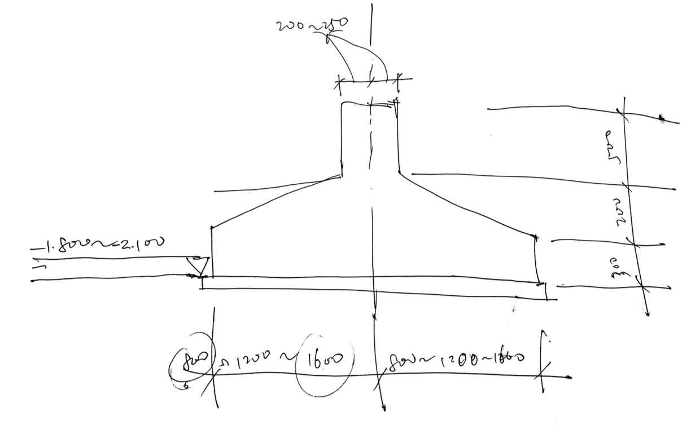

## 2.1 基础知识汇总

### 1. 提土建管架要注意的事项

标高、荷载，画个简图。

土建管架如果跨距比较大的话，比如 8m 及以上，要考虑管道方向上的推力，一般按荷载的 10-30% 考虑；如果不给结构提的话他们一般就做拉梁，水平方向只能受很小的力，提的话会做支撑，赵总让直接按 30% 的荷载提；即使是气体，也应按装液体的荷载考虑，充水试压。

### 2. 混凝土楼板上开孔挂反应釜提土建条件的注意事项

1、要有荷载、开孔尺寸、电机功率、设防水翻边、支耳的地方埋预埋铁。

2、开孔尺寸保温的按净距 150 考虑、不保温的 100 考虑。

3、翻边高出楼面 100 考虑、支耳预埋铁的尺寸根据选 A 型还是 B 型接着参考 JBT4712.3 耳式支座里的尺寸考虑。

1『做设备工程图自动生成的过程中，已经把 4 大类支座（腿式、鞍座、支耳、裙座）的数据做成数据库了。（2021-06-10）』

举例如下：

单个设备最大总重 35T，共 4 台，四支耳挂于楼面，电机功率 22Kw，开孔尺寸 3300x3300，设防水翻边高出楼面 100，支耳预埋钢板 300x300。

### 3. 行车高度、牛腿高度的确定

1、吊装高度。

如果走梁底的话，要考虑梁高、行车高度、葫芦高度、钢梁的高度（结构算出来）。这种是葫芦在行车上面，也有下面的，详见设备样本。

其实应该给结构提行车的高度，因为钢梁的高度我们是不知道的，对工艺来说最有用的是行车的高度，涉及到吊装的空间。看样本上的尺寸 D+400（离梁底的空间要求）+梁高。

比如荣泰电工里，梁高 900、行车高度 800、吊车高度 800（有余量），那么层高扣掉 2500。

2、悬挂式行车。

1T 及以下的行车都可以做悬挂式的，比做牛耳的省成本。

### 4. 釜耳朵斜挂的土建条件提法

除了普通荷载、开孔信息外，加上「斜挂，支耳中心圆 φ3500」，图里把斜梁、支耳中心圆标注出来。

### 5. 沟的坡度

一般排水沟的坡度按 0.5% 考虑。之前问过建筑专业，沟的起点最浅可以做 -150，坡度最小 0.3%，宽度自己定，一般 300。

### 6. 室外污水池混凝土盖板的厚度

一般小的池子因为不加梁，200mm 厚，大的池子因为要架梁，要薄一些。

### 7. 结构会前签哪几张图纸

各个平面的基础平面布置，比如 +6.00 基础平面布置。

### 8. 后置埋件

就是膨胀螺栓。

### 9. 基础下面的垫层

一般厚 100，就是基础浇之前下面的一层。

### 10. 设备基础和车间柱子下面的承台基础不能做在一起的原因

1、施工的时间不一样，柱子先打桩做的。

2、沉降不一样。

车间里做地池、设备基础的埋地部分要避开柱子的承台。

首先要弄清楚柱子下面承台基础的尺寸，就像一个倒着的漏斗。

高度方向上，基底标高一般 -1800 到 -2100（这个具体要看结构返的基础平面布置图，比如新华的 2# 车间承台的基底标高是 -4500），再往上的高度一般是 300、200（具体也是看结构图纸），所以地池如果浅，可以贴在柱子做，但一定要保证在承台上面，那么地池的底标高一定要比基底标高 500 再上 100（100 是池子底的基层）；否则必须要水平方向上避开承台。

水平方向上，上面柱子边缘到柱中心一般 200-250；下面，承台边缘到柱中心一般 800-1600，一般不会超过最大的 1600，所以池子边缘只要与柱中心有 1600 的距离就可以避开承台了。

详见图解 PDF：https://pan.baidu.com/s/1nuLOB13。

### 11. 设备基础下面埋的比较大比较深的一个衡量准则

看单位面积下的荷载；小于 10T/m2 的，地下的基础基本跟地上的尺寸一样，不变大；大于 20T/m2 的，地下的基础尺寸会变大的；很重、很高、土质不好的是要打桩的。

### 12. 地梁的宽度

地梁的宽度一般是 400-500，地梁也就是地圈梁。

### 13. 楼板埋件的锚固长度

天新 D3 成品车间，有些埋件是埋在楼面上的「非梁区域」，结构图纸上的埋件锚固长度统一都是 180mm，但楼板厚度一般是 120。

后来结构解释说，这种情况也比较常规，穿出楼板的部分到时弯一下就行了。

### 14. 甲乙类混凝土框架不能是单跨结构

东西、南北方向必须 2 跨以上，不能是单跨结构。图审意见，怕地震的时候，单跨抗震差。

### 15. 钢平台钢梁的高度的估算方法

跟跨距有关，一般是跨距的 1/25-1/20，就走走人的话按 1/25 考虑；立柱一般跟钢平台的高度有关，+5.00 平台的话立柱按 250x250 考虑，自己布方案的时候画 300x300 尺寸的柱子。

### 16. 罐区储罐基础地下部分尺寸

地上部分要高出地面至少 500，地下部分结构规范有要求要比冻深多个 200，比如西安油漆的中间罐区，西安那边的冻深是六七百，所以邢杰地下部分定的是 1000。

### 17. 车间里地磅的土建条件

地磅的尺寸规格：200Kg、500Kg 的按 1200x1200 的尺寸考虑；1T 的按 1500x1500 的尺寸考虑。

根据荣泰电工项目的经验举例：

200Kg 地磅，地磅基坑尺寸 1230x1230x120（深），边框角铁包边，荷载 0.4T，基坑底部四个角预埋 200x200x10（厚）铁板，地磅基坑请给排水专业考虑排水。

500Kg 地磅，地磅基坑尺寸 1230x1230x120（深），边框角铁包边，荷载 0.8T，基坑底部四个角预埋 200x200x10（厚）铁板，地磅基坑请给排水专业考虑排水。

1T 地磅，地磅基坑尺寸 1530x1530x120（深），边框角铁包边，荷载 1.3T，基坑底部四个角预埋 200x200x10（厚）铁板，地磅基坑请给排水专业考虑排水。

### 18. 荷载 1KN 与 Kg 之间的换算

就是 1000/9.8，可以简单看成 100Kg 荷载。

### 19. 污水池土建条件

1、一次土建条件。

汇总：1）尺寸大小；2）高出地坪多少，一般 200；3）预埋套管信息（开始能定的话，最好把给排水的管子信息考虑进来）；4）钢盖板还是混凝土盖板。

看下天新 D3 的信息补充全。

2、二次土建条件。

检修人孔 800x800；在积液坑上方穿管的地方预埋管套，大管子 2 档规格。详细的可参考天新 D3 成品的条件。

### 20. 梁/柱预埋钢板示例

梁柱外部表面都是要浇混凝土的，浇混凝土前要提掉埋件条件让结构的做，这种浇混凝土是从底层往上一层一层的来的，做 2 楼的时候 1 楼都是浇好了，所以有些很急的项目是一层一层的提埋件条件。

1、柱侧埋件示例：

A1 处 +3.50 顶标高预埋钢板 300x300，荷载 1.5T。

2、梁底埋件示例：

梁底预埋钢板 200x200，荷载 500Kg。

### 21. 罐区储罐基础上积液坑的土建条件

定位：离罐壁 500 的地方。

尺寸大小：φ400/φ600，深200。是 400 的孔深 200，大一圈的 600 的孔是深 10，用来放补强板的。

### 22. 沉降观测点

重的设备要做沉降观测点，气柜是有规范要求必须做，压缩机一般也是要做的，比如新和成业主要求压缩机的需要做。

沉降观测的一般指标有基础沉降量、平均沉降量和倾斜度等。

### 23. H 型钢梁的参数含义

比如型号是 HW300x300x10x15，表示高度x宽度x腹板厚度x翼缘板厚度。

### 24. 土建的 T 型管架知识汇总

高度高于 4500 以后的话建议混凝土的，钢的不好做了。

### 25. 常规三废的埋地深度

2021-12-05（旁听获取的数据信息）

邢杰：常规三废，地下埋深也就 1m 多一些。

## 2.2 设备基础的一般做法汇总

### 1. 在基础上预埋钢板

可以与设备支腿的地板焊起来。基础的直径一般可以做的跟设备直径差不多大，预埋钢板适合于一些储罐、槽。

预埋铁设备的基础说明：

1、基础直径 φ4000，高于地面 200。

2、设备规格 φ3600x6000；设备最大总重 30t。

3、预埋钢板 4-400x400，跨中均布，钢板中心距 φ1980。

### 2. 在基础上做预留孔

一般做 100x100 的预留孔，孔边缘离基础边缘至少 100，预留孔不能做太多，太多（比如 16 个）就不好做了，做预埋地脚螺栓。

举例：预留地脚螺栓孔 100x100x800(h)，共 2 个。

### 3. 在基础上做预埋地脚螺栓

自己提的话一般螺栓中心离基础边缘至少 100（结构专业要求我们至少 150），但往往设备返回来资料，地脚螺栓的位置比设备外缘大很多，这就导致了地脚螺栓的位置离基础边缘太近（按习惯基础比设备外缘多200），所以这时候基础就要提大一些，比设备外缘多 300（新和成罐区的教训）。

一般裙座的考虑做环形基础而不是大饼。

参考模板：图形上首先把 4 个角度（0/90/180/270）标上；地脚螺栓画上，主要有均布和跨中均布 2 种，选哪种和旋转多少度角主要是看自己怎么设管口，不要让突出来的地脚螺栓挡住管口，同时把螺栓的定位（即圆直径）和其角度标一下；罐区储罐的话把罐底的集水槽的尺寸、定位画上，再加一个剖面。

普通设备的基础说明：

1、基础直径 φ4000，高于地面 200。

2、设备规格 φ3600x6000；设备最大总重 30t。

3、预埋地脚螺栓 8-M48x2000，跨中均布（均布），螺栓伸出基础 550；螺栓中心距 φ3800。

补充：地脚螺栓埋入深度一般取 20~30d，可以适当放大一些；露出基础的长度是设备底座或支座（支腿）底板厚度加上3x重型螺母厚度，设备底座这些信息看业主发来的设备资料，例如昌海醋酸精馏塔的底座是 320。

#### 01. 地脚螺栓埋入混凝土基础的方式

在《设备地脚螺栓设计》第四节的一般规定中，地脚螺栓埋入混凝土基础内一般采用直接预埋或预留孔二次灌浆 2 种方法。

1、直接预埋地脚螺栓适用于塔器、较高的容器、球罐和振动较大的机械设备；地脚螺栓中心线距基础边的尺寸要大于等于 100mm，当不能满足时必须请土建专业对基础配筋加固。

注：后来做项目沟通，怕现场不能保证 100，得多留一点，而且也是给配筋留出空间，理论上 100 是够的；以后做的话按 150 考虑。

2、预留螺栓孔，适用于卧式容器、换热器、小型的立式容器等静置设备及振动较小的机、泵类，其特点是便于地脚螺栓定位尺寸的调整而不需要定位模板。

预留孔的最小尺寸为 100x100；螺栓钩距孔壁尺寸大于等于 20mm，预留孔的孔壁离基础边缘的距离大于等于100mm，不能满足时可采用预埋方式或者请土建专业对基础配筋加固，螺栓钩距孔底的尺寸取 80mm，那么孔深的取值是地脚螺栓埋入深度 +80mm。

#### 02. 地脚螺栓的相关知识

摘自《设备地脚螺栓设计》。

1、地脚螺栓有死地脚螺栓和活地脚螺栓 2 种；活地脚螺栓又叫长地脚螺栓，主要用来固定工作时有强烈振动和冲击的重型设备，一般长度为 1000-4000；活地脚螺栓要和锚板一起使用，锚板可用钢板焊接或铸造成型，它中间有一个矩形孔或圆孔，供穿螺栓之用。

2、每一个地脚螺栓，应根据标准配一个垫圈和一个螺母，对振动较大的设备应加锁紧螺母或双螺母。

3、地脚螺栓长度的确定见上述分析；

第五节的设计要求：

1、所用塔类设备应按具体要求尽量采用带模板的直埋地脚螺栓，模板应由设备制造厂提供；若采用无模板和直埋地脚螺栓时，则底板上应留有比螺栓直径足够大的孔；这种结构也适用于其他非定型设备，以免施工偏差，造成安装困难。

2、对有振动的设备和塔类，地脚螺栓应采用双螺母。

3、地脚螺栓直埋混凝土基础内的深度一般为 30d；对不重要的设备不考虑倾覆力矩时，可采用 20d；对塔类设备的地脚螺栓，要求埋入深度大于等于 30d。

4、为了考虑直埋地脚螺栓间距的误差，以避免设备上的地脚螺栓孔不能与地脚螺栓对准，可采用以下 2 种方法：

第一，将设备底部、裙座或耳架上的螺栓孔适当予以放大，待地脚螺栓穿入后，加一块垫板，将垫板焊在设备上，再上螺栓。

第二，在地脚螺栓上焊一个套管，将套管与地脚螺栓一起埋入基础中，套管顶部与基础顶面齐平；当设备地脚螺栓孔间距与埋入基础中的地脚螺栓间距与偏差时，可将套管中的地脚螺栓位置予以调整一下。

5、对于受拉力不大的静设备，可将地脚螺栓焊在基础面的钢板上；地脚螺栓采用单头螺栓（GB/T902-2008），端口部坡口。

6、在钢结构上的设备一般均采用普通的螺栓代替地脚螺栓，其长度按连接结构而定；支腿是可以直接焊在钢梁上的，参考传化的二次条件。

详见 PDF；https://pan.baidu.com/s/1boGdxMZ

### 4. 泵基础

目前做过的有两种。

一个常规做法，做预留基础上孔，尺寸一般 100x100，深度按装配图里螺栓的长度加个 100，一般深 400 够了，基础边缘离孔至少保证 100 以上。

另一个是基础上预埋长条形钢板，这样施工比二次灌浆简单很多。比如泵是南北向布置的，埋两条东西向的钢板，宽度可以 150，定位可以定位在螺栓的位置，其实也无所谓，因为一般还会在钢板上放两条南北向的槽钢，把泵焊在槽钢上的。这种做法定位就不需要那么精确了，后面修改有余量。

注意一下泵基础的高度问题，需要保证进口的 Y 型过滤器可以检修抽出来。在徐宝东的《化工管路设计手册》 P676 里可以查到 Y 型过滤器管中心离地面的检修技净高 H1，DN50 的 270、DN65 的 369、DN80 的 429。比如泵的装配图里泵中心离底板是 250，基础做 150 的话就有了 400 的空间，这个空间必须要大于 H1。如果地下垫槽钢的加下槽钢的高度。

### 5. 罐区储罐的基础

举例：

1、基础直径 φ8900，高于地面 500。

2、设备规格 φ8400x10522；设备最大总重 620t。

3、预埋地脚螺栓 14-M48x1500，均布，螺栓伸出基础 385（设备返的条件里）；螺栓中心距 φ8650，每只地脚螺栓应能承受 120KN 的拉力（设备返的条件里）。

4、基础中间高四周低，坡度 15/1000（设备返的条件里）。

5、储罐基础应进行防渗处理；土建专业根据储罐基础类型确定是否需要泄露管。

6、储罐土建基础顶部应采用沥青砂垫层，厚度不应小于 100mm。

7、其余应满足 GB 50341-2014 附录 E 的要求。

如果储罐的设计温度比较高的，那么换下面的版本：

1、基础直径 φ8900，高于地面 500。

2、设备规格 φ8400x10522；设备最大总重 620t。

3、预埋地脚螺栓 14-M48x1500，均布，螺栓伸出基础 385（设备返的条件里）；螺栓中心距 φ8650，每只地脚螺栓应能承受 100KN 的拉力（设备返的条件里）。

4、基础中间高四周低，坡度 15/1000（设备返的条件里）。

5、储罐基础应进行防渗处理；土建专业根据储罐基础类型确定是否需要泄露管。

6、储罐内设计温度 130℃，储罐基础需要设置隔热层。

7、其余应满足 GB 50341-2014 附录 E 的要求。

### 6. 卧式储罐的基础

卧式储罐一般是鞍座，大多数是 2 个，也有 3 个的，比如新和成的液氨储罐。

2 个地板一般是一个固定端，基础上预埋地脚螺栓孔，一个是活动端，基础上预埋板。

举例：

1、基础直径 2100x450，高于地面 500，共 3 个。

2、设备规格 φ2600x8400；设备最大总重 70t。

3、预留地脚螺栓孔 100x100x800(h)，共 2 个；预埋钢板尺寸 1900x300，共 2 个。

### 7. 钢平台上设备

举例：

1、4 支腿置于钢梁上，跨中局部，支腿中心定位 φ2000。

2、设备最大总重 10t。