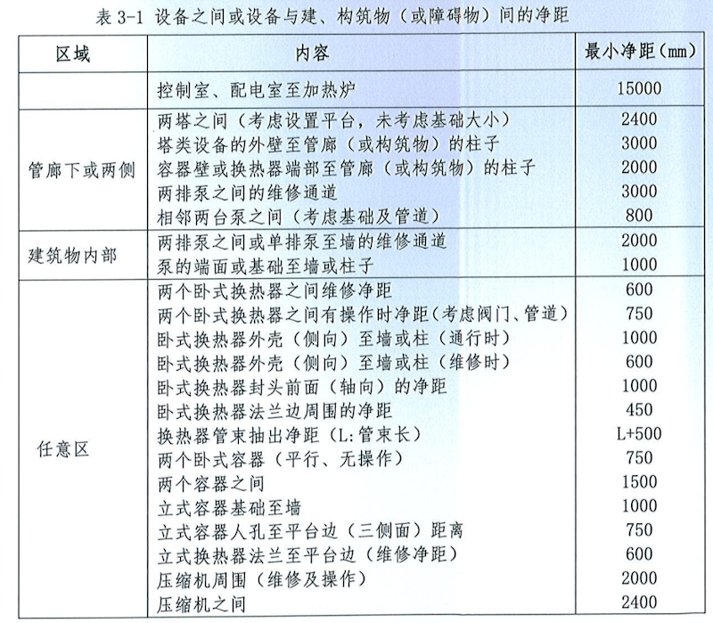
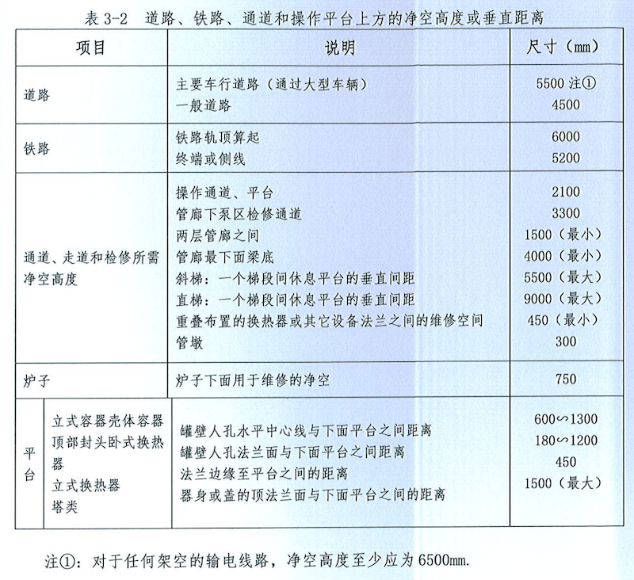
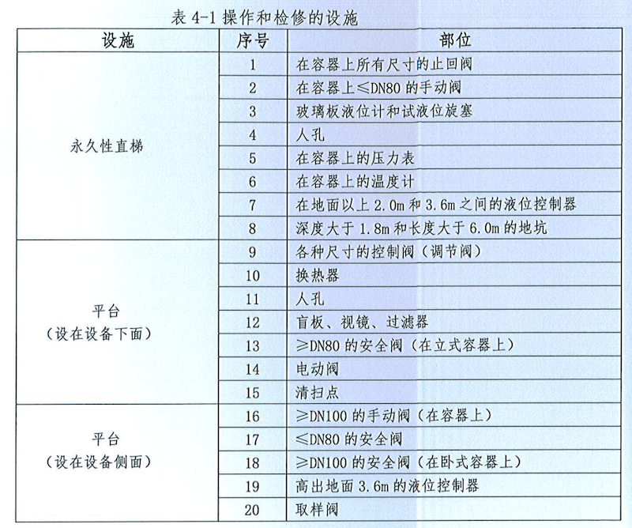
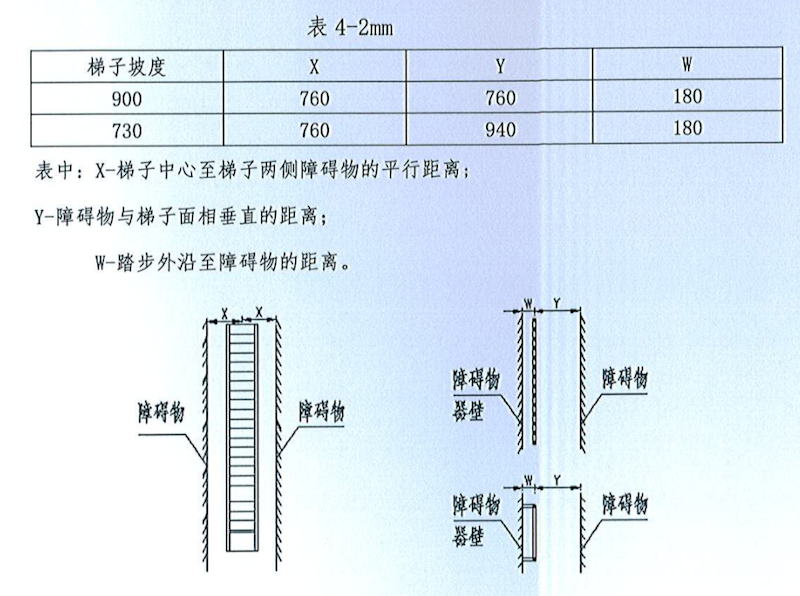
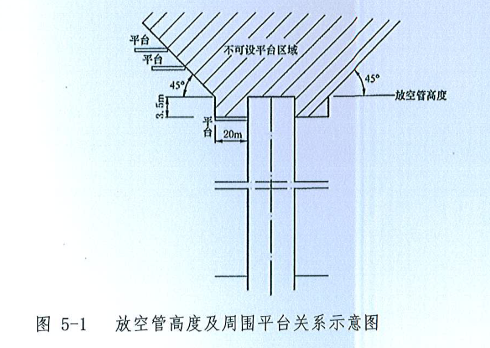

## 0228. 设备布置设计工程规定

### 1.1 总则

#### 1.1.1 目的

为规范公司化工装置类项目设备布置要求，特制定本规定。

#### 1.1.2 适用范围

本规定明确了化工装置设备布置的原则及基本要求。本规定适用于公司承接的工程设计项目。

#### 1.1.3 引用标准

《化工装置设备布置设计规定》HG/T20546 

### 1.2 化工装置设备布置的一般要求

#### 1.2.1 工艺及流程的要求

化工装置设备布置应满足工艺及流程的要求。如真空、重力流、固体卸料等，管道及仪表流程图（PID）上有高度差要求的一般应按管道及仪表流程图（PID）的高差要求布置设备。对处理腐蚀性、有毒、粘稠物料的设备宜按物料性质紧凑布置，必要时还需采取设隔离墙等措施。另外，还应根据地形、主导风向等情况布置，以免影响工艺的要求。例如空分装置空气吸风口及循环水冷却塔位置等。

#### 1.2.2 环境保护、防火及其他安全生产的要求

设备、建筑物、构筑物等的防火间距应符合现行的有关防火规范的规定。要注意环境保护、防止污染及噪音，还应根据职业卫生安全及危险程度的划分来考虑设备布置。

在火灾爆炸危险场所，利用电能或电动机的电气设备的布置，应符合国家现行的《爆炸危险环境电力装置设计规范》（GB50058）的要求。

对于加热炉、压缩机及控制室配电室等的位置要考虑主导风向的问题。从设备泄漏出的可燃气体或蒸汽不应吹向加热炉，故加热炉应位于全年最小频率风向的下风向烟囱排出的烟气不应吹向压缩机室或控制室。配电室宜布置在可能泄漏出易燃易爆气体场所的上风向。

#### 1.2.3 方便操作

设备布置应考虑能给操作者创造一个良好的操作条件，主要包括：必要的操作通道和平台；楼梯与安全出入口要符合规范要求；合理安排设备间距和浄空高度等。

控制室的位置要合理，应避开危险区，远离振动设备，以免影响仪表的运行。

#### 1.2.4 便于安装和维修

1、设备的安装和维修应尽量采用可移动式的起吊设备。在设备布置设计阶段应满足以下各方面要求：1）道路的出入口要方便吊车的出入；2）搬运及吊装所需的占地面积和空间；3）设备内填充物的装卸及清洗场地；4）在定期大修时，能对所有设备同时进行大修；5）对换热器、加热炉等的管束抽芯要考虑有足够的场地，应避免拉出管束时延伸到相邻的通道上。对压缩机驱动机等转动设备部件的检修和更换，也要提供足够的检修区。

2、下述场合需设固定式维修设备：1）大型设备的人孔盖需设置吊柱；2）板及塔内部件需设置吊柱；3）大型压缩机、透平机等需设置起重机；对于小型压缩机可酌情设置简易起重设施；4）建筑物内的搅拌器需设置吊钩或起重设备。

#### 1.2.5 经济合理的要求

1、设备布置在符合工艺要求的前提下应以经济合理为原则，并注意整齐美观。除热膨胀有要求的管道外，设备布置是应考虑管道尽量短而直，有的设备为了经济的目的可以不按工序来布置。

2、为了考虑美观整齐，可采取下列方式布置：1）塔采取成排布置，如可能时可设置联合平台。2）换热器采取并排布置，推荐靠管廊侧管程接管中心线取齐。3）离心泵的成排布置，其排列应以泵出口管中心线取齐为宜。4）卧式容器的成排布置推荐以靠管廊侧封头切线取齐为宜；加热炉、反应器的成排布置推荐以中心线取齐。

### 1.3 设备布置的净距、净空及有关标高

#### 1.3.1 设备间的最小净距

1、设备间的净距，应首先遵照防火间距的要求，详见《石油化工企业设计防火规范》（GB50160）和《建筑设计防火规范》（GB50016）的规定。

2、非防火因素决定的或防火规范中未加规定的设备间距可参见表 3-1。

#### 1.3.2 净空高度或垂直距离

道路、铁路、通道和操作平台上方的净空高度或垂直距离宜符合表 3-2 的规定。

#### 1.3.3 标高

部分构筑物、构件间标高可参照表 3-3 的规定。

注：

① 所有标高均按 EL±0.000 m 为基准，与这个标高相对应的绝对标高由总图专业在设计中确定。

② 所有用于设备和结构的混凝土支承标高（除斜梯和直梯外）已包括至少 25 mm 的二次灌浆层高度。

③ 与敞开的建筑物周围连接的铺砌面的边缘应同建筑物地面的边缘同一标高，并且有向外的坡度，而且这个地面的坡度应从厂房向外面坡。

④ 小尺寸的泵，例如比例泵、喷射泵和其他小齿轮泵，可以将基础的顶面标高高出所在地坪 300 mm。并且几台小泵可以安装在一个公用的基础上。

⑤ 如有地下管线穿过时，可降低个别基础的标高。

⑥ 卧式设备基础标高应按设备底部排液管及出入口配管的具体情况而定，但不得小于 EL+0.60。

⑦ 对于可能产生重度大于空气的易燃易爆气体的装置，平面布置位于附加 2 区的控制室和配电室室内地面应高出室外地面 600。

#### 1.3.4 道路和操作通道宽度

1、主要车行道路最小宽度为 6 m，转弯半径为 12 m。

2、次要车行道路最小宽度为 4 m，转弯半径为 9 m

3、道路两边的人行道最小宽度为 1 m。

4、装置内的操作通道一般宽度为 800-1000 mm。不常通行的局部地方最小为 650 mm。

5、斜梯宽度最小为 600 mm，斜梯着地前方宽度为 900-1200 mm。

### 1.4 操作平合和梯子

#### 1.4.1 操作平台

1、在生产中需要操作和经常维修的场所应设置平台和梯子。仅在检修期间操作距地面 3 m 高度范围内的人孔、仪表及阀门可采用带有直梯或斜梯的活动平台

2、平台的尺寸应符合下列规定：1）平台宽度一般不小于 800 mn，平台上方净空要求见表 3-2，特殊规定的维修平台宽度见表 3-1。2）设备人孔中心线距平台的最适宜高度为 900 mm。允许高度范围见表 3-2。3）为设备加料口设置的平台，距料口顶面不宜大于 1 m。

3、平台周围应设栏杆，除平台的出入口外，平台边缘及平台开孔的周围应设踢脚板。

4、在炉子下列部位可设置平台：1）烟道鼓风机；2）地面上难以接近的烧嘴及视孔，设置平台的宽度，管式炉侧面 ≥750 mm，端部 ≥1000 mm；3）烟灰吹除器；4）集气管（包括可拆卸部件）只设置平台支架，需检修时临时加设平台板或提供活动的平台；5）取样点的平台。

5、为考虑操作和检修的需要，小型设备或阀件距地面 2.5 m 以上或在平台上高于 1.8 m，设备上的仪表距地面 2 m 以上，应按表 4-1 设平合或永久性梯子。并考虑以下两点要求：1）在容器上的法兰管口、管廊上的切断阀、容器上的就地测温、测压点根部阀、集中仪表的一次元件，在管道上的测温、测压点和在管廊最下层管道上的孔板均不设置平台。2）在装置运行期间或在事故的情况下需要操纵手动阀门时，应按下述进行设计：a）DN100 及以下的阀门，手轮的底部不能高出平台或地面 1.8 m； b）DN150 及以上的阀门，手轮高度应设置在平台上或地面上便于操作的位置。

假如阀门不能按照上述安装时，则阀门应安装操作链条或伸长杆。

#### 1.4.2 梯子

1、设置直梯的要求：

1）装置的操作和维修人员不需要经常巡视的辅助操作平台和容器的操作平台可设置直梯。

2）平台的辅助出口应有直梯，该梯子的位置应符合从主要或辅助出口到平合任何一点的水平距离不大于 25 m，平台的死端长度不应大于 6 m。若死端大于 6 m 时，需增设出口梯子。

3）对于有易燃易爆危险介质的设备，其构筑物平台水平距离不足 25 m，也应按 GB50160 的要求在适当的位置增设安全直梯。

4）立式设备上的直梯通常从侧面通向平台。正面进出的直梯用于通向设备顶部以上的平台。

5）除烟囱上的直梯外，每段直梯的高度见表 3-2（如超过表 3-2 中规定，但不超过 10 m 也允许不分段）；超过时应增加中间体息平台。宜采用分段错开布置的平台，并结合设备人孔的高度设置。

6）从地面起设直梯，高度 ≥4 m 时，应加安全保护圈，从 2.5 m 处向上设置；上方其它各段直梯每段高度 ≥2.5 m 时，需加安全保护圈，从 2.2 m 处向上设置。

7）在直梯的攀登通过的空间内不应有任何障碍物。

不带有安全保护圈的直梯，在整个直梯长度的空间内无障碍物的范围必须按表 4-2 规定。

8）直梯宽度宜为 400-700 mm。

9）所有平台直梯的出入口处宜设自动隔离安全栏。

2、设置斜梯的要求：1）厂房和框架的主要操作面，操作人员经常巡视（每班至少一次到达该处）的区域应采用斜梯。2）一段斜梯的最大高度见表 3-2。3）斜梯的角度 45°-59°，斜梯宽度一般为 600-1000 mm，按具体情况设双面或单面栏杆。4）两个平台高差 ≤300 mm 时，不需设中间踏步。高差大于 300 mm 时，需增设个中间踏步。

### 1.5 设备布置设计的其他要求

#### 1.5.1 放空口高度

1、除无毒、不可燃性介质外，任何连续排放的放空管，从它的外缘水平距离 20 m 半径范围内所设置的平台，必须至少低于放空管顶部 3.5 m。位于放空管外径边缘水平距离 20 m 半径以外的平台从水平半径 20 m 的末端垂直引线与放空管顶部标高线的交点以 45° 引伸线向上引出，引伸线以下的地区可设置平台。如图 5-1 所示。

2、紧靠建筑物、构筑物或室内布置的设备放空管，应高出建筑物、构筑物 2 m 以上。

3、除无毒、不可燃介质外，从释放阀、安全阀出口排放点（非连续放空）的高度至少应比其出口管径边缘算起水平距离 10 m 半径以内的操作平台或厂房屋顶高出 3.5 m 以上。

4、从气体放空口排出气体时，要防止地面上或平台上的操作或维修人员遭受噪音或烫伤的危害。

#### 1.5.2 管道

1、通常工艺管道、公用工程总管（下水管除外）和仪表电缆桥架宜架空敷设布置在管廊（管架）上。

2、短距离管道可敷设在不影响检修或操作通道的地面上，当管道不可避免需穿越通道时，应在管道的上方加设钢结构的跨越过道（桥）。

#### 1.5.3 管沟和污水井

1、在生产过程中可能产生重度大于空气的易燃易爆气体的装置，原则上不设管沟。如工程特殊需要必须设置管沟时，管沟内要填砂或采取其他防止气体积聚的措施。

2、管沟一般用平盖板封河，避免地面水浸入。有特殊要求时可敞开，可用篦子板盖。沟壁材料采用砖砌或混凝土结构，沟底可用混凝土或碎石铺面，仅在腐蚀性工况的情况下才做耐腐蚀处理。

3、为便于管沟排水，要求沟底带有坡度，一般坡度为 0.5%-1.0%。

4、管沟的最小宽度为 600 mn。管道的凸出部分与沟壁之间最小间距为 100 m；与沟底最高点之间的最小间距为 50 mm。

5、在铺砌地面区域内管沟盖板与地面平齐，在不铺砌地面区域内管沟盖顶应超出地面至少 100 m。在室内的沟盖顶应与地面平齐。

6、污水井一般采取砖砌并加盖 d700 铸铁盖板。在铺砌地面区域内井盖应与地面平齐，在不铺砌地面区域内井盖的顶部应至少高出地面 50 mm。

7、穿越交通道路的管沟，其盖板应采用承重盖板，以利于车辆通行。

#### 1.5.4 排液管及下水道

1、对于石油化工类型的装置，应设地下的油水污水系统，以收集铺砌地面区域的全部废油、废水、雨水及消防水，并排到装置边界。经处理的生活污水或化学废水，也可通过此系统排出。

2、污染雨水与未污染雨水应加以控制，分开排放。

3、从不同区域（例如完全封闭的工艺厂房、炉子及设备群）排出的污水，应通过具有水封进口的污水井与污水系统相接。如不能将几根排水管分别排到污水井时，此种排水管应采用弯管水封。

4、通常所有单个或成对的容器或换热器应设置 DN100 的油水排放漏斗作为辅助排液口。但对于清洁的设备或其他类似装置中的设备可以不考虑。1）在停车期间，从大容器排出水量应加以控制，以防止排水设施满溢。2）在铺砌地面区域的容器或换热器，如需要把辅助排液中停车排液和仪表排液分开，应分别设排放漏斗。

5、在铺砌地面区域，泵、压缩机厂房的地面应设排水沟，以收集地表面的污水。对于下列情况不需设排水沟：1）半敞开式的压缩机厂房的混凝土地面；2）控制室和配电室地面。

6、常压酸、碱贮槽和酸泵等区域应铺砌的地面，设围堰和有防腐蚀措施。受压的酸贮槽应装有单独的排放点。

7、当泵没有设置排液设施时，基础顶面应坡向基础边的排水沟或排液管并引至下水道。

8、不回收利用的蒸汽冷凝液可排入下水道。如排液点远离下水道时，可单独或通过冷凝水汇集系统排入干井。

9、当土壤吸收不了正常的降雨量时，在这个地区的周围所有未铺砌的区域应坡向装置边界。在装置界区范围以内的道路、建筑物、构筑物和铺砌区域之间的无铺砌区域应考虑排水，以便使最大降雨量时雨水送到装置边界的排水沟中降雨强度和持续时间见工程设计数据表。

10、位于易燃和易爆的危险区域内的污水井，例如炉子周围的污水井应当设有密封盖，并且放空管道应当通到安全的地方。污水井排气口通常应高出地面或邻近操作台 3 m 以上，并且与平台的水平距离至少 4.5 m，与炉壁的水平距离至少为 12 m。

#### 1.5.5 铺砌地面和坡度

1、人行道及下述区域一般用混凝土铺砌。1）以液体或固体为燃料或原料的炉子及其附属设备的区域，以及焦炭贮槽和装有催化剂的容器支承架下面的区域，铺砌地面应延伸打到设备基础或设备支架柱脚的外面。2）露天布置的泵和压缩机的周围，铺砌地面应延伸到基础以外 1.2 m 处。3）处理诸如苯酚、糠醛、砷碱液等物料的单元中围绕泵、塔及换热器的区域内，应提供回收溢出物料的排放设施。

2、控制室和配电室的地面应是水平的。

3、除 5.5.2 外，其它室内外的铺砌地面应坡向排水点。铺砌地面的最小坡度为 1%。但最大标高差为 150 mm。

4、如需要收集溢出的物料时，所做的围堰厚度至少 150 mm，其容积足以容纳最大的常压贮槽的容量，围堰最小高度不小于 450 mm。

5、当工艺装置的贮罐区使用围堰来容纳设备及管道溢流出来的液体时，围堰应有足够的容积来容纳从被围的区域内「最大贮罐」排放出来的最大液体量（计算容积时，应减去围堤内其他贮罐低于围堰高度所占去的体积）。可燃液体储罐围堤高度应符合《石油化工企业设计防火规范》（GB50160）相关条款的规定。

6、装有烃类贮罐周围的铺砌地面应以最小 1% 的坡度从贮罐处向外坡向排水系统，该排水点应位于距贮罐最远的围堤旁。

7、道路的中心应坡向两侧，最大高差为 100 mm。