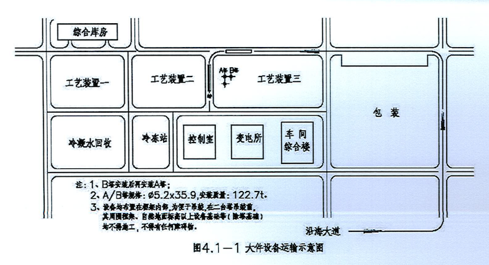
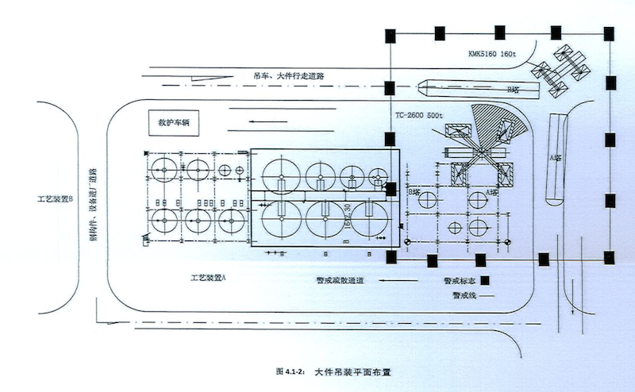
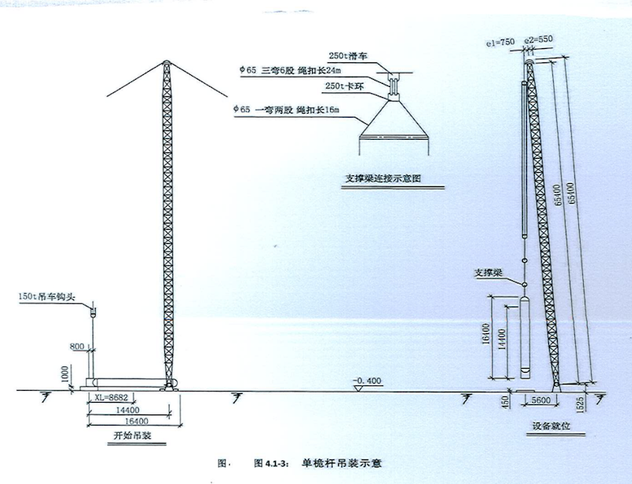
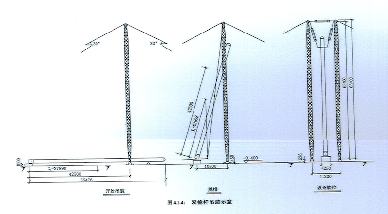
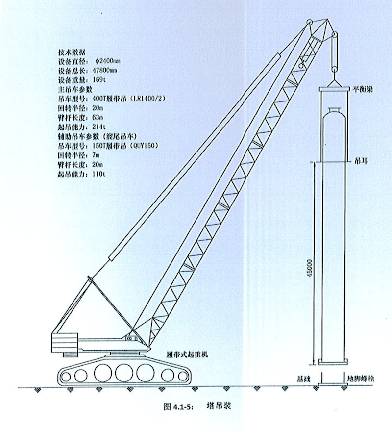

## 0229. 设备运输和吊装设计规定

### 01. 总则

#### 1.1 目的

为规范公司工艺专业设计中设备运输和吊装设计的要求，特制定本规定。

#### 1.2 适用范围

本规定明确了工艺专业设计中设备运输和吊装设计的原则及基本要求。本规定适用于公司承接的工程设计项目。

#### 1.3 引用标准

《化工装置设备布置设计规定》HG/T20546 

### 02. 原则

2.1 为便于考虑吊装要求，按设备质量或按尺寸分为三个等级

2.2 设备吊装方案的编制，应符合《工程建设安装工程起重施工规范》HG20201 的规定，通常由施工单位编制。但对主要设备吊装方案的技术条件如吊耳及吊装方位等要求，应与施工单位共同商定。

2.3 对于某些可能更换的设备，在设备布置设计时应考虑留有足够的空问和通道，便于安装拆卸设备的机具作业以及运输。

2.4 在设备布置「设计版」之前，需了解施工单位吊装机具的装备情况以及外协条件等。

2.5 厂区以外的设备运输要求，仅限于提出下列内容交项目负责人，以便考虑概算及解决运输问题。

1）超限设备名称、编号、外形尺寸（包括管ロ）、吨位及主要材料。

2）需考虑运输问题的其他设备名称、编号、尺寸、吨位及主要材料。

3）外形尺寸应包括出厂的包装尺寸（与制造厂联系）。

### 03. 一般要求

3.1 设备从厂区仓库或厂区码头运到安装地点应考虑下述事项：

1）运输所经过的道路、桥梁的承载能力以及道路的宽度、坡度、凹凸不平弯曲半径等，是否符合设备运输的要求。

2）运输沿途的建、构筑物、架空电缆、管架等地面设施是否对运输有影响。

3）运输途中地下设施与埋设深度是否能承受运载设备的压力。

4）由水路直接运大设备到现场时，应考虑厂区码头所用起重设施的能力。

3.2 设备出厂放置托板（座）时设备方位宜与安装方位一致。

3.3 对于特大尺寸的设备（如球罐、油罐等），宜由制造厂提供预制件在设备基础上就地组装。

3.4 室外无框架直接安装在基础上的设备吊装方案要求如下：

1）吊装设计采用的方案应考虑施工单位的机具装备和外协条件。

2）对于高大设备，是否采用整体组合吊装，应由施工单位自行决定。

3）与施工单位协商决定采用桅杆或活动起重设备安装的设备位号、吊耳的设置要求、预留空间的要求、对吊装有顺序要求的设备位号等。

4）设计方案的深度仅限于保证吊装的可能性以及上款中内容的规定。至于具体的吊装方案，应由是个单位编制。

3.5 在框架中用卷扬机吊装设备。

1）位于框架内的设备尽量采用活动的起重设备（汽车吊、履帯式吊车），利用吊臂外伸完成设备吊装，当不宜用上述起重设备吊装时，可用塔式吊车进行设备吊装（需具有塔式吊车条件的情况下）或利用框架顶或在比设备安装层高的楼面而设置临时横梁，用卷扬机进行吊装。

2）在楼面上留孔，吊装带有支耳的设备时，如果采用从下方穿过楼面的吊装方法，对于开孔的尺寸应考虑能通过设备的管口及支耳，必要时可设置活动梁。

3）特别大的带裙座的设备，可事先将设备安装就位后再施工土建的框架。

4）支撑在楼面上的特别大的设备，也可以在设备上先安装临时裙座，将设备落地安装在临时基础上，再施工土建的框架，待确认支耳面在梁上达到承受荷载时，再割掉临时支座。

3.6 在厂房或框架内应设有吊装孔，用吊梁吊装设备。

利用厂房内公用吊装孔，如无起重机时，吊装设备应注意如下几点：

1）吊装孔的尺寸应满足最大设备外形尺寸要求（包括设备支耳或支架外缘尺寸）。建筑物门的尺寸应考虑装有设备的运载车或带有包装托架的设备，能够进入厂房内吊装孔的区域。

2）最顶层应有吊梁，可以悬挂手动行车。

3）吊点的梁和吊钩强度是否满足最大设备荷载的要求（包括索具的质量）。

4）设备从建筑物吊装孔运至安装点和临时放置的位置，所经过的梁、板荷载（包括水平力）应提供土建专业计算。

5）设备从墙的外侧进入厂房时，墙应在设备吊装后进行砌筑，并应在设计说明中写明。

3.7 在厂房或框架内用起重机（桥式起重机、电动葫芦等）吊装设备时应注意如下几点：

1）桥式起重机由于桥架宽度和起吊行车的行程原因，对于布置在靠墙边的设备应在桥式起重机的吊钩可到达的范围之内。

2）吊装作业区空间不应有管道、电缆桥架、平台等障碍物。

3）设备安装在楼面上时应设吊装孔。见以上 3.6 节第 1）款的要求。

4）为考虑楼面的利用率，对于不常使用的吊装孔可加设活动盖板及活动栏杆。

3.8 起重机选型及其他注意事项

1）起吊高度是否已考虑吊钩与桥架的安全距离和起重机吊钩至地面距离。

2）起重机吊起能力是否满足最重部件的要求，并留有适当余量。

3）生产环境是否有防爆要求，是否采用带操作室的起重机。

4）起重机跨距是否与轨道间距相同。

5）单轨梁的规格是否符合单轨电动葫芦的要求。

3.9 注意事项。

1）安装设备采用移动式吊车时，吊车所需的通道、占地面积及空间应在平面布置图中给予考虑，并向总图专业提出吊装通道位置。

2）当设备检修用单轨吊车时，根据设备检修最大部件的质量及起吊有效高度作为吊车的选型依据，选型后校核起吊空间及起吊高度时，选定吊车及葫芦的型号。

3）根据设备装配图考虑设备检修的频率及吊装设备的部件（最大检修件）质量，在设备布置图中表示出：吊车的起重量、提升高度、吊轨的相对位置，即吊轨中心线与、建构筑物轴线间的距离以及轨顶标高。

4）当吊车需转弯运行或环形轨道时，应表示出轨道的相对位置及曲率半径。

5）带搅拌容器的搅拌轴和电动机的拆卸需设单轨吊车时，应核对取出搅拌器所需的最小净空尺寸，将轨顶标高标注在设备布置图中。

### 04. 例图

4.1 大件设备运输示意图，见图 4.1-1。

4.2 大件吊装平面布置，见图 4.1-2。

4.3 单桅杆吊装示意图，见图 4.1-3。

4.4 双桅杆吊装示意图，见图 4.1-4

4.5 塔吊装，见图 4.1-5。

