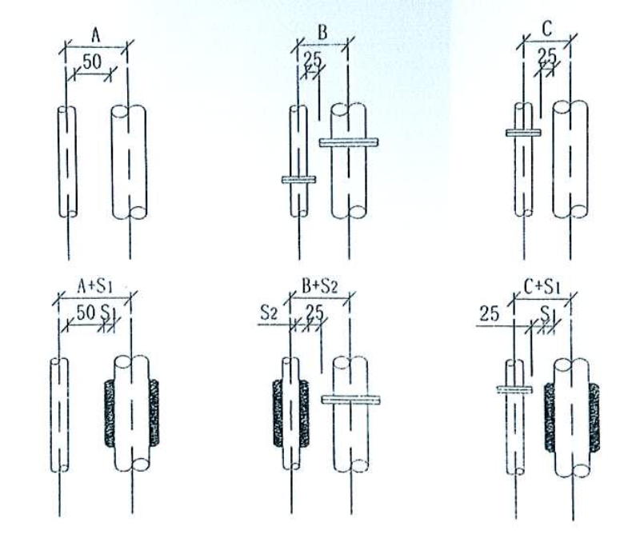
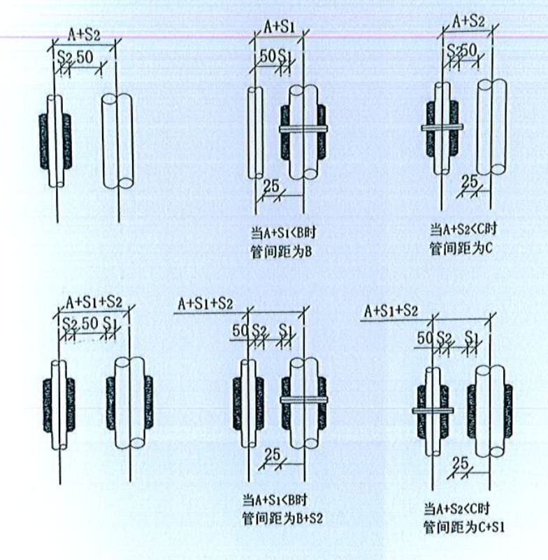

## 0201. 管道布置设计统一规定

### 01. 总则 

#### 1.1 目的

1.1.1 为使本专业设计采用统一的技术标准，确保设计内容完整一致，保证设计质量，特制定本规定。

1.1.2 当规范、规定有新版本颁布时应随时补充，同时应将作废版本及时删除。

#### 1.2 适用范围

1.2.1 本规定仅适用于单体内（装置内，车间内及车间的室外设备区）的管道布置设计。

1.2.2 本规定所列之情况为通用情况，特殊场合需根据实际情况确定或与专业设计负责人、校审人员商定 。

#### 1.3 引用标准

下列标准包含的条文，通过在本规定中引用而构成为本规定的条文。使用本规定时，应探讨使用下列标准最新版本的可能性。

《化工装置管道布置设计工程规定》HG/T20554.2-1998 

《化工装置设备布置设计工程规定》HG/T20546.2-2009

《管道布置设计一般规定》中国石油和化工勘察设计协会

《化工管路设计手册-2 管路安装设计》

《化工工艺设计手册一第 4 篇配管设计》

《工艺施工图设计规定》本院 QS04-Pl-标 6-99 

### 02. 设计原则

2.1 管道布置设计必须符合管道仪表流程图（PID）的设计要求，并应做到安全可靠、经济合理，并满足施工、操作、维修等方面的要求。

2.2 管道布置必须守安全及环保的法规，对防火、防爆、安全防护、环保要求等条件进行检查，以便管道布置能满足安全生产的要求。

2.3 管道布置应满足热胀冷缩所需的柔性。

2.4 对于动设备的管道，应注意控制管道的固有频率，避免产生共振。

2.5 管道布置应严格按照管道等级表和特殊件表选用管道组成件。

2.6 管道布置应符合《化工装置设备布置设计规定一第 2 部分设计工程规定》（HG20546.2) 的有关要求。

### 03 管道布置 

#### 3.1 一般规定

3.1.1 管道布置的净空高度、通道宽度、基础标高应符合《化工装置设备布置设计规定第 2 部分设计工程规定》（HG20546.2) 第 3 章中的规定。

3.1.2 应按国家现行标准中许用最大支架间距的规定进行管道布置设计。管道跨距选取可参考《化エ工艺设计手册》中的「表 26-20 装置内不保温管道的基本跨距」、「表 26-21 装置内保温管道的基本跨距」、「表 26-22 装置外不保温管道的基本跨距」、「表 26-23 装置外保温管道的基本跨距「表 26-24 垂直管道管架最大问距」「表 26-24 水平管道导向架最大间距」表。

3.1.3 管道尽可能架空敷设，如必要时，也可埋地或管沟敷设。在车间内或装置内不便维修的区域，不宜将输送强腐蚀性及 B 类流体的管道敷设在地下。

3.1.4 管道布置应考虑操作、安装及维护方便，不影响起重机的运行。在建筑物安装孔的区域不应布置管道。

3.1.5 管道布置设计应考虑便于做支吊架的设计，使管道尽量靠近已有建筑物或构筑物，但应避免使柔性大的构件承受较大的荷载。

3.1.6 在有条件的地方，管道应集中成排布置。裸管的管底与管托底面取齐，以便设计支架。

3.1.7 无绝热层的管道不用管托或支座。大口径薄壁裸管及有绝热层的管道应采用管托或支座支承。

3.1.8 在跨越通道或转动设备上方的输送腐蚀性介质的管道上，不应设置法兰或螺纹连接等可能产生泄漏的连接点。

3.1.9 管道穿过为隔离剧毒或易爆介质的建筑物隔离墙时应加套管，套管内的空隙应采用非金属柔性材料充填。管道上的焊缝不应在套管内，并距套管端口不小于 100 m。管道穿屋面处，应有防雨措施。

3.1.10 消防水和冷却水总管以及下水管做埋地敷设时，管外表面应按有关规定采取防腐措施。

3.1.11 埋地管道应考虑车辆荷载的影响，管顶与路面的距离不小于 0.6 m，并应在冻土深度以下。

3.1.12 对于「无袋形」、「带有坡度」及「带液封」等要求的管道，应严格按 PID 的要求配管。

3.1.13 从水平的气体主管上引接支管时，应从主管的顶部接出。

#### 3.2 平行管道的间距及安装空间

3.2.1 平行管道间净距应满足管子焊接、隔热层及组成件安装维修的要求。管道上突出部之间的净距不应小于 30 mm。例如法兰外缘与相邻管道隔热层外壁问的净距或法兰与法兰间净距等。

3.2.2 无法兰不隔热的管道间的距离应满足管道焊接及检验的要求，一般不小于 50 mn。

3.2.3 有侧向位移的管道应适当加大管道间的净距。

3.2.4 管道突出部或管道隔热层的外壁的最突出部分，距管架或框架的支柱、建筑物墙壁的净距不应小于 100 mm，并考虑拧紧法兰螺栓所需的空间。

3.2.5 管道间距可参考下图：（数据来源：工艺设计技术规定）

#### 3.3 排气与排液

3.3.1 由于管道布置形成的高点或低点，应设置排气和排液口。

1) 高点排气口最小管径为 DN15，低点排液口最小管径为 DN20（主管为 DN15 时，排液口为 DN15）。高粘度介质的排气、排液口最小管径为 DN25。

2) 气体管的高点排气口可不设阀门，采用螺纹管帽或法兰盖封闭。除管廊上的管道外，DN 小于或等于 25 的管道可不设高点排气口。

3) 非工艺性的高点排气和低点排液口可不在 PID 上表示。

3.3.2 工艺要求的排气和排液口（包括设备上连接的）应按 PID 上的要求设置。

3.3.3 排气口的高度要求，应符合国家现行标准《石油化工企业设计防火规范》（GB50160)的规定。

3.3.4 有毒及易燃易爆液体管道的排放点不得接入下水道，应接入封闭系统。比空气重的气体的放空点应考虑对操作环境的影响及人身安全的防护。

#### 3.4 焊缝的位置

3.4.1 管道对接焊口的中心与弯管起弯点的距离不应小于管子外径，且不小于 100 mm。

3.4.2 管道上两相邻对接焊缝问的净距应不小于 3 倍管壁厚，短管净长度应不小于 5 倍管壁厚，且不小于 50 m；对于 DN 大于或等于 50 mm 的管道，两焊缝间净距应不小于 100 mm。

3.4.3 管道的环焊缝不应在管托范围内。焊縫边缘与支架边缘间的净距离应大于焊缝宽度的 5 倍，且不小于 100 mm。

3.4.4 不宜在管道焊鏠及其边缘上开孔与接管。

3.4.5 钢板卷焊的管子纵向焊缝应置于易检修和观察位置，且不宜在水平管底部。

3.4.6 对有加固环或支撑环的管子，加固环或支撑环的对接缝应与管子的纵向焊鏠错开，且不小于 100 mn。加固环或支撑环距管子环焊缝应不小于 50 m。

#### 3.5 管道的热（冷）补偿

3.5.1 管道由热胀或冷缩产生的位移、力和力矩，必须经过认真的计算，优先利用管道布置的自然几何形状来吸收。作用在设备或机泵接口上的力和力矩不得大于允许值。

3.5.2 管道自补偿能力不能满足要求时，应在管系的适当位置安装补偿元件，如「π」形弯管；当条件限制，必须选用波纹膨胀节或其它型式的补偿器时，应根据计算结果合理选型，并按标准要求考虑设置固定架和导向架。

3.5.3 当要求减小カ与力矩时，允许采用冷拉措施，但对重要的敏感机器和设备接管不宜采用冷拉。

### 04 阀门的布置 

#### 4.1 一般要求

4.1.1 阀门应设在容易操作、便于安装、维修的地方。成排管道（如进出装置的管道）上的阀门应集中布置，有利于设置操作平台及梯子。

4.1.2 有的阀门位置有工艺操作的要求及锁定的要求，应按 PID 的说明进行布置及标注。

4.1.3 塔、反应器、立式容器等设备底部管道上的阀门，不应布置在裙座内。

4.1.4 需要根据就地仪表的指示操作的手动阀门，其位置应靠近就地仪表。

4.1.5 调节阀和安全阀应布置在地面或平台上便于维修与调试的地方。

4.1.6 消火栓或消防用的阀门，应设在发生火灾时能安全接近的位置。

4.1.7 埋地管道的阀门要设在阀门井内，并留有维修的空问。

4.1.8 阀门应设在热位移小的地方。

4.1.9 阀门上有旁路或偏置的传动部件时（如齿轮传动阀），应为旁路或偏置部件留有足够的安装和操作空问。

#### 4.2 阀门的位置要求

4.2.1 立管上阀门的阀杆中心线的安装高度宜在地面或平台以上 0.7 至 1.6 m 的范围，DN40 及以下阀门可布置在 2 m 高度以下。位置过高或过低时应设平台或操纵装置，如链轮或伸长杆等以便于操作。

4.2.2 极少数不经常操作的阀，且其操作高度离地面不大于 2.5 m，又不便另设永久性平台时，应用便携梯或移动式平台使人能够操作。

4.2.3 布置在操作平台周围的阀门手轮中心距操作平台边缘不宜大于 400 mm，当阀杆和手轮伸入平台上方且高度小于 2 m 时，应使其不影响操作人员的操作和通行安全。

4.2.4 阀门相邻布置时，手轮间的净距不宜小于 100 mm。

4.2.5 阀门的阀杆不应向下垂直或倾斜安装。

4.2.6 安装在管沟内或阀门井内经常操作的阀门，当手轮低于盖板以下 300 m 时，应加装伸长杆，使其在盖板下 100 m 以内。

### 05 非金属管道和非金属衬里管道

详见本公司《非金属和衬里管道设计规定》（ZTT-GBxx-2016)

### 06 支架和固定架

6.1 管道支架的设计应参照 HG-T21629-1999 执行。

6.2 所有配管都应有可靠的支撑并设固定架、移动架或减振器以防止作用在设备上的附加力和附加振动。

6.3 所有的管道支吊架的设置应考虑热胀或冷缩。

6.4 由于设备布置或其他因素使管道系统的几何形状受到限制，补偿能力不能满足要求时，应在管道系统的适当位置安装补偿器。

6.5 所有管道系统的设计都应使作用在机械设备法兰上的荷载和力矩，例如泵和压缩机，不能超过设备允许的力和力矩。

### 07 管道的连接和支管连接

7.1 管道上两相邻对接焊口的中心间距：

a）对于公称直径小于 150 m 的管道，不应小于外径，且不得小于 50 mm。

b）对于公称直径大于或等于 150 mm 的管道，不应小于 150 mm。

7.2 管道相邻两焊鏠中心的距离除定型管件外，其他任意两焊缝间距离不应小于 50 mm。

7.3 管道焊縫与支、吊架边缘的净距离不应小于 50 m。需要热处理的管道焊鏠与支、吊架边缘的净距离应大于焊縫宽度的 5 倍，且不小于 100 mm。

7.4 分支管件的连接形式应符合《工业金属管道设计规范》（GB50316) 的规定。

7.5 除另有要求外，开孔焊的支管设计的分支方向与主管的夹角不宜小于 45°。

### 08 安全措施

#### 8.1 消防与防护

8.1.1 对于直接排放到大气中去的温度高于物料自燃温度的烃类气体泄放阀出口管道，应设置灭火用的蒸汽或氮气管道，并由地面上控制。

8.1.2 烃类液体储罐外应设置水喷淋的防火措施，阀门应设在火灾时可接近的地方。

#### 8.2 事故应急设施

在输送酸性、碱性及有害介质的各种管道和设备附近应配备专用的洗眼和淋浴设施，该设施应布置在使用方便的地方，还要考虑淋浴器的安装高度，使水能从头上喷淋。在寒冷地区户外使用时，应对该设施采取防冻措施，以应急用。

#### 8.3 防静电

对输送有静电危害的介质的管道，必须考虑静电接地措施。应符合国家现行标准《防止静电事故通用导则）(GB12158) 的规定。

#### 8.4《建筑设计防火规范》中的相关要求

8.4.1 可燃气体和甲、乙、丙类液体的管道严禁穿过防火墙。防火墙内不应设置排气道。

8.4.2 疏散楼梯间内不应设置甲、乙、丙类液体管道。

8.4.3 电梯井内严禁敷设可燃气体和甲、乙、丙类液体管道。

8.4.4 火炬系统管道设计应考虑蒸汽吹扫工况。

8.4.5 装置内的火炬放空总管和分支管道，应按一定的坡度坡向火矩分液罐，火矩放空管道上严禁有袋形。

附件里有各种画法的图里。