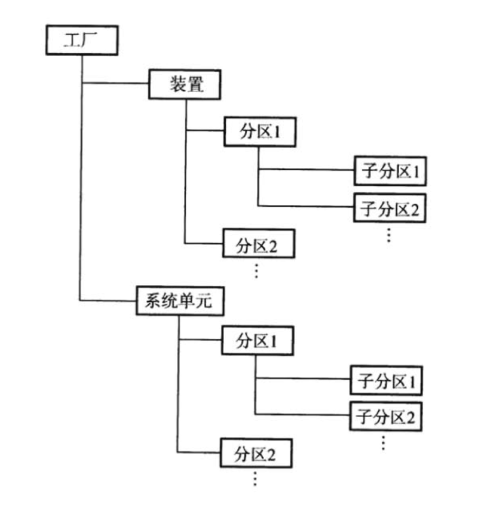
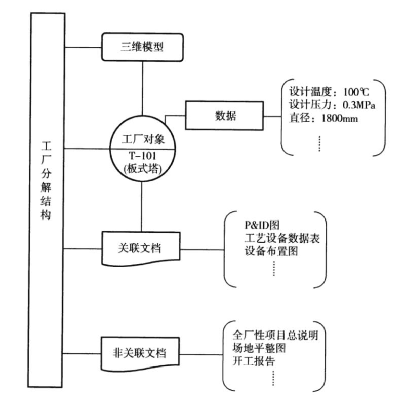
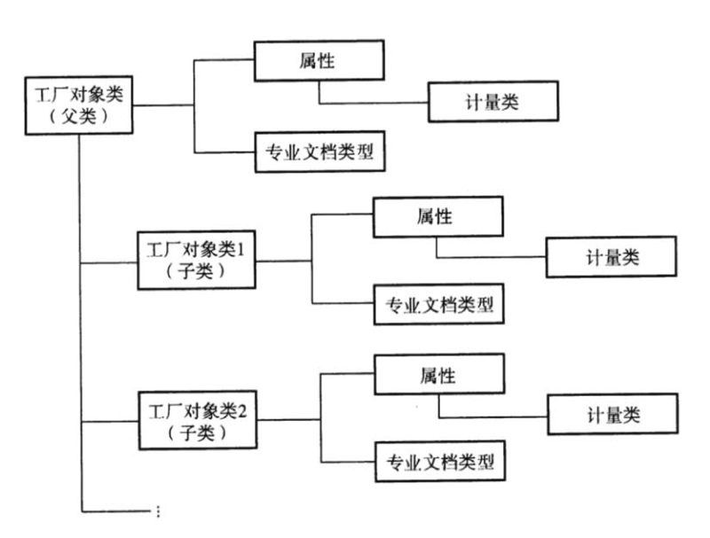
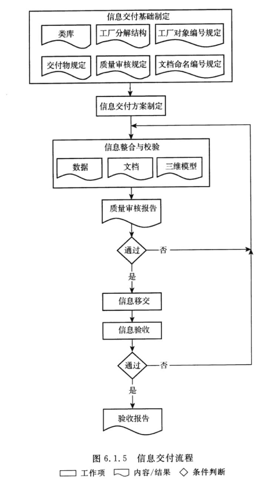

## 01. 总则

1.0.1 为石油化工数字化工厂和智能工厂建设提供基础，规范工程建设数字化交付工作，制定本标准。

1.0.2 本标准适用于石油化工工程项目设计、采购、施工直至工程中间交接阶段的数字化交付。

1.0.3 石油化工工程数字化交付应遵循现行国家及行业保密规定。

1.0.4 石油化工工程数字化交付除应符合本标准外，尚应符合国家现行有关标准的规定。

## 02. 术语

### 2.0.1 数字化 digitalization

应用信息技术，将工程设计、采购、施工等信息转变为结构化数据和非结构化数据，建立数据组织模型，并运用计算机进行表达、传输和处理的过程。

### 2.0.2 数字化工厂 digital plant

由工程建设阶段产生的数字化静态信息、运行维护阶段产生的数字化动态信息、基于工厂对象的关联关系及信息管理平台构成的综合体。

### 2.0.3 数字化交付 digital delivery

以工厂对象为核心，对工程项目建设阶段产生的静态信息进行数字化创建直至移交的工作过程。涵盖信息交付策略制定、信息交付基础制定、信息交付方案制定、信息整合与校验、信息移交和信息验收。

### 2.0.4 工厂对象 plant object

构成石油化工工厂的设备、管道、仪表、电气和建（构）筑物等具有编号可独立识别的工程实体。

### 2.0.5 工厂对象类 plant object class

根据功能或结构等特征对工厂对象分类，同类别的工厂对象具有相同的属性定义。

### 2.0.6 工厂分解结构 plant breakdown structure

根据工艺流程或空间布置。按照一定的分类原则和编码体系进行组织，形成反映工厂对象的树状结构。

### 2.0.7 信息颗粒度 information granularity

反映工厂对象信息的详细程度，与信息使用要求、信息收集和处理能力及成本有关。

### 2.0.8 类库 class library

描述工厂对象的信息组织结构，包括工厂对象类、属性、计量类、专业文档类型及其关联关系。

### 2.0.9 电子文件 electronic file

在数字设备及环境中生成，以数码形式存储于磁带、磁盘、光盘等载体，依赖计算机等数字设备阅读、处理，并可在通信网络上传送的文件。

### 2.0.10 电子文档 electronic document

面向页面的文本与图像数据的集合及其特征属性的电子表现，可在纸上或者以光学微缩型文献的形式重现其内容，且无关键信息丟失。简称文档。

### 2.0.11 信息模型 information model

工程数字化交付过程中建立的以工厂对象为核心的数据、文档和三维模型及其关联关系的信息组织。

### 2.0.12 交付信息 delivery information

工程建设过程中产生的需要交付的设计信息、采购信息、施工信息等内容，包括信息模型和其他与工厂对象关联的信息。

### 2.0.13 交付物 deliverables

承载交付信息实现移交的电子文件。

### 2.0.14 交付平台 delivery platform

用于承载和管理数字化交付信息，可与多种工程软件集成并兼容多种文件格式的信息管理系统。

### 2.0.15 信息完整性 information integrity

交付信息涵盖工程建设过程中产生且用于运行维护的相关内容，包括设计信息、采购信息和施工信息，简称完整性。

### 2.0.16 信息准确性 information accuracy

工厂对象属性的值及计量单位准确，文档内容正确，以及各种。关联关系正确。简称准确性。

### 2.0.17 信息一致性 information consistence

交付信息在特定的工厂或装置中具有唯一性，与实体工厂信息一致，简称一致性。

### 2.0.18 交付方 delivery party

移交工程数字化交付信息的责任主体。

### 2.0.19 接收方 receiving party

接收工程数字化交付信息的责任主体。

### 2.0.20 关联文档 associated document

直接反映工厂对象典型特征，并与工厂对象编号建立关系的交付文档。

## 03. 基本规定

3.0.1 工程数字化交付工作宜与工程建设同步进行。

3.0.2 交付信息应满足完整性、准确性和一致性的质量要求，其内容应与交工资料所对应的部分一致。

3.0.3 交付信息应设置交付级别，并应符合表 3.0.3 的规定。

表 3.0.3 付级别

| 信息等级 | 描述 | 代码 |
| --- | --- | --- |
| 必要信息 | 工厂运行维护需要的关键信息 | ESS |
| 可选信息 | 工厂运行维护需要的一般信息 | OPT |

3.0.4 交付信息宜采用数字化交付平台组织与存储。

3.0.5 交付信息应作为整体知识产权进行保护。

3.0.6 接收方应提供数字化交付策略和交付基础，协调和管理工程数字化交付工作，验收交付方所移交的交付信息。

3.0.7 交付方应按照交付基础的要求收集、整合交付信息，并应按交付物规定移交。

## 04. 交付基础

### 4.1 一般规定

4.1.1 交付基础应依据项目的信息交付策略制定。

4.1.2 交付基础应包括工厂分解结构、类库、工厂对象编号规定文档命名和编号规定、交付物规定及质量审核规定等内容。

### 4.2 工厂分解结构

4.2.1 工厂分解结构宜根据工艺流程和 / 或空间布置划分，工厂分解结构可按图 4.2.1 进行划分。

图 4.2.1 工厂分解结构

4.2.2 工厂对象和文档应与工厂分解结构建立关联关系，关联关系可按图 4.2.2 建立。

图 4.2.2 工厂对象和文档与工厂分解结构关联关系

4.2.3 工厂分解结构及其与工厂对象和文档关联关系的数据结构可依据本标准附录 A 建立。

### 4.3 类库

4.3.1 类库应包括工厂对象类、属性、计量类、专业文档类型等信息及其关联关系，类库逻辑结构及层级关系可按图 4.3.1 建立。

图 4.3.1 类库逻辑结构及层级关系

4.3.2 类库的建立应结构合理、层次清晰、内容完整和支持扩展，并应符合下列规定：

1、工厂对象类应有继承关系。

2、工厂对象类、属性、计量类、专业文档类型的名称应唯易识别、无歧义。

3、类库设计应支持信息校验。

4.3.3 工厂对象类宜根据工厂对象功能或结构等分类，可分级建立。

4.3.4 属性应包括工厂对象类具有的典型特征，宜分组管理并设置交付级别。

4.3.5 计量类应包括所有属性涉及的计量单位分类。

4.3.6 专业文档类型应由专业和文档类别共同确定。

4.3.7 工厂对象类应与属性、专业文档类型建立关联关系，属性应与计量类建立关联关系。

4.3.8 类库可依据本标准附录 B 的数据结构建立，典型的工厂对象类及属性可见本标准附录 C。

### 4.4 工厂对象编号规定

4.4.1 工厂对象编号规定中应明确工厂对象的编号规则，满足快速检索和定位的要求。

4.4.2 工厂对象编号应唯一，满足快速检索和定位的要求。

### 4.5 文档命名和编号规定

文档命名和编号规定中应制定交付文档的命名和编号规则。

4.5.2 文档编号应唯一。

4.5.3 文档名称和编号应满足快速检索和定位的要求。

4.5.4 文档名称宜包含字母、数字、`_` 或 `-` 字符，不应使用特殊字符。

### 4.6 交付物规定

4.6.1 交付物规定中应明确数据的信息颗粒度及交付格式。

4.6.2 交付物规定中应明确文档交付清单内容及其具体要求，包括标题、版本、发布原因等。

4.6.3 交付物规定中应明确电子文件的具体要求，包括文件名称和格式等。

4.6.4 交付物规定中应明确电子文件大小的上限。

4.6.5 交付物规定中应明确三维模型的交付格式。

### 4.7 质量审核规定

4.7.1 质量审核规定中应制定数据、文档和三维模型的完整性准确性和一致性的审核规则。

4.7.2 质量审核规定中应依据审核规编制质量审核报告模板。

## 05. 交付内容与形式

### 5.1 一般规定

5.1.1 交付内容应包括数据、文档和三维模型。

5.1.2 工厂对象与数据、工厂对象与文档、工厂对象与三维模型等不同信息之间应建立关联关系。

5.1.3 数据、文档和三维模型的交付物清单应符合本标准第 4.6 节的规定。

5.1.4 交付内容宜包括信息来源、交付级别、专业类别和文档类别等信息。信息来源宜符合表 5.1.4-1 的要求，交付级别宜符合本标准表 3.0.3 的要求，文档类别宜符合表 5.1.4-2 的要求。

表 5.1.4-1 信息来源

表 5.1.4-2 文档类别

### 5.2 数据

5.2.1 交付的数据宜包括工厂对象属性的值和计量单位等信息。

5.2.2 交付的数据应按类库的要求组织。

5.2.3 工厂对象的数据内容宜涵盖设计、采购、施工等阶段的基本信息。

### 5.3 文档

5.3.1 交付文档的内容应与原版文档一致，并应符合下列规定：

1、当原版文档为纸质文档时，应扫描为电子文件。

2、当原版文档包含不止一种文件格式时，应转换为统一格式的电子文件。

5.3.2 每个文档应包含至少ー个有效的电子文件，电子文件应符合下列规定：

1、电子文件不应包含任何指向其他文档的链接。

2、电子文件中不应内嵌其他格式的文件。

3、电子文件不应包含影响读取的密码保护。

4、电子文件中的图片应满足可接受的打印分辨率及最小尺寸要求。

5、电子文件应采用交付平台支持的格式。

6、电子文件本身及其索引和附件应为一个文件包。

7、仅关联单个工厂对象的文档宜以独立的电子文件或电子文件集合提交。

8、电子文件应安全可靠，不含计算机病毒及木马程序。 

5.3.3 交付的文档质量应符合下列规定：

1、文档编号与命名应符合项目文档编号及命名规则。

2、文档编号应与文档目录中对应的文档编号一致。

3、文档应采用项目文档模板生成。

5.3.4 典型的文档交付内容宜包含本标准附录 D 所示的内容。

### 5.4 三维模型

5.4.1 交付的三维模型应符合信息交付方案中约定的交付范围和内容深度的要求。

5.4.2 交付的三维模型信息应与其他交付的数据、文档中的信息一致。

5.4.3 交付的三维模型应能在交付平台中正确地读取和显示。

5.4.4 交付的三维模型应使用统一的坐标系和坐标原点。

5.4.5 交付的三维模型宜包含可视化碰撞空。

5.4.6 交付的三维模型不应包含临时信息、测试信息以及与交付无关的信息。

### 5.5 交付形式

5.5.1 数字化交付宜采用交付平台移交形式，也可采用信息模型移交形式。

5.5.2 交付平台移交形式应符合平台信息组织方式的要求。

5.5.3 信息模型移交形式应符合信息交付方案约定的信息模型组织规则。

## 06. 交付过程

### 6.1 信息交付策略制定

6.1.1 信息交付策略应确定信息交付的目标及参与方的组织机构、工作范围和职责。

6.1.2 信息交付策略应明确信息交付遵循的法律法规及标准。

6.1.3 信息交付策略应明确交付信息的组织方式、存储方式和交付形式等。

6.1.4 信息交付策略应明确信息交付验收标准。

6.1.5 信息交付策略应包含信息交付流程，信息交付流程宜按图 6.1.5 的工作程序进行。

6.1.6 信息交付策略应包含质量管理方案。

### 6.2 信息交付基础制定

6.2.1 项目招标前应制定信息交付基础，内容应符合本标准第 4 章的规定。

6.2.2 信息交付基础宜适应当前行业信息化水平，具有可操作性。

### 6.3 信息交付方案制定

6.3.1 信息交付方案应依据信息交付策略和交付基础细化相关内容，应包括下列内容：

1、信息交付的目标。

2、组织机构、工作范围和职责。

3、遵循的标准。

4、采用的信息系统。

5、交付内容、组织方式、存储方式和交付形式。

6、信息交付的进度计划。

7、信息交付的工作流程。

6.3.2 信息交付方案应获得建设单位批准后方可实施。

### 6.4 信息整合与校验

6.4.1 信息整合阶段应将相关方的数据、文档及三维模型等信息按照信息模型组织规则和信息交付方案收集、整理、转换并建立关联关系。

6.4.2 信息整合阶段应根据质量审核规则进行信息校验。

6.4.3 信息整合与校验应在信息交付前完成，并应按照本标准第 4.7 节的要求形成质量审核报告。

### 6.5 信息移交

6.5.1 信息移交应按照信息交付方案约定的交付形式及进度计划执行。

6.5.2 信息移交时应提供交付信息的电子文件移交清单，移交清单应包括文件名称、格式、描述、修改日期和版本等。

### 6.6 信息验收

6.6.1 交付信息验收应按数据、文档和三维模型的交付物清单执行。

6.6.2 交付信息验收应依据信息交付基础验证交付信息的完整性、准确性和一致性。

6.6.3 交付信息验收应包括下列内容：

1、工厂对象无缺失、分类正确。

2、工厂对象编号满足规定。

3、工厂对象属性完整，必要信息无缺失。

4、属性计量单位正确，属性值的数据类型正确。

5、文档无缺失。

6、文档命名和编号满足规定。

7、工厂对象与工厂分解结构之间、工厂对象与文档之间的关联关系正确。

8、数据、文档和三维模型符合交付物规定。

6.6.4 交付信息验收后应形成验收报告。

## 07. 交付平台

### 7.1 功能要求

7.1.1 交付平台应具备依据交付基础的类库、编号规则、工厂分解结构等进行配置的功能。

7.1.2 交付平台应支持常用格式的数据、文档和三维模型。

7.1.3 交付平台应具备建立和管理数据、文档和三维模型之间关联关系的功能。

7.1.4 交付平台应支持校验规则的配置，具备依据交付基础进行信息校验并生成校验报告的功能。

7.1.5 交付平台应具备对工厂对象进行关联查询的功能。

7.1.6 交付平台应具备三维可视化工厂信息的浏览、综合查询检索和测量的功能。

7.1.7 交付平台应具备多视图展示的功能，并支持多种信息组织方式。

7.1.8 交付平台应具有报表功能。

7.1.9 交付平台宜具备对项目相关方的知识产权保护的功能。

7.1.10 交付平台应具备权限分级管理等系统安全功能。

### 7.2 开放性要求

7.2.1 交付平台应具有开放的标准接口和成熟的对外服务引擎。

7.2.2 交付平台应兼容主流的工程设计软件和项目管理软件，可接收不同系统的数据、文档和三维模型。

7.2.3 交付平台宜能够与生产运行维护系统集成。