## 07 夹套管设计 

### 7.1 夹套管系统

夹套管系统的典型示意图见图 7.1。

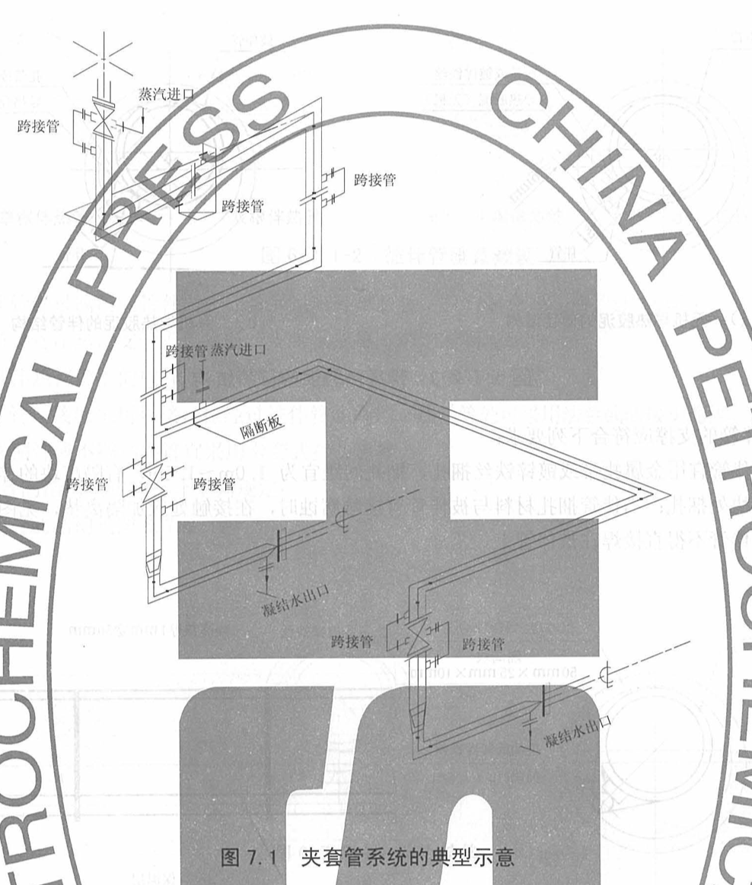

### 7.2 夹套管的组合尽寸及结构

721 除色想外・夹套管的组合尽す按表 72 的規定确定。

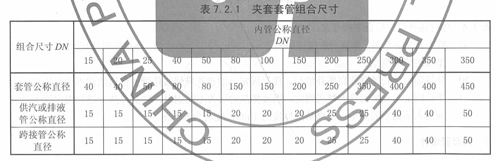

7.2.2 内管与套管的连接型式分为内管焊缝隐蔽型（全夹套）和内管焊缝外露型（半夹 a）法兰式夹套管用于内管焊缝隐蔽型时，其连接型式见图 7.2.2-1~图 7,22い)

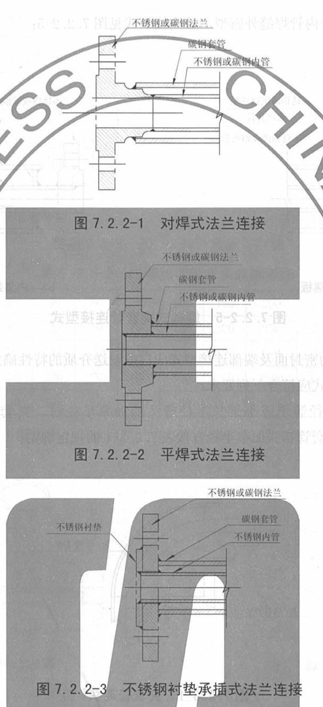

B）管相管用于内管焊外露型，其连接型式见图 7.2.2-4

C）端板式夹套管用于内管焊缝外露型，其连接型式见图 7.2.2-5

D）夹套管专用法兰的密封面及端部连接型式应根据输送介质的特性确定。7.2.3 夹套管管件结构形式应符合下列要求

a）内管弯头曲率半径等于或小于长半径弯头的曲率半径时，夹套管弯头的结构型式见图

7.2.3-1。内管和套管弯头曲率半径宜按表 7.2.3-1 的规定确定；

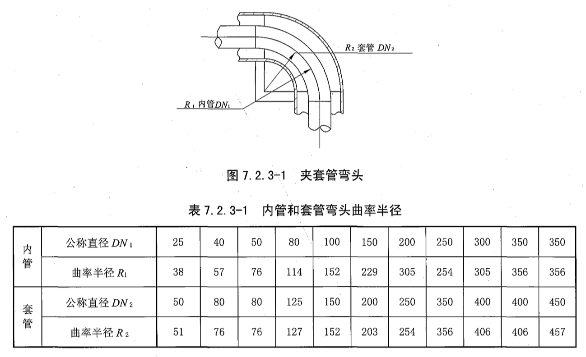

B）内管弯头曲率半径等于或大于 3 DN 时，套管弯头应采用剖切型。套管弯头的曲率半径宜与内

管的曲率半径相等，见图 7.2.3-2。曲率半径 R 宜按表 7.2.3-2 的规定确定；

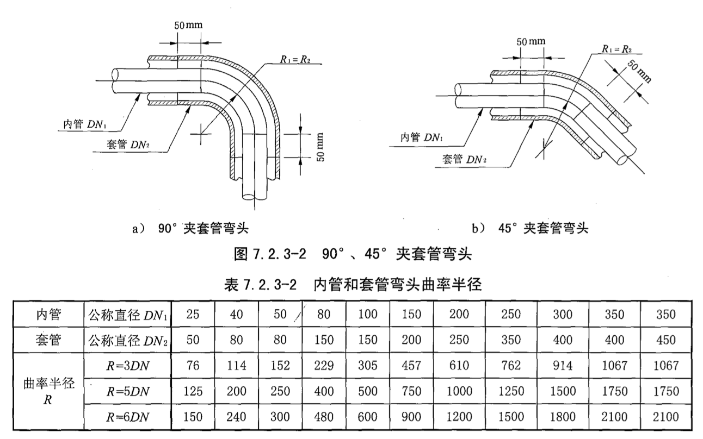

套管的三通应采用剖切型，型式有横切和纵切两种，见图 7.2.3-3; 型式的选用应根据实际安装情况确定；

D）夹套管变径时，应选用标准的异径管。内管的异径管与套管的异径管的大口端端部应错开布

置，相距距离不应小于 50 mm，其连接型式见图 7.2.3-4;

E）夹套管内管的仪表管口、管顶放空口及管底排液口的连接型式见图 7.2.3-5 或图 7.2.3-6。

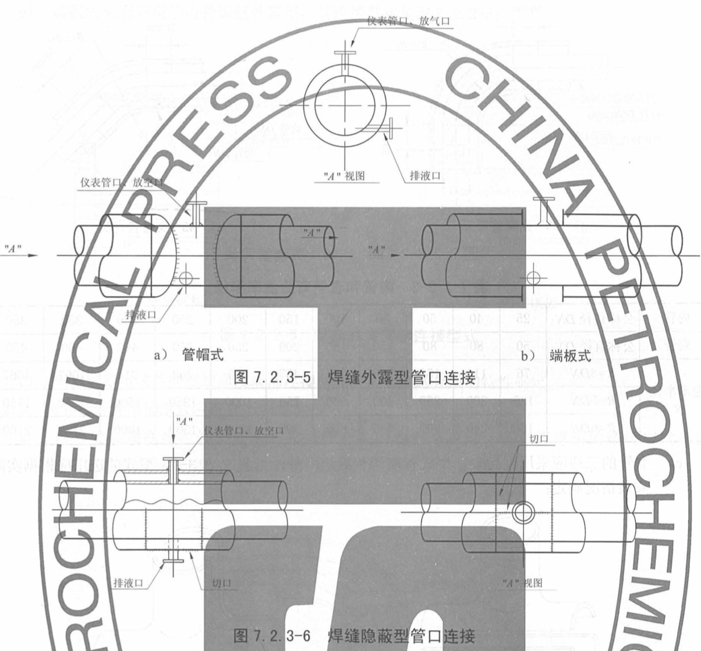

7.2.4 管内应采用定位板定位，定位板的安装方位不应影响内管的热位移，定板的布た见图

7.2.4。定位板间距宣按表 7,.2.4 的规定取值

### 7.3 套管伴热长度

哈非另有树定外，夹套管蒸汽引入口至凝结水排出口的距离（即套管伴热长）7.3 的规定确走

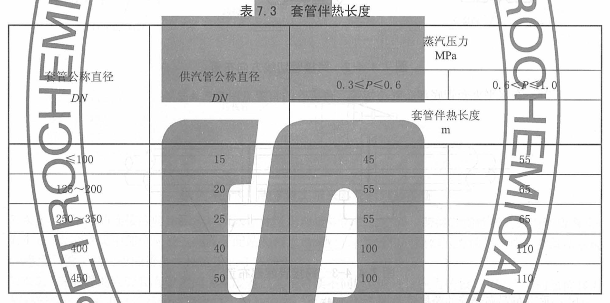

### 7.4 夹套債件热示统管道布置

7.4.1 夹管水平敷设要求有坡度时，套管内介质流向应与坡度一致

7.4.2 蒸汽成由美管上部引入，凝结水由套管下部排出，供汽管和凝结水管应分別没切断阀：疏水阀后宜设置检查

7.4.3每节夹套管的长度取决于管道布置,并受内管与套管热膨形為的限制/每节夹套管的长度不 宜超过6m。夹套管的布置不应有死角或“U”形弯。当“U”形弯不可避兔时/宜在其低点处设排凝口。7.4.4 在规定长度范，夹套管之间的蒸汽管宜采用跨接管进行接，跨接管应采用法兰连接，各种跨接管的布置如

a）水平夹套管的跨接管有下面三种方式，可根据具体情沅选择

1) 蒸汽上进下出垂直方向跨接，跨接管的布置见图 7.4.4-1, 跨接管低点是否设排液口，

可酌情确定

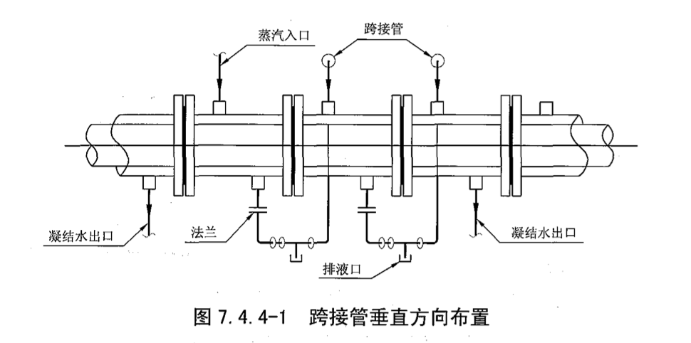

2) 在水平夹套管底部切线方向布置跨接管，跨接管的布置见图 7.4.4-2

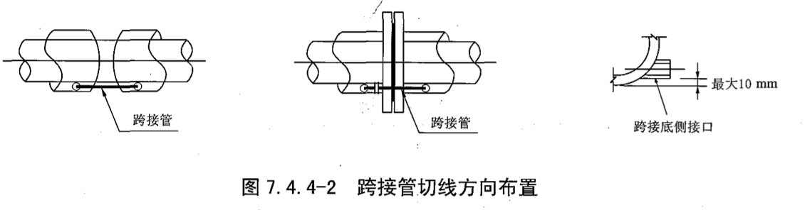

3) 在水平夹套管底部布置跨接管，跨接管的布置见图 7.7.4-3。

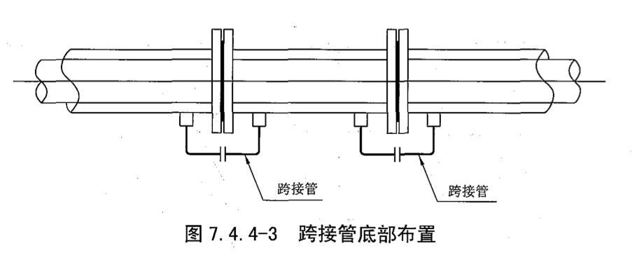

B）垂直布置夹套管的跨接管见图 7.4.4-4;

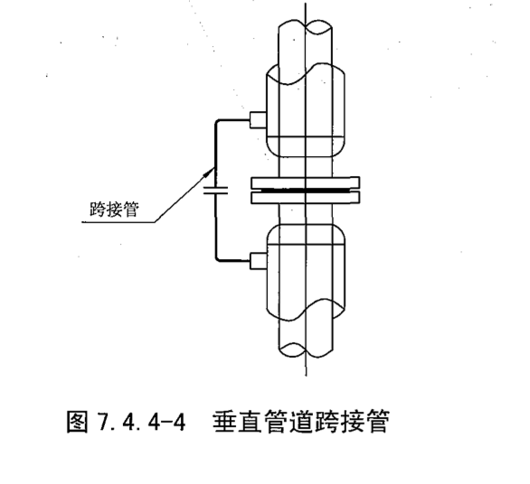

C）夹套阀门的跨接管见图 7.4.4-5 和图 7.4.4-6。

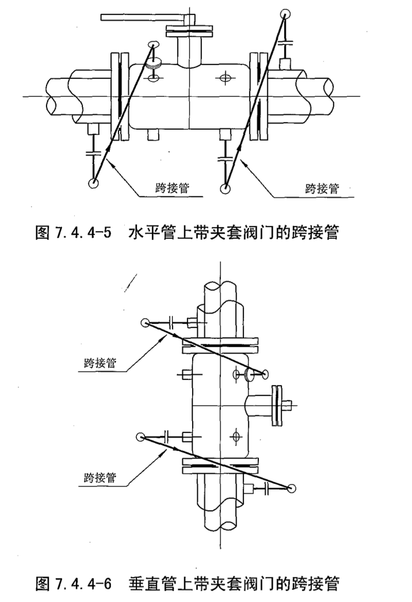

7.4.5 跨接管的连接应防止积液和堵塞，并考虑跨接管的安装空间。跨接管拐弯处宜采用煨弯弯头。7.4.6 夹套管集中部位应设置蒸汽分配站和疏水站，也可与邻近相同操作压力的蒸汽伴管和凝结水统考虑。设置的要求应符合本规范第 6.5 节的规定。

7.4.7 夹套管的内管和套管之间的温度差过大或材质不同时，应进行应力校核。内管产生的热位移需 要补偿时,宜采用自然补偿或设“I”型补偿器。夹套管的管道柔性计算应符合SH/T3041的规定。

## 08 疏水阀的型式和选用

### 8.1 疏水阀的型式

疏水阀的基本型式有热静力型、机械型和热动力型 。

### 8.2 蒸汽疏水阀的选用

伴热用蒸汽疏水阀的选用应符合下列规定：

a）疏水阀的热水排量应大于计算出的伴热用最大蒸汽耗量；

b）蒸汽伴管用的疏水阀可用热静力型或热动力型；

蒸汽夹套管的疏水阀宜选用热动力型

疏水阀宜选用内置过滤网型式，否则应在疏水阀前设置 Y 型过滤器

e）若选用热动力型疏水阀时，冷凝水管道的背压不应超过上游压力的 80%

F）冷凝水就地排放的伴热管道，宜选用定温排放的热静力型疏水阀；g）伴热用疏水阀宜选用焊接或法兰连接

h）疏水阀宜选用可在任意方向安装的型式，以便于现场安装

疏水阀宜内置止回阀或者具备出回功能，否则宜在疏水间后加止回阅。

## 09 安装要求

9.1 伴热系统管道的安装

9.1.1 蒸汽伴管和热水件管的安装应符合下列要求：

a）蒸汽伴管利热水作管的安装应符合本规范第 6 章的规定

b）伴管句拆御的法兰、活接头及伴管补偿器应安装在保温层外侧，保温层上开缝尺寸不应影

响件补偿器的热变形

c）伴管改变方向时宜采用现场煨弯。

9.1.2 蒸洋分配利疏水站、热水分配站和热水回水站的安装应符合下列腰求：

A）汽或热水分配站引出的伴管上的阀门及进入疏水或热水回水站的伴管上间应便于操作：

伴管宜集中敷數设。集中數敷设的伴管管束不应妨碍阀门、设备、电气和仪表等的瑮作和维修，满足操作和维修所需的净空要求

c）集中敷设的伴管管束不应与无关的管道或设备一起保 d）伴耸管東的敷设应排列整齐，不宣互相跨越或就近斜穿

e）疏本站宜安装在最低的位置：疏水站的管底宣高出地面或平合 5 omm）「旅水内的安装位置应协调、整并，且便于维修、拆卸和更换：

g）蒸汽分配站和疏水站、热水分配站和热水回水站上备用接头应用管帽或法兰盖封 9.1.3 导热腋沱的安装应符合制造商的要求

9.1.4 汽分碑站和疏水站、热水分配站和热水回水站以及与其相连的伴管应标志，标本的容座符合设计文作的要求。标志应采用钢印，字迹应清晰：标志的标牌材料宣采用铝或不锈钢，企推在相应的伴管中。

9.1.5 伴管的施工质量验收应符合 GB50517 的有关规定 9.2 夹套管的安装

9.2.1 头套管的安装应符合下列要求

a）除夹套管的供汽管和琉水管外，夹套管的主体部分应预制

b）夹管面制时，应预留调整管段，管段的调节裕量宜为 50 mm~1 m，管段的接缝位

置应避开套管开口处

c）内管焊缝臆蔽型夹套管，在内管焊缝处的套管应留 150 mm 长的缺口，锈内管焊经 10%射

线检、试压分格后方可进行隐作业

d) 夹套管经剖切后安装时, 纵向焊缝应置于易检修部位

e)套管与内管间的间隙应均匀，并应按设计文件的要求焊接定位板/定位不得妨碍内管与套

管的热变形

9.2.2 夹套管的施工及验收应符合 SH (T3546 的有关规定
