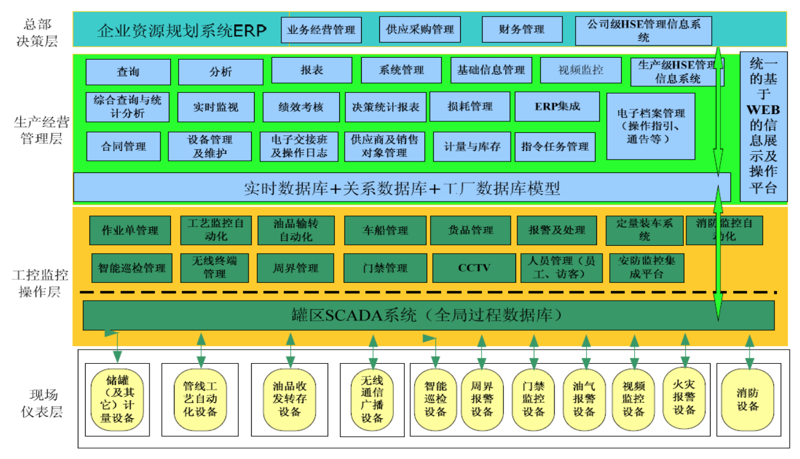
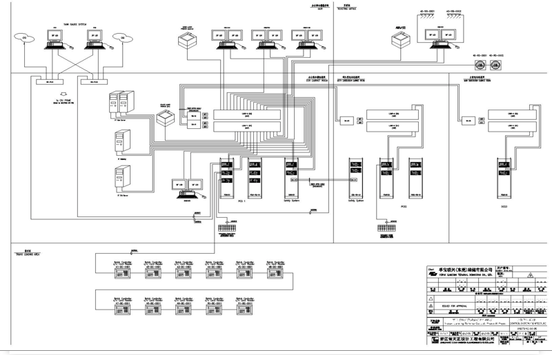
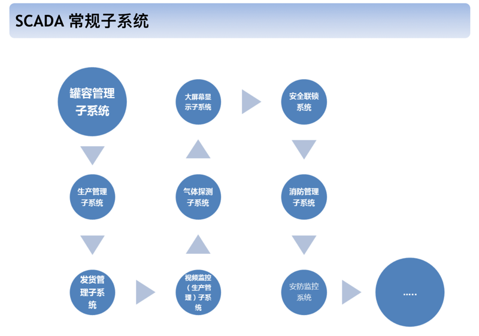
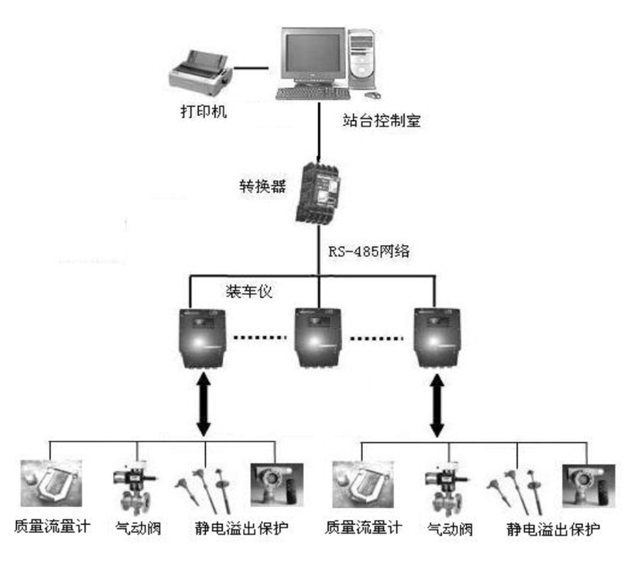
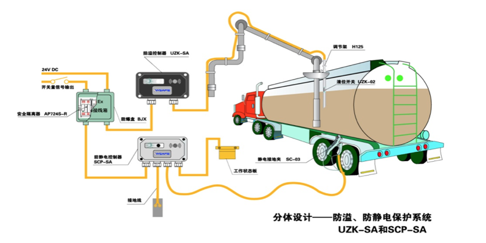
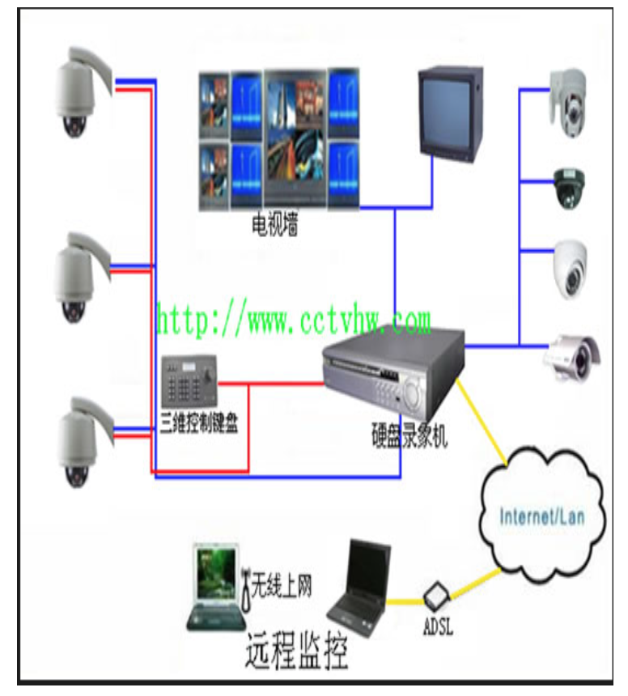

## 2019010. 罐区控制系统设计要点

### 记忆记录

2020-01-03

按目前的理解可以分解为 4 个模块：控制系统的作用；控制系统的构成；控制系统里各部分的功能；总体里涉及的控制系统部分。

### 01. 库区自动化系统的作用

1、提升效率确保高效的库区运作。库区的进销存数据和后端办公室的自动化系统无缝连接使得管理层在成本，时间和资源配置方面更有效率。

2、 降低物料损失。借助自动化系统建立更准确的计量体系，更严密的库存管理制度，减少物料的损失。

3、増进安全。设置自动化的安全监控设备，增加安全、联锁联动措施，提高安全管理水平。

4、全面安保。建立自动化系统确保所有事务被控制，监视和记录。

### 02. 库区控制系统构成

现阶段油库自动化系统总体架构一般分为四层，分别为现场仪表层、监控操作层、经营管理系统层（MES）以及企业总部层。

各层的作用及含义：

1、现场仪表层：主要完成信号的采集及传输，实现各种指令的动作及执行。

2、监控操作层：建立全局过程数据库，对现场仪表层送来的各种数据进行统一管理并根据不同的需求进行整合，根据不同的生产操作需求建立相应的人机界面，方便操作员进行各项操作管理，一般由 SCADA 系统完成。

3、经营管理系统层，有时也称制造执行系统（MES）层。本层建立相应的实时数据库、关系数据库，并根据数据库模型进行相应的数据管理。通过设立不同的流程软件以及管理软件执行不同的管理功能，通过相应的管理软件生成相关的生产执行信息下传给监控操作层实现操作管理。

4、企业总部层是完全意义上的企业信息系统。就是企业的 ERP 系统，也是企业的一个综合管理平台。

### 03. 控制系统各部分功能

#### 3.1 罐区管理系统设计概况

在管理系统架构中企业 ERP 层由信息部门负责，经营管理系统层有些单位是自控专业在负责，有些单位是信息部门负责，现场监控层和现场仪表层一般由自控专业完成。

我公司常规的设计中，一般负责现场仪表层以及现场监控层的设计，经营管理系统层（MES）与生产组织、调度管理要求息息相关，我们无法提出需求，一般不在设计中考虑。

现场监控层一般设置实时数据库组成 SCADA 系统，形成统一监控平台。可根据不同的应用需求划分为不同的子系统，库区建设过程中可根据实际情况选配相应子系统，达到不同的应用目的。

#### 3.2 罐容管理子系統

3.2.1 概况

罐容测量子系统一般在对罐容有计量管理要求的库区设置，罐容管理无要求的库区储罐参数直接送入生产管理子系统。

主要监控储罐的液位、温度、密度、体积、质量及储罐状态等参数系统能够迅速提供以上参数的换算，能够迅速提供各类报表。一般由现场设置的储罐液位计、温度计、高精度差压变送器和控制室内设置的罐容计算管理软件组成。

3.2.2 液位

1、伺服液位计：浮子平衡力方式测量，浮子与介质接触。要求测量介质清洁、粘度低、腐蚀性小，满足条件时可首先考虑选择，典型的应用成品油（汽柴油）的存储罐。安装方式为顶部插入，导波管保护。比其它液位计额外增加的功能是能够实施测量密度以及油水界面。

2、雷达液位计：电磁波反射方式测量，非接触式。一般要求介质介电常数大于 2.0 以上，并且没有大量泡沫，典型应用如原油、化工品罐。安装方式为顶部安装，浮顶罐内设置导波管测量，拱顶管可不设导波管。

3、磁致伸缩液位计：浮子磁性耦合加机械波方式测量，接触式。介质要求同伺服液位计，典型的应用为成品油罐。安装为顶部导向管插入。此类液位计是 90 年度末新应用，后来由于应用中出现一些故障，现在基本停用。

 3.2.3 温度

1、多点温度测量：地上常压罐一般选用多点温度计，顶部插入安装，要求测量元件安装位置离罐壁 1 米以上，下部第一点元件离罐底 1 米，最大每隔 3m设置一个测量点，根据 GB/T21451.4 规定 9 米及以下罐高至少设 4 个测量点，大于 9 米小于等于 15 米罐高至少设 5 个测量点，大于 15 米储罐至少设 6 个测量点。

2、单点温度测量：能够保证温度均匀不分层，最大竖向温度变化小于 1 度的储罐、容积小于 159 立方米或者液位小于 3 米的储罐可设置单点温度测量。测量点设置在离罐底 1 米以上并且离罐壁 1 米以上部位，一般采用侧面插入。

3.2.4 压力

一般选用高精度差压变送器，法兰式连接，通常为 DN50 法兰。

#### 3.3 生产管理子系统

一般由 DCS 或 PLC 及现场仪表构成，主要功能是管理库区内管道上的设备以及储罐上除罐容测量系统以外的设备，如管线阀门、输送泵、管线压力、管线温度、管线流量、管线密度以及储罐萢位开关等。这个系统主要是生产执行流程管理，相当于我们平时装置的控制系统设计，要求及选型与平时设计类同，这里不作详述。

#### 3.4 发货管理子系统

一般采用定量装车仪组成集散式装车管理系统，也有一些地方采用集中式装车管理系统。主要区别是是否使用定量装车仪，集散式定量装车系统采用定量装车仪，装车控制功能由安装在现场的定量装车仪完成；集中式装车管理系统现场没有定量装车仪，现场只设有人机界面，装车的控制功能由集中的控制系统完成。

发车数据管理系统：一般配置数据服务器、开票管理操作站、打印机及 IC 卡读写器，配置数量根据发货频度确定。系统主要完成装车操作控制流程生成及下装、发货记录浏览统计功能、各种数据的统计査询功能以及与 SCADA 系统对接等功能。

定量装车仪：装车控制的大脑，实现所管理装车区域内的装车具体实现。装车仪可以控制单支鹤管，也可以控制多支鹤管，选型时根据鹤管数量计算输入输出点数后选择相应装车仪。

流量计：定量装车一般需要做到贸易结算要求，通常流量计精度要求优于 0.2%。流量计类型一般选择容积式流量计（椭圆齿轮、双转子或刮板），费用允许时优先考虑质量流量计。质量流量计相比容积式流量计优点是测量稳定、维修维护工作量小，不需要温度补偿，更换品种适应性强；缺点是质量流量计相对压损较大，在装车泵的选择时需要考虑流量计压损 50 kPa 左右。

控制阀：决定装车过程的安全稳定性，与流量计一起是装车系统中的关键设备。现阶段装车控制阀一般有两种类型——数控阀（电液阀）和多段式气动阀（一般为两段）。电液阀动作采用管线动力，不需要额外的动力源，最早源于国外应用，最近 10 年国内出现很多仿制品牌，但高端应用仍旧被国外品牌垄断。在清洁、无腐蚀性的常温液体介质装车中适用，典型应用于成品油装车。气动二段阀利用压缩空气作为气源，适用所有介质。

静电溢油：用作静电火灾的防护以及槽车满溢的保护。静电接地保护系统用作有火灾危险介质灌装的等电位接地，在接地与槽车脱开时输出联锁信号停止灌装。槽车溢满保护系统其实是一个高液位开关，安装于上裝鹤管上，与鹤管一起插入槽罐车，当槽罐车液位达到液位开关处送出联锁信号停止灌裝。

其它说明：

1、当装车系统采用体积流量计，为减少温度变化产生的误差可在管道上设置温度变送器进行实时温度补偿。

2、下装型装车现在越来越多，与上装型不同之处主要在静电溢油报警器的设置上有不同，下装系统一般高液位开关预装在槽罐车上，静电与溢油保护功能采用一个插头与槽罐车相连实现。

#### 3.5 视频监控（生产管理）子系统

从两方面来考虑系统设置，一方面为生产管理服务的监控系统，主要监视生产工作面；另外一块为安保服务的监控系统，主要监控出入口、道路以及安全保卫需要的场合。两套系统一般共用后台系统，只是在监控画面的应用上不同岗位有不同的侧重。作为生产管理的监控系统现场摄像机的点位主要在储罐区罐组、泵房、集中阀区、物料装卸区以及消防设施等地方为主。安保监控系统以出入口、道路以及边界为主。

#### 3.6 大屏幕显示子系统

一般小型库区工艺流程相对简单，视频监控点位不多利用操作站监控能够满足要求，可以不考虑大屏幕系统；对于罐组多、管道交换多、工艺流程相对较长的罐区，一般应考虑设置大屏幕显示系统，用作操作人员直观地观察整个罐区的工艺流程，储罐、管线、机泵等设备的串联情况及运行状态及诸罐的工艺参数。也可以分割为多屏来显示多个监控点的视频。

#### 3.7 气体探测子系统

对于甲乙类罐区应根据 GB50493 的要求设置可燃及有毒气体检测报警系统。建议报警系统独立设置，在受条件限制时也可借助生产管理子系统设置，但应遵循相对独立的原则。

#### 3.8 安全联锁系统

根据安监 40 号文的要求，对于属于一二级重大危险源且涉及毒性气体、液化气体及剧毒液体的库区应配备独立的安全仪表系统，因此属于以上条文范围内的库区应设置安全联锁系统（SIS），作为生产管理系统后的又一层保护。

#### 3.9 其它

1、库区生产监控系统除了以上一些外，根据不同需要可以有不同的管理子系统，例如收发货管理的一卡通系统、油品移动监管系统、管道收发子系统等等。

2、库区管理系统可有全部子系统构成也可由少量子系统构成，甚至可以自由一个子系统，应根据管理实际需求可有选择地配置各子系统。

3、另外消防管理系统、安防管理子系统我们公司有电信或电气专业完成，未在此做介绍，必要时可请相关人员介绍

### 04. 总体规划中涉及控制的内容

控制系统总体框架：规刘好鑵区的生产监控系统、安防系统、消防系统的大致配置要求、互相间的关系。

控制室的设置：库区一般设置中心控制室一处，生产监控系统、安防系统以及一些上层系统的服务器一般布置在中心控制室，小型库区（1-2 个罐组考虑 40-50 平方米面积、每增加一个罐组增加 10 平方米左右考虑，如果系统功能复杂适当增加一些面积。

现场机柜间的设置：受信号输送距离限制，一般要求控制室（机柜间）到最远罐离的距离小于 500 米，若无法满足时应在适当位置设置现场机柜间。机柜间的面积一般最小按照 25-30 平方米考虑，每增加一个罐组増加 5 平方米左右。