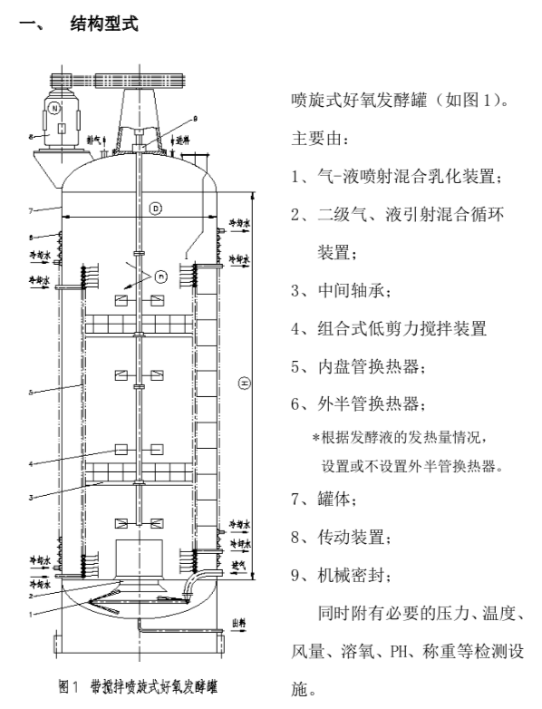
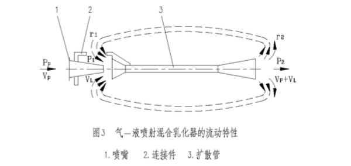
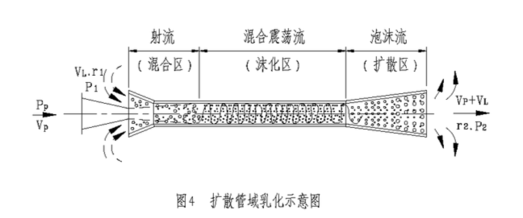
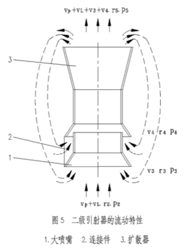
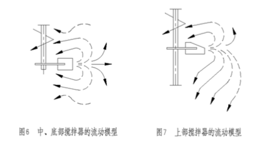
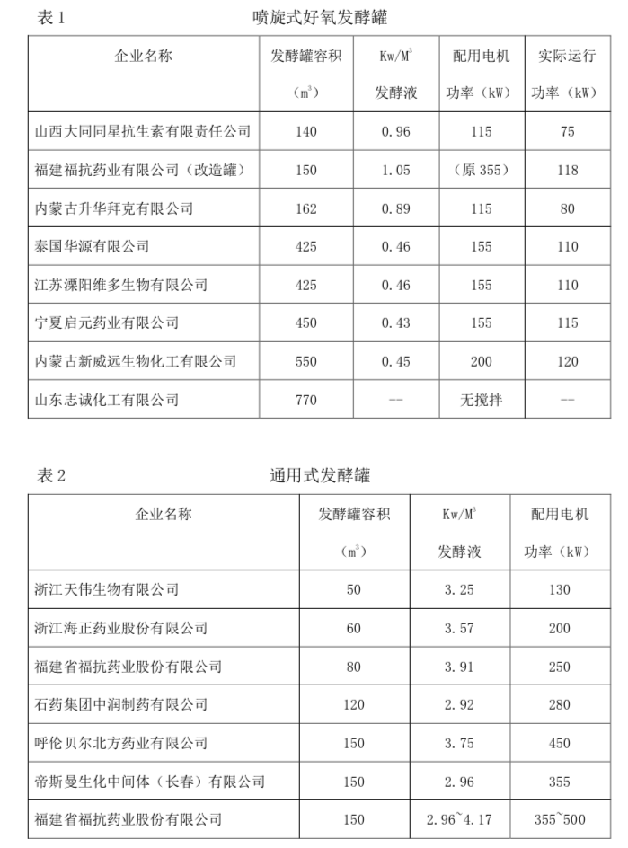
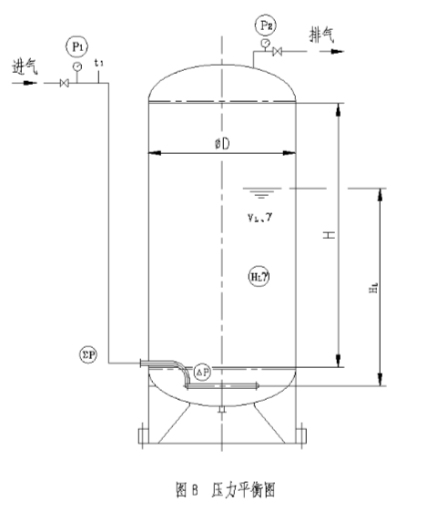

# 2018005. 喷旋式好氧发酵罐专利技术及其应用

## 记忆时间

2019-11-06

## 概述

发酵罐是发酵工业生产中的关键生化反应设备，面广量大。自 1985 年以来，天正设计先后在制药、农药、食品和轻化工生物发酵领域，相继开发成功新型高效节能（1987年）、射流式（1989年）、喷环式（1995年）和喷旋式（2002年）四类新型好氧发酵罐，并分别于 1988 年、1990 年、1996 年和 2011 年通过省级鉴定。

该技术已获得一项国家发明专利（87101299.5）和多项实用新型专利 （87216445.4、ZL200520013575.3、
ZL201220287960.7），同时荣获国家级新产品证书和多项省部级科技进步奖，列为国家科技成果重点推广项目和「八五」国家重点新技术推广项目。

该项成果已在国内外 100 余家制药、农药、食品和轻化工生产企业的 10～770m3 发酵罐上推广应用，生产应用表明：使用新型好氧发酵罐或改造传统发酵罐都可以实现大幅度降低能耗并提高发酵生产水平，取得增产、节能、降耗等多重效果，给生产企业带来很大的经济效益和社会效益，它是一项造价低、见效快、效益高、投资回收期短的实用技术。

## 01. 带搅拌喷旋式好氧发酵罐

主要由：

1、气-液喷射混合乳化装置；

2、二级气、液引射混合循环装置；

3、中间轴承；

4、组合式低剪力搅拌装置；

5、内盘管换热器；

6、外半管换热器；

根据发酵液的发热量情况，设置或不设置外半管换热器。

7、罐体；

8、传动装置；

9、机械密封；

同时附有必要的压力、温度、风量、溶氧、PH、称重等检测设施。

## 02. 技术特点

喷旋式好氧发酵罐采用气-液喷射混合乳化和二级气、液引射混合循环的专利技术，不但突破了传统的通用式发酵罐鼓泡传质机理与设计技术，而且解决了发酵罐深层的溶氧问题，同时充分利用了压缩空气的释放能量和各装置的速度能、静压力能与重度差，通过能量与质量的传递转换实现反应动力与流体动力二者的完美结合，具有如下技术特点：

### 1. 容量传质系数高

深层设置的气-液喷射混合乳化装置「如图 2」是喷旋式好氧发酵罐的关键所在，而气-液喷射乳化器是该装置的核心，它的流动特性如图 3 所示。

图 2 气-液喷射混合乳化装置

在压缩空气 Pp、Vp 的连续喷射作用下，将重度为 r1 的发酵液 VL 吸入并随空气一并进入喷射乳化器扩散管。在扩散管喉部，气液二相由初步的混合发展成为激烈的混合震荡并产生气体动力沫化和压力沫化，其沫化结果，使发酵液和空气被粉碎成大量的微小粒群，造就气液间一个高度湍动、扩展且表面不断更新的乳化接触界面，如图 4 所示。

试验表明：气泡直径随着通气量 Vp 的增大或喷咀推动力（Pp-P1）的增加而减小，乳化程度加剧，气含率增大。该装置：不但解决了当今任何结构型式的通气装置其气泡直径随着通气量 VP 的增大或推动力（PP-P1）的增加而增大的技术难题，而且突破了传统的鼓泡传质机理。从容量传质系数 KLa 不难看出，随着气、液二相接触比表面积 a 的增大，容量传质系数提高。

生产实际测定表明，该项技术与鼓泡传质相比，不但容量传质系数 KLa 提高 30~50%，而且由于空气与发酵液是柔性混合体，不存在对发酵过程有害的剪切力，更有利于菌丝的生长。

气-液喷射混合乳化装置是由多层、多组切线布置的喷射乳化器组成，当压缩空气进入喷嘴后，气、液二相混合物必定会产生径向循环的喷射旋流运动，经测定，其自旋转速度可达 30～40r/min。

### 2. 氧利用率和气含率高

空气中的氧首先在深层设置的气-液喷射混合乳化装置中得到了充分利用。

底层设置的气、液引射混合循环装置中的二级引射器，其流动特性如图 5 所示。

从气-液喷射混合乳化装置喷旋出来压力为 P2、重度为 r2 的气液混合物（Vp+VL）全部进入大喷咀，在气液混合物的喷旋作用下，借助于气液混合物的重度差和静压力差，双级引射重度为 r3.r4、静压力为 P3 .P4 的发酵液 V3.V4，并一并进入扩散器再次实现气液混合物轴向混合循环的旋流运动，以增进气液二相的接触机遇，使空气中的氧在二级气、液引射混合循环装置获得二次利用。

随着全床蜂窝状球形小气泡群的上升与聚并所产生的气体膨胀功，加之导流筒式内盘管换热器上、下二层面气液混合物「发酵液」的重度差和静压力差，实现高气含率发酵液在内盘管换热器内、外侧的全循环「环流」运动，使空气中的氧得到再次利用。

不难看出，空气中氧的利用，喷旋式好氧发酵罐要比通用式发酵罐增加四次。

生产实践表明，喷旋式好氧发酵罐全床气含率远远高于通用式发酵罐。

### 3. 低搅拌功率和低罐压

喷旋式好氧发酵罐采用组合式低剪力机械搅拌装置。在罐内的中、底部采用气泡分散能力强、剪切力低的径向搅拌器，其流动模型如图 6 所示。该搅拌器能满足菌丝对氧的需求和发酵液的稳定以及对气泛的控制。上部采用低功率、强循环的轴向搅拌器，其流动模型如图 7 所示。该搅拌器能保证发酵液浓度与温度的均衡和代谢产物 CO2 的排出，在有利于菌丝生长的同时，有效地降低了搅拌功率。

从已实施容积在 140M3 以上喷旋式好氧发酵罐的生产实践表明：搅拌电机功率喷旋式好氧发酵罐「表 1」比通用式发酵罐「表 2」降低 50～70%。

由于传质机理的突破，喷旋式好氧罐的操作罐压一般比通用式发酵罐降低 30～50%，既有利于代谢产物 CO2 的排出、乳化程度的加剧和发酵液的循环，又降低了搅拌电机和空压机的运行功率。

### 4. 实消彻底无震动

喷旋式好氧发酵罐在实消操作中，灭菌蒸汽直接进入气-液喷射混合乳化装置，经汽、液二相能量、热量与质量的传递转换，不但获得了很好的传热效果，而且消除了对罐底的冲蚀和罐体、楼层的震动，同时灭菌彻底、染菌率降低，改善了操作环境，延长了设备的使用寿命。

### 5. 人性化设计

随着生物发酵工业的发展，生物发酵技术日趋成熟，发酵罐的大型化已经成为现实。大型喷旋式好氧发酵罐不但结构简洁、检修量少、利用率高，而且具有组装、检修、清罐、检查和人身安全等方面的人性化设计，给生产操作、维护管理带来更多的方便。

## 03. 应用领域

本成果已广泛应用于制药、农药、食品和轻化工等好氧发酵领域，它可在不影响正常生产的前提下短期内实现对传统的通用式发酵罐技术改造，又能在新建好氧类发酵罐上直接得以应用，至今已成功应用于下列发酵产品：

### 1. 制药

土霉素、洁霉素、四环素、麦迪霉素、庆大霉素、小诺霉素、青霉素、丁胺卡那霉素、红霉素、阿霉素、妥布霉素、霉菌氢化物、洛伐他汀、兽药盐霉素、霉酚酸等。

### 2. 农药

井冈霉素、阿维霉素、赤霉素、金核霉素、春雷霉素、浏阳霉素等。

### 3. 食品

柠檬酸、谷氨酸、衣康酸、糖化霉、苏氨酸、苯丙氨酸、那他霉素、酵母等。

### 4. 轻化工

碱性蛋白酶、甘油等。

## 04. 使用效果

推广应用的生产实践表明，喷旋式好氧发酵罐与传统的通用式发酵罐相比，在不增加原材料、压缩空气用量，不改变现有发酵生产工艺、菌种和不降低同期生产水平「指各项生产指标」的条件下，达到下列效果：

1、溶氧系数提高 30～50%。

2、增产 5～20%。

3、节能 50～70%。

4、发酵指数或转化率提高 5～10%。

5、设备造价降低 10～15%。

6、投资回收期：传统发酵罐改造需 3～6 个月；新型发酵罐制造需 1～1.5 年。

附 10 m3、162 m3、550m3 喷旋式好氧发酵罐效益证明。

## 05. 适用范围

本专利技术适用下列发酵生产工艺：

1、发酵罐容积­：10m3~1000m3「容积愈大、效益愈好」。

2、气、液比值「通风比」λ≥0.10 Nm3/m3·min。

3、进罐空气压力 P1「阀后」应为发酵液液柱静压力 HLγ、排气压力「罐压」P2、阀后管线与喷咀阻力降 ∑P、乳化推动力 △P之和「如图 8」。  

	P1=HLγ+P2+∑P+△P

一般 ∑P =0.01~0.015 Mpa

△P=0.005~0.01 Mpa

4、排气压力「罐压」P2≥0.015 Mpa

5、培养基为各类淀粉、淀粉液化液、液糖等。

6、适用于各种不同的好氧菌种、总糖、固液比、料液粘度与重度、培养时间与温度等。

7、适用于培养基实消或连消生产工艺。