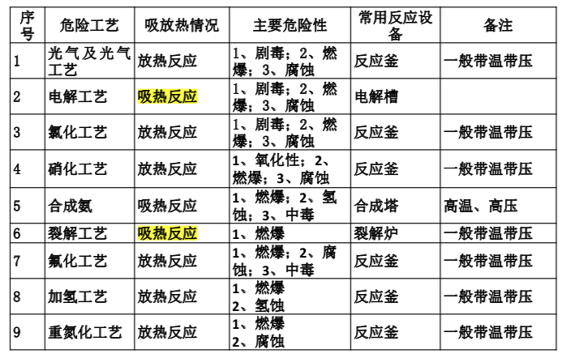
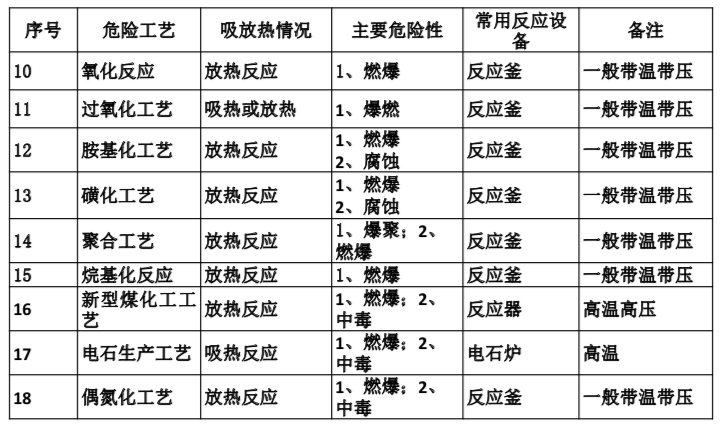

# 2018008. 原料药及精细化工合成工艺工程设计的要点

2016-05-16

通过迭代，目前形成的框架包含 5 个模块：1）概念。2）反应机理。3）物料能量衡算。4）安全设计、绿色设计、节能设计。

## 记忆时间

2019-11-06

## 00. 概述

合成的概念：合成顾名思义就是几种原料经过单元反应生成产品的过程。在制药行业原料药生产中，发酵工艺、提取工艺、合成工艺是三个比较典型的工艺板块。在精细化工行业中大多工艺过程为合成过程，合成也是最为多元、最为复杂的工艺。

合成反应按反应设备分类有平推流反应、混合流反应「釜式反应」、间歇式反应「釜式反应」。
   
## 01. 理清合成工艺路线，掌握合成工艺的主要机理

合成化学是有机化学、无机化学、药物化学、高分子化学、材料化学等学科的基础和核心。历代化学家研究、发现了许多合成的方法与工艺，也总结了许多合成工艺的反应机理。我们在大学也学习了许多这方面的原理知识，这些也是我们合成化工设计的基础。

### 1.1 基本的反应机理

1、酸碱中和反应：在无机化合物中氢氧根离子与氢离子发生反应。

例如：

	NaOH+HCl=NaCl+H2O

2、卤化反应：在有机化合物分子中建立碳-卤键的反应。

例如：

	C6H6+3Cl2→C6H6Cl6

3、缩合反应：两个或多个有机化合物分子通过反应形成一个较大分子的反应或同一个分子发生分子内的反应形成新的分子称缩合反应。

4、酰化反应：在有机化合物中的碳、氧、氮、硫等原子上引入酰基的反应成为酰化反应。

5、氧化反应：氧化反应是碳原子氧化数升高的反应，广义来讲卤化、硝化、磺化等都可以属于氧化反应之列。

例如，醇氧化成醛：

	R-OH+O2→RCHO

6、还原反应：在化学反应中使有机物分子中碳原子总的氧化数降低的反应成为还原反应。

例如：

	RCH=CHR’+H2→R-CH2-CH2-R’

### 1.2 常用危化工艺的反应

1、亲电取代反应：如硝化、卤化、磺化、酰化和烷基化反应。

2、亲核取代反应：如卤代物和重氮化物的取代反应。

3、卤化反应：氯化反应是化合物中引入氯原子的反应。这是取代反应，是 16 种危化工艺氯化反应中的取代氯化。

4、硝化反应：硝化反应是化合物中引入硝基的反应，最常见的是取代反应。

5、磺化反应：磺化是向有机分子中引入磺酰基「-SO3H」的反应。上式为取代反应。

6、重氮化反应：重氮化是一级胺与亚硝酸在低温下作用生成重氮盐的反应。

7、烷基化反应：烷基化是把烷基引入有机化合物分子中的碳、 氧、氮等原子上的反应。上式为取代反应。

8、氧化反应：氧化为有电子转移的化学反应中失电子的过程，即氧化数升高的过程。

9、还原反应：也是一种氢化反应。

以上是一些最基本的反应原理，举了一些比较简单的例子，但是在每一种原理中又有很多反应类型、很多反应机理，实际我们碰到的反应特别是原料药的合成反应要比这些复杂的多，但都以基本原理为基础，需要我们实际工作中根据所学知识或查阅有关资料理解。

## 02. 需要收集物料的性质

物化性质目前主要有三大来源：查阅资料、向工艺包提供方获取、推测物料的化学性质。

1、查阅资料：正规出版的文献资料，或通过互联网获得化学品安全技术说明书（MSDS）。值得一提的是网上获取的信息来源要可靠正确。

2、向工艺包提供方获取：有些中间品或产品的 MSDS 很难查阅得到，一般可以通过向工艺包提供方索取获得。

3、推测物料的化学性质：由于实际中化学品种类非常之多，并不是每种物料的化学性质都是可以通过查询得到。但若我们知道了化学品的分子结构，可以根据类似分子结构的物料来推测化学品的物化性质作为参考。

## 03. 物料平衡

我们实际工作中合成反应大多是间歇反应，故建议在做物料平衡的时候可以以单元反应为中心，例如以一个反应釜做物料平衡。

1）根据设计基础资料，列出主副化学反应方程式。明确反应前后的物料组成和它们之间的定量关系。

2）明确初步的工艺流程、装置规模、年操作时间、产品质量、产品收率等。

3）根据所确定的初步工艺流程绘制物料平衡示意图，并在相应的位置标注与物料平衡有关的数据。

4）整理编制有关计算书。

5）根据物料平衡计算反应釜、储罐的大小。

一般反应釜装料系数取 0.5-0.7；储罐装料系数取 0.8~0.9；根据物料平衡计算进出物料管径的大小；根据物料平衡选择合适的物料输送设备，并计算能力大小。

6）整理有关计算书、资料，以便后续查阅。

## 04. 热量平衡

热量平衡是在物料平衡的基础上依据能量守恒与转化定律对化工过程中的能量进行计算，定量的表示出工艺过程中的能量变化，确定需要加入或可利用的能量，从而进一步确定加热剂的合适规格与用量以及换热设备的尺寸等。通过整个工艺过程的能量衡算还可以得出过程的能耗指标，分析工艺过程的能量利用是否合理，以便节能降耗。

以物料平衡为基础，热量平衡的对象要与物料平衡一致，以便前后一致。

初步确定过程能量利用的方案并绘制系统示意图。

选择计算的基准温度和基准态。一般选择 25℃ 为基准。

根据物料平衡结果和能量守恒定律，结合设备的热量特点，列出能量衡算式。

整理结果，汇总列出各台设备的热负荷、公用工程名称、规格及用量数据，计算和分析整个过程的加热和冷却公用工程消耗指标。

## 05. 安全设计

安全设计原则：安全设计是合成工艺的非常重要的内容，化工合成一般伴随易燃易爆有毒有害的物料，反应条件往往是带温带压，安全设计关系设备能否正常运行，人身财产安全能否得到保障。

1、熟悉原料、产品、中间产品的物料性质，明白其危险性、危害性（用到前面查阅的资料）。

2、了解化学反应的过程、原理，了解反应工况，明白反应的苛刻性（用到前面物料平衡查阅的资料）。

3、根据实际情况采取安全设计设施。

18 种重点监管的危险化工工艺危险情况分析：

从上表可以看出大多数危化工艺为合成工艺过程，他们有共同特点都是都是釜式反应釜中进行，放热反应，有燃爆危险，带温带压操作，部分还有腐蚀性。故我们要根据反应特点做好工艺安全设施设计。

主要有以下措施：

1、根据物料性质选择合适的反应釜、管道的材质，并考虑经济性。

2、密闭操作。整个生产过程尽最大限度的做到密闭操作，既安全又环保。

3、防止静电。对易燃易爆的物料采取控制流速，防止静电产生。采取导除静电的措施：设备管道静电接地；法兰连接处采用铜线跨接等。

4、防火。设备放空设置阻火器；反应过程采用氮气保护等。

5、防超限。设置高低液位「温度、压力等」报警装置；设置高低液位「流量、重量等」切断装置；设置温度「压力、液位等」连锁调节装置；设置泄压装置「紧急泄放阀、安全阀、爆破片等」；设置泄放料液收集罐。

1『先控制，不行再切断，再不行就泄放。』

6、防误操作。人性化设计，设置防止误操作措施，注重职业健康（例如考虑投料粉尘防护、有害气体导除等）。

7、及时移除反应热量，保证换热面积大小以及冷媒的量，保证反应釜中热量不局部堆积，保证搅拌效果良好。

8、模拟验证。对单元反应做 Hazop 分析，对重要反应单元做有组织的 Hazop 分析。

## 06. 绿色设计

原则上我们尽量选用无毒无害的化学反应来生产产品，但是一般我们的工艺包都是业主提供的，故所选用的工艺路线一般都是确定的，所使用的反应物料也是确定的。即反应的先进性不是我们能确定的。但是我们在设计中要考虑尽量使有害物料反应完全，减轻后续分离的压力；要考虑尽量考虑对过量的原料进行回收再利用；要考虑生产过程的连续性，减少跑冒滴漏；要考虑对三废的收集与处理，减少排放，做到「绿色设计」。