## 2018010. 药物提取工艺要点

含中药提取。

通过迭代，目前形成的框架如下：

1、概述。

2、客户要求。

3、技术要点。

4、车间方案设计。

根据不同的产品特性，选择合适的提取工艺，并将其串联到一起形成一条完整的生产线。

### 记忆时间

2019-11-07

### 总结

以上仅对我们设计过程中经常用的提取工艺进行了介绍，一般来说在设计过程中针对产品特性、要求对这几种常见工艺进行组合即可构成一条完整的提取生产线。

### 01. 概述

药物提取工艺的重要性：

提取是通过溶剂处理、蒸馏、脱水、经受压力或离心力作用，或通过其他化学或机械工艺过程从物质中制取有用成分「如组成成分或汁液」。

药物提取技术是医药工程的一个重要组成部分，他主要是描述医药产品分离过程的原理和方法的一个术语，指从制药化学合成液、生物发酵液、动植物原料中分离、纯化医药目标产物的过程，是医药科学技术转化为生产力不可缺少的重要环节。

1『提取液一般三个来源：合成车间的合成液、发酵车间的发酵液和天然动植物提取液。』

药物提取过程与很多医药技术、产品质量的优劣、成品的高低、竞争力的大小密切相关，还与许多新产品的开发和环境保护相关。近 20 年来，提取技术取得了长足的发展，出现了许多新技术和新概念，有些技术已经得到了工业化的应用，有些技术正处在研究阶段，但已经显示出了良好的应用前景。医药技术产业在 21 世纪是发展最快的产业之一，必将成为本世纪的支柱产业，而药物提取工艺的研究和发展是医药技术产业实现生存、进步和可持续发展的重要保证。

医药产品具有很高的质量标准以及生产过程质量控制的法规严格约束，医药产品的生产，尤其是分离纯化过程，不同于一般的精细化工产品的生产，具有其自身的特点。

首先提取对象的浓度多受物理和生产条件的限制，浓度很低，药物原料液如天然药物提取液、发酵液多为成分复杂的混合物，一些药物的稳定性较差，容易受温度、PH 值以及某些物质的影响发生功能的变性或者失活，最后由于药物的特殊性往往对最终产品的质量要求很高。

1『特点：提取对象的浓度受限，一般很低；要提取的药物稳定性较差；最终产品的质量要求很高。』

由于提取对象的特殊性以及产品种类和性质的多样性，这就决定了提取工艺的复杂性。为实现一个产品的提取，往往用到多种技术和多个提取步骤，而且同一个单元操作可以在不同的工艺阶段使用，为获得最佳的生产效率，不同的操作单元相互组合、优化。同时由于药品生产的特殊性，工艺设计和设备选择还应根据产品要求符合相应的药品生产管理规范，以保证最终产品的质量。

1『提取对象的特殊性，产品种类和性质的多样性，导致了提取工艺的复杂性。单元操作设备的套用是常见情况。』

药物提取的工艺主要包括预处理、固液萃取、过滤及离心分离、液液萃取、蒸馏、膜分离、吸附与离子交换、结晶、干燥、超临界萃取等。

一个完整的提取流程应考虑以下几条原则：

1. 技术路线、工艺流程尽量简化；

2. 尽可能采用低成本的材料和设备；

3. 采用成熟技术和可靠设备；

4. 以保护、浓缩目标产物，破坏、稀释、去除非目标产物为中心。

具体工艺的选择主要跟产品的规格或技术要求、生产规模、进料组成、产品的形式、产品的稳定性、产品的物性、分批或者连续操作要求等有关。

近年来我公司承接了很多大型、特大型提取项目，例如北大方正项目、海正基地项目等，这些项目往往产品种类多，特性不一，涉及到的提取工艺复杂，基本涵盖了目前较为常用的提取工艺。

在参与这类项目的设计过程中，我们积累了丰富的经验，尤其是在根据不同产品特性，选择不同提取工艺，并将其串联到一起形成一条完整的生产线方面。于此同时也接触了很多中试项目、多功能项目，在提取工艺模块化方面也涉及较多。

1『根据不同的产品特性，选择合适的提取工艺，并将其串联到一起形成一条完整的生产线。』

### 02. 客户要求

1、原则：1）短时间内处理。2）分离时尽量低温。3）选择生物物质稳定的 PH。4）避免污染和交叉污染，要程序化进行清洗和消毒，包括厂房、设备、管路。

2、要求：1）达到所需的纯度。2）成本低、得率高。3）工艺过程简便，对分离物质特性清楚。4）废弃物要易处理，能够做到综合利用「零排放、清洁生产」。5）实验室产品能够放大生产。

### 03. 技术要点

#### 1. 预处理

#### 预处理工艺

为保证化学原料药、中药、生物药的安全性、有效性和质量的可控性，对相关的原料进行必要的预处理，属于药品生产环节中的粗加工范畴。

预处理主要包括以下内容：中药及天然药物原料的清洗、精选、软化及切片/粉碎；固体化学原料药的结晶、液体原料药的精馏；发酵液的预处理。

#### 01. 中药及天然药物的预处理

中药及天然药物的预处理主要包括原料的精选、清洗、软化及切片/粉碎。

其中原料的精选主要是为了选取规定的药用部位，除去非药用部位、杂质及霉变等；原料的清洗主要是为了去除药材中的泥沙、杂物，主要分为水洗和干洗两种；原料的软化主要是为后面切制工序做准备，使原料软硬适度，便于切制；切片/粉碎是指将原料切成不同形状、厚度规格或者将大颗粒固体变成小颗粒甚至微粉粒，以保证提取的质量和效率。通常直接入药的粉碎工序在净化区内完成。

#### 02. 发酵液的预处理

发酵液的预处理主要是为了除去发酵液中的杂质「大量的水、培养基及代谢产物等」；改变发酵液的物理性质，提高后续分离效果；还有就是使产物尽可能多的转入后续处理的某一相中。

通常的处理方法主要是凝聚和絮凝法，加热法，加水稀释法，调节 PH 法等。

附图\发酵液预处理工艺流程.pdf

#### 03. 化学原料药的预处理

化学原料药的预处理「如果工艺需要」一般是固体通过结晶的方式，液体通过精馏和萃取的方式完成。

需要注意的是如果需要的固体物料，往往还要增加干燥工序。

#### 预处理设备

中药及天然药物的预处理常用的设备为洗药机、风选机、干式表皮清洗机、润药机及切药机等，应根据场地大小、生产规模等综合考虑进行选择。

发酵液则常在预处理罐等容器内进行处理，为尽可能达到预处理的目的，常常配有搅拌、蒸汽加热、调节 PH 值等相关功能。

### 2. 提取手段汇总

#### 01. 固液萃取「浸取」

固液萃取是利用固体原料中组分在溶剂中溶解度的差异，选择一种溶剂作为萃取剂用来溶解固体原料混合物中待分离的组分，其余组分则不溶或很少溶于萃取剂中，从而使溶质分离。

浸取过程的影响因素主要是被浸取物质的理化性质、原料的粉碎度、原料的干燥程度、浸取温度、浸取时间、溶液的浓度差、浸取压力、浸取溶剂的选择等。

浸取的工艺主要为浸泡法、渗漉法、溶剂回流法、压榨法，这里仅介绍我们平常用到较多的溶剂回流法。

溶剂回流法是通过将原料置于溶剂中，加热至沸腾的情况下进行成分的浸出，以提高浸出速度，提高浸出收率。沸腾后气化的溶剂经过冷凝冷却回收后循环使用。

浸取设备按其操作方式分为间歇式和连续式，我们目前设计用到较多的主要为间歇式，主要由多功能浸取罐、冷凝冷却器、回收缓冲罐、输送泵等组成。

这里需要注意的是回流法适用于水不溶性成分的浸取，并不适用于热敏性物料。

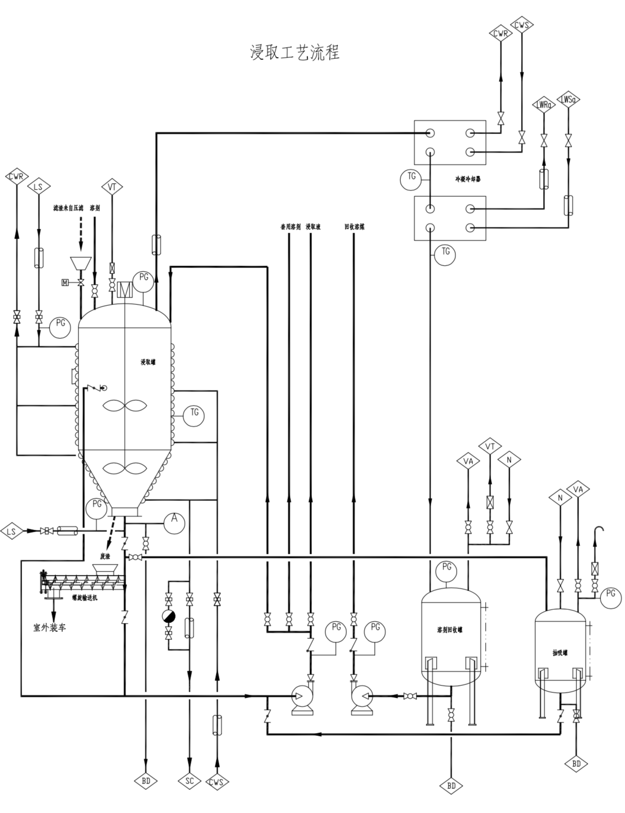

附图\浸取工艺流程.pdf

#### 02. 固液分离「过滤、离心分离」

在医药工艺中，无论是原料药的生产还是废水的处理都离不开固液分离操作，其主要的手段为过滤、沉降和离心三种。其分离效果主要受颗粒的形状、大小、粒径分布，液体的密度、黏度、表面张力等影响。

过滤是利用多孔介质构成的障碍场从流体中分离固体颗粒的过程。沉降是利用非均相混合物之间的密度差使颗粒在重力作用下发生下沉或上浮来进行分离的过程。离心是利用高速旋转产生的离心力来强化分离的过程。

设计过程中使用较多的过滤手段主要为板框过滤和袋式过滤，都为加压过滤，工艺流程较为简单，但需要注意的是过滤往往结合活性炭脱色一同进行，这时应采用循环过滤的方式以提高过滤质量。

较为完整的离心工艺是由离心机、清洗罐、母液缓冲罐等组成，同时针对介质的危险性，还应配备氮气系统和尾气系统。离心工艺也可作为精烘包工艺的一个部分，在洁净区中进行操作。

这里仅介绍我们使用较多的板框压滤机、三足式离心机、卧式刮刀离心机。

板框压滤机是加压过滤机的代表，历史悠久、在制药领域广泛使用。主要由固定架、滤板、滤框、滤布、压紧装置组成，按照工作方式可分为自动式、半自动式、手动式。

压滤机的出液有明流和暗流两种形式，滤液从每块滤板的出液孔直接排出机外的称明流式，明流式便于监视每块滤板的过滤情况，发现某滤板滤液不纯，即可关闭该板出液口；若各块滤板的滤液汇合从一条出液管道排出机外的则称暗流式，暗流式用于滤液易挥发或滤液对人体有害的悬浮液的过滤。

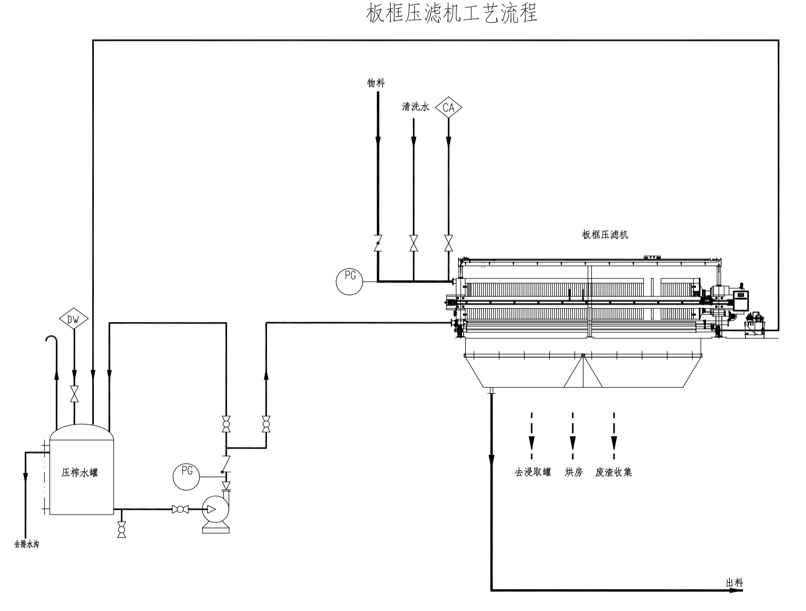

附图\板框压滤机工艺流程.pdf

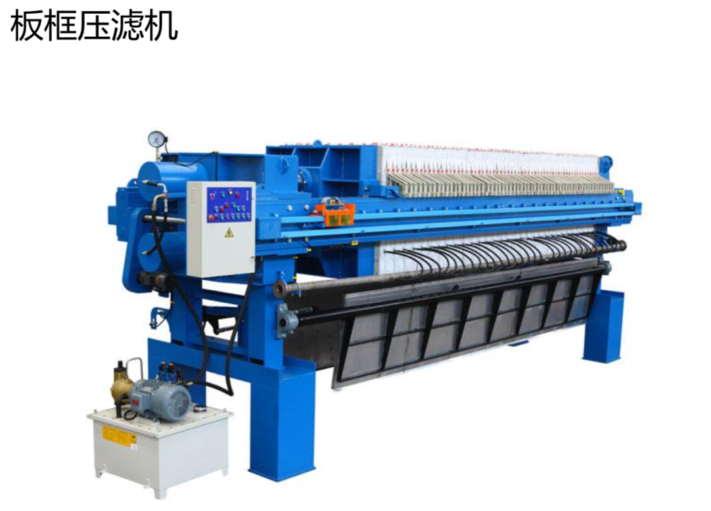

板框压滤机结构简单、制造容易、过滤面积大、操作压力高、所得滤饼含水量少「尤其是针对污泥」、对各种物料适用性强；缺点是不能连续化操作，劳动强度大，操作环境比较恶劣。

在设计中应注意针对介质选择板框和滤布的材质，同时，板框应尽量做到集中布置，并设置独立房间，做好通风措施；板框压滤机之间应留有足够的空间更换滤布及检修；为减少劳动强度，滤渣应尽量做到自动出料。

三足式离心机是医药工业中最常用的过滤式离心设备，其优点是结构简单、占地面积小、过滤颗粒不易磨损，适用于小批量、处理量不大、过滤周期长的生产过程，缺点是上部出料、间歇操作、劳动强度大、滤饼不均匀。

在设计时应注意设置吸排风装置，能集中布置在独立的房间最好，应考虑到离心机卸料开盖时的空间需求。另外，如果是吊袋式则最好设置起吊装置以减少劳动强度。

卧式刮刀离心机可实现进料、洗涤、脱水、卸料自动操作，劳动强度低、操作环境较好，产量高适合于大规模生产，但缺点是设备振动较大，晶体破坏率较高。

在设计时应考虑开门时的空间需求，如果能考虑到维修转鼓的起吊设施则更好。

#### 03. 液液萃取

液液萃取又称溶剂萃取，是一种用液态的萃取剂处理与之不互溶的双组分或多组分溶液，实现组分分离的传质分离过程。他是制药工业中提取或分离混合物的重要单元操作，该单元操作具有处理能力大、分离效果好、回收率高等特点。

影响萃取操作的因素主要有 PH 值，温度和溶剂的性质。

在液液萃取操作中，所有的萃取工艺都包含了两相的混合和分离两个工艺，混合部分应采取各种措施使两相密切接触并伴有较高的湍动程度，分离部分主要是两相经过充分接触后根据两相的重力或离心力的差异能较快的分离。

在我们设计过程中最普通也是最常见的形式为萃取罐，带混合搅拌澄清功能，搅拌后静置分层进行分离，或者是前端设置混合设备如静态混合器，混合完后进入萃取罐进行分离，该方法主要是操作简单、稳定，缺点则是动力消耗大，占地面积也相对较大。

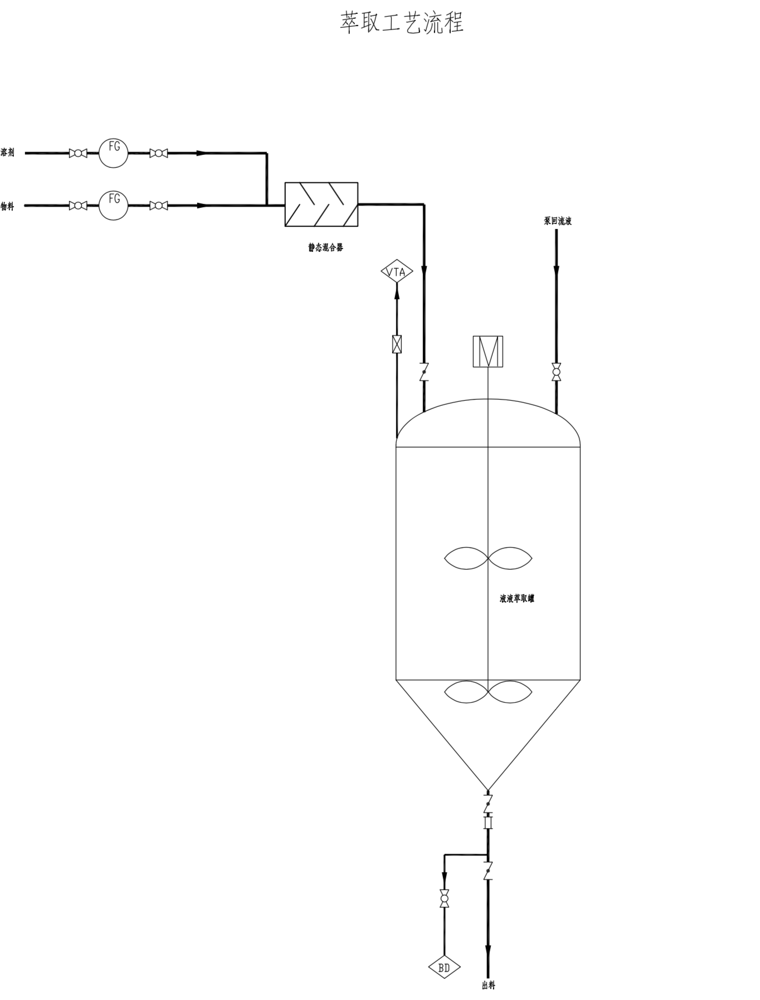

附图\萃取工艺流程.pdf

随着萃取技术的发展，现在我们也较多的运用离心萃取机，比较常见的是碟片式，离心萃取机在分离两相密度差小，粘度大和易乳化的体系优势明显，其设备紧凑，占地面积小，生产能力高，易于密封，但制造成本较高，维修成本也较高。

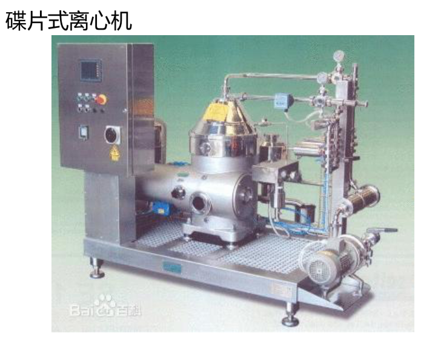

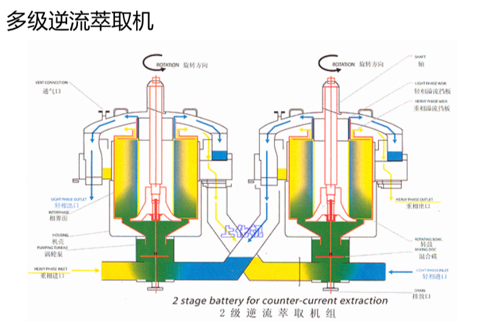

液/液萃取时，将含有一种或多种溶质的溶液「图示为黄色」和一密度与之不同、不相混溶的溶剂「图示为蓝色」装入机器底部的混合室内。

旋转的搅拌叶将两种不相混溶的液体混合为分散液「图示为绿色」。根据液相间的界面张力可使用不同的搅拌叶。高效率的混合能在两种液相间产生较大的界面面积，从而保证最大程度地传质。

转鼓底部的涡轮泵将分散液吸入转鼓内。转鼓产生的离心力对分散液进行分离。重相「图示为黄色」占据转鼓的外侧。轻相「图示为蓝色」占据转鼓的内侧。重相溢流挡板确定了相界面的位置。有不同直径的重相溢流挡板可供调换，以满足不同密度比的需要。重相下溢至重相接收室内。轻相溢出至另一独立的轻相接收室内。

液体受重力作用排至下一个离心萃取机或下游设备。当需要进行多级萃取时，可安装一系列的离心萃取机，实现所需的级数。萃取机之间无需设泵。

为使灵活性达到最佳，可用外部管道在萃取流程中「主萃取，洗涤，反萃取」装入或排出液体。

#### 04. 蒸馏和浓缩

医药工艺中的蒸馏和浓缩是作为一种提纯、精制工艺存在的，也是溶剂回收的重要手段，其主要是利用混合液体或液-固体系中各组分沸点不同，使低沸点组分蒸发，再冷凝以分离整个组分的单元操作过程。

由于在制药过程中不可避免的使用到大量的溶剂，而我们所需要的产品中又不能带有这些溶剂，因而蒸馏和浓缩工艺就成为解决这一矛盾的重要手段。

蒸馏浓缩工艺往往由蒸发和冷凝两个工序组成，目前我们在医药生产中主要用到的蒸馏浓缩工艺为单釜蒸馏、薄膜蒸发器蒸馏和多效蒸发器，如果按操作条件分则又分为常压蒸馏和减压蒸馏。

单釜蒸馏操作简单，设备制造简单，投资小，但由于在釜内停留时间较长，对热敏性物质不适用，而且处理能力受限制。

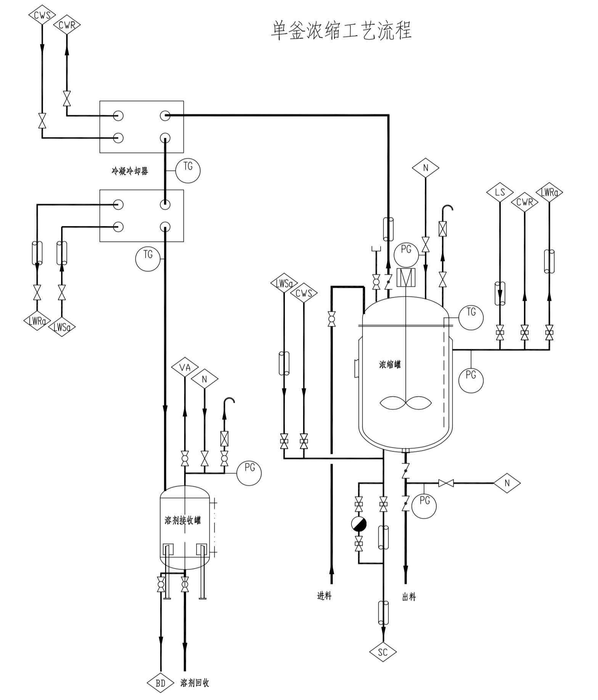

附图\单釜浓缩工艺流程.pdf

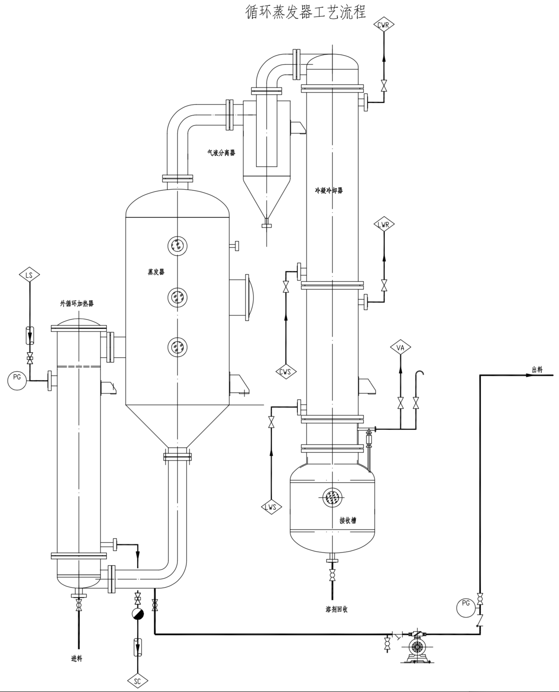

附图\循环蒸发器工艺流程.pdf

薄膜蒸发器，物料液体是沿着加热管壁，呈膜状流动，从而进行传热和蒸发，一般它具有传热效率高、蒸发速度快的特点，所以物料在蒸发器中的停留时间很短。

薄膜蒸发器，它主要是用于热敏性物质的蒸发，一般可以分为升膜蒸发器和降膜蒸发器这两大类。

性能特点：

1. 真空压降小：它的压力降很小，真空度可达 5mmHg。

2. 操作温度低：因为具有良好的真空度，所以物料的沸点低，并且在低温下进行可以降低物料的热分解。

3. 蒸发强度高：物料沸点低，增大了温度差，但热阻小，热交换良好，所以总传热系数高，蒸发快。

4. 操作弹性大：不仅能用于热敏性物料的蒸发，还能用于物料的蒸发和蒸馏。

多效蒸发器是将几个蒸发器串联运行的蒸发操作，使蒸汽热能得到多次利用，从而提高热能的利用率，多用于水溶液的处理。

以其前一效的二次蒸汽作为加热蒸汽，从而可大幅度减少生蒸汽的用量。每一效的二次蒸汽温度总是低于其加热蒸汽，故多效蒸发时各效的操作压力及溶液沸腾温度沿蒸汽流动方向依次降低。

依据二次蒸汽和溶液的流向，多效蒸发的流程可分为：

① 并流流程——溶液和二次蒸汽同向依次通过各效。

由于前效压力高于后效，料液可借压差流动。但末效溶液浓度高而温度低，溶液粘度大，因此传热系数低。

② 逆流流程——溶液与二次蒸汽流动方向相反。需用泵将溶液送至压力较高的前一效，各效溶液的浓度和温度对粘度的影响大致抵消，各效传热条件基本相同。

③ 错流流程——二次蒸汽依次通过各效，但料液则每效单独进出，这种流程适用于有晶体析出的料液。

#### 05. 膜分离

利用膜的选择性通过在膜两侧施加一种或多种推动力，使原料中的某组分选择性的优先透过膜来实现组分的分离、纯化、浓缩的过程称作膜分离。它与传统过滤的不同在于，膜可以在分子范围内进行分离，并且这过程是一种物理过程，不需发生相的变化和添加助剂。

各种膜的机理不尽相同，适用于不同的对象和要求，但一般具有常温下进行，有效成分损失极少，特别适用于热敏性物质，无相态变化，无化学变化，典型的物理分离过程，不用化学试剂和添加剂，产品不受污染，选择性好，适应性强，能耗低等特点。

膜分离技术是指在分子水平上不同粒径分子的混合物在通过半透膜时，实现选择性分离的技术，半透膜又称分离膜或滤膜，膜壁布满小孔，根据孔径大小可以分为：微滤膜「MF」、超滤膜「UF」、纳滤膜「NF」、反渗透膜「RO」等，膜分离都采用错流过滤方式。

膜是具有选择性分离功能的材料。无机膜由于各种优良性能「如抗高温、耐酸碱等」，已得到广泛应用。由于技术发展水平限制，无机膜主要只有微滤和超滤级别的膜，主要是陶瓷膜和金属膜。特别是超滤陶瓷膜，已经在很多行业得到应用，如重金属废水处理与回收。

1）在常温下进行——有效成分损失极少，特别适用于热敏性物质，如抗生素等医药、果汁、酶、蛋白的分离与浓缩。

2）无相态变化——保持原有的风味。

3）无化学变化——典型的物理分离过程，不用化学试剂和添加剂，产品不受污染。

4）选择性好——可在分子级内进行物质分离，具有普遍滤材无法取代的卓越性能。

5）适应性强——处理规模可大可小，可以连续也可以间隙进行，工艺简单，操作方便，易于自动化。

6）能耗低——只需电能驱动，能耗极低，其费用约为蒸发浓缩或冷冻浓缩的 1/3-1/8。

微滤「MF」又称微孔过滤，它属于精密过滤，其基本原理是筛孔分离过程。微滤膜的材质分为有机和无机两大类，有机聚合物有醋酸纤维素、聚丙烯、聚碳酸酯、聚砜、聚酰胺等。无机膜材料有陶瓷和金属等。鉴于微孔滤膜的分离特征，微孔滤膜的应用范围主要是从气相和液相中截留微粒、细菌以及其他污染物，以达到净化、分离、浓缩的目的。

对于微滤而言，膜的截留特性是以膜的孔径来表征，通常孔径范围在 0.1～1 微米，故微滤膜能对大直径的菌体、悬浮固体等进行分离。可作为一般料液的澄清、保安过滤、空气除菌。

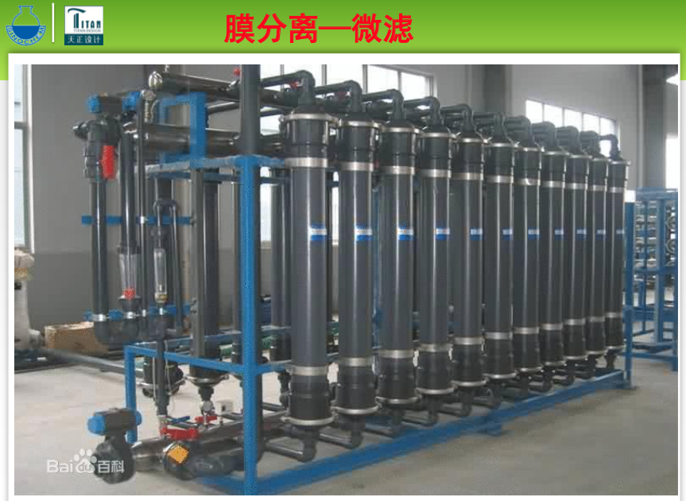

超滤「UF」是介于微滤和纳滤之间的一种膜过程，膜孔径在 0.05um-1nm 之间。超滤是一种能够将溶液进行净化、分离、浓缩的膜分离技术，超滤过程通常可以理解成与膜孔径大小相关的筛分过程。以膜两侧的压力差为驱动力，以超滤膜为过滤介质，在一定的压力下，当水流过膜表面时，只允许水及比膜孔径小的小分子物质通过，达到溶液的净化、分离、浓缩的目的。

对于超滤而言，膜的截留特性是以对标准有机物的截留分子量来表征，通常截留分子量范围在 1000～300000，故超滤膜能对大分子有机物「如蛋白质、细菌」、胶体、悬浮固体等进行分离，广泛应用于料液的澄清、大分子有机物的分离纯化、除热源。

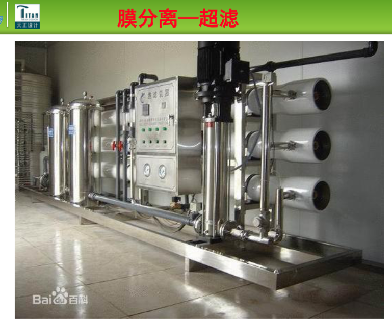

纳滤「NF」是介于超滤与反渗透之间的一种膜分离技术， 其截留分子量在 80～1000 的范围内，孔径为几纳米，因此称纳滤。基于纳滤分离技术的优越特性，其在制药、生物化工、 食品工业等诸多领域显示出广阔的应用前景。

对于纳滤而言，膜的截留特性是以对标准 NaCl、MgSO4、CaCl2 溶液的截留率来表征，通常截留率范围在 60～90%，相应截留分子量范围在 100～1000，故纳滤膜能对小分子有机物等与水、无机盐进行分离，实现脱盐与浓缩的同时进行。

反渗透「RO」是利用反渗透膜只能透过溶剂「通常是水」而截留离子物质或小分子物质的选择透过性，以膜两侧静压为推动力，而实现的对液体混合物分离的膜过程。反渗透是膜分离技术的一个重要组成部分，因具有产水水质高、运行成本低、无污染、操作方便运行可靠等诸多优点 ，而成为海水和苦咸水淡化，以及纯水制备的最节能、最简便的技术，已广泛应用于医药、电子、化工、食品、海水淡化等诸多行业。反渗透技术已成为现代工业中首选的水处理技术。

反渗透的截留对象是所有的离子，仅让水透过膜，对 NaCl 的截留率在 98% 以上，出水为无离子水。反渗透法能够去除可溶性的金属盐、有机物、细菌、胶体粒子、发热物质，也即能截留所有的离子，在生产纯净水、软化水、无离子水、产品浓缩、废水处理方面反渗透膜已经应用广泛，如垃圾渗滤液的处理。

#### 06. 吸附与离子交换

利用某些多孔固体有选择地吸附流体中的一个或几个组分，从而使混合物分离的方法称为吸附操作，它是分离和纯净气体和液体混合物的重要单元操作之一。

离子交换法是使用合成的离子交换树脂等离子交换剂作为吸附剂，将溶液中的物质，依靠静电引力吸附在树脂上，发生离子交换过程后，再用适当的洗脱机将吸附物从树脂上置换下来，从而达到分离的目的。

吸附法操作条件温和，适合于热敏性物质的分离，但处理量较小；离子交换法的特点是树脂无毒性，可反复使用，过程中一般不用有机溶剂，因而具有设备简单，操作方便的特点，适合于带电荷离子之间的分离，尤其适合微量组分的富集和高纯物质的制备。

但两种方法在医药化工领域应用面不是很广，只能用来解决比较复杂的分离问题。我们目前用到相对较多的工艺主要是在吸附柱中进行脱盐等处理。

#### 07. 结晶

结晶是从液态原料中析出晶体物质的过程，是制药工业重要的单元操作，往往决定了最终产品的质量。

与其他单元操作相比结晶操作能从杂质含量较多的混合液中分离出高纯度的晶体；有利于高熔点混合物、相对挥发度小的物系、共沸物、热敏性物质等的分离；而且与蒸馏相比能耗也相对较低。

影响结晶效果的主要因素包括过饱和度、温度、搅拌速度和晶种的加入量等。

按照产生过饱和溶液的方式不同，结晶主要分为冷却结晶、蒸发结晶、真空结晶、溶析结晶「加稀释剂或沉淀剂」等结晶方式。

但应当注意的是我们在工艺设计过程中为了得到更好的结晶效果，往往几种结晶工艺综合运用，比如蒸发-冷却结晶。

还有一点应注意的是很多情况结晶工艺已经是整个产品生产环节的最后几步，为保障药品的质量，往往会根据需要将该工艺及后续工艺「主要为离心、干燥，也就是我们所说的精烘包工艺」放在洁净区进行操作，在工艺设计过程中应考虑到洁净区的设计要求。

目前的结晶工艺主要还是采取釜式间歇操作，这样可以便于批间对设备进行清理，并可防止批间交叉污染。

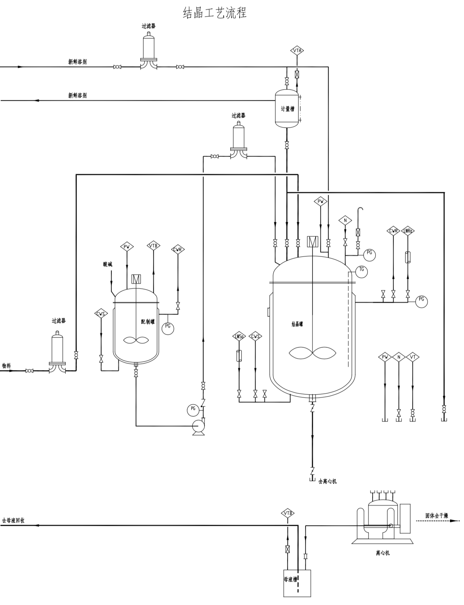

附图\结晶工艺流程.pdf

#### 08. 干燥

干燥技术指借热能使物料中水分「或溶剂」气化，并由气流带走气化的水分「或溶剂」，从而获得干燥物品的工艺操作技术。干燥通常是药物成品化前的最后一个工序，因此，干燥的质量直接影响产品的质量和价值。

我们设计过程中用到较多的干燥方式为双锥回转真空干燥、烘箱，也有使用喷雾干燥、气流干燥、流化床沸腾干燥、冷冻干燥的方式。

双锥回转真空干燥有蒸汽加热和热水加热两种主要形式，同时一般设有溶剂冷凝回收装置「如果溶剂不回收则可不设」和抽真空装置。

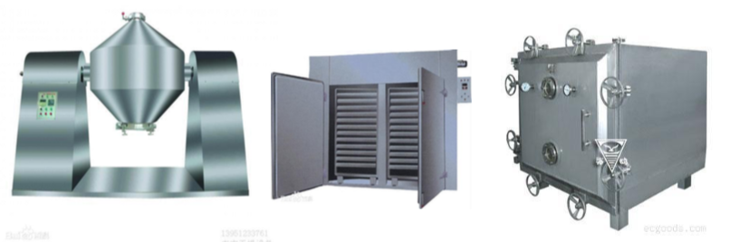

喷雾干燥是通过机械作用，将需干燥的物料，分散成很细的像雾一样的微粒，「增大水分蒸发面积，加速干燥过程」与热空气接触，在瞬间将大部分水分除去，使物料中的固体物质干燥成粉末的一种干燥方法。主要流程为原料经过泵进入雾化器雾化，干燥空气经过加热、过滤后进入干燥塔对已雾化好的液滴进行干燥，干燥塔底部进行收料，热风通过引风机排走。

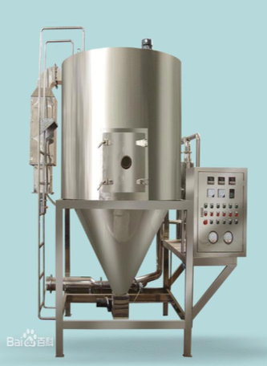

附图\喷雾干燥工艺流程.pdf

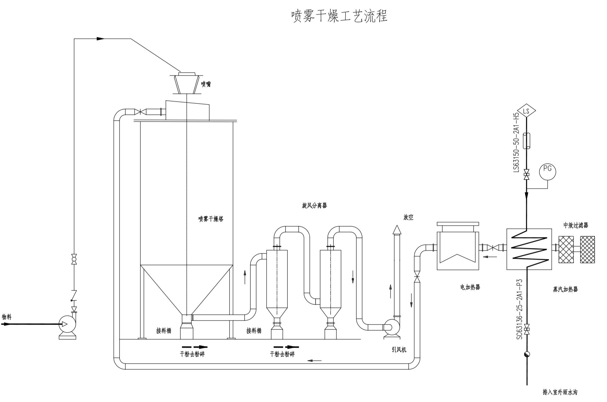

气流干燥机是利用高速流动的热气流使湿淀粉悬浮在其中，在气流流动过程中进行干燥。具有传热系数高，传热面积大，干燥时间短等特点。气流干燥也称「瞬间干燥」，是固体流态化中稀相输送在干燥方面的应用。该法是使加热介质和待干燥固体颗粒直接接触，并使待干燥固体颗粒悬浮于流体中，因而两相接触面积大，强化了传热传质过程，广泛用于散状物料的干燥单元操作。

沸腾干燥机是一种干燥设备，又称流化床，一般由加热器、沸腾床主机、旋风分离器、布袋除尘器、引风机、操作台组成。根据物料的性质不同，可按需要选配旋风分离器或布袋除尘器。

沸腾干燥机是利用空气经热交换器加热后，形成热风经阀板分配进入主机，湿物料从加料器进入干燥机，由于风压的作用，物料在干燥机内形成沸腾状态，并与热空气进行广泛接触，从而在较短时间完成物料烘干。

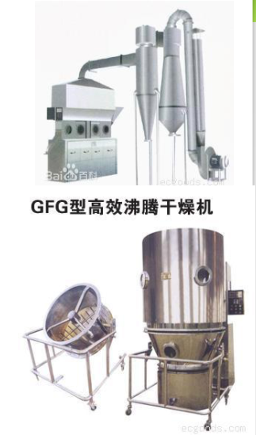

冷冻干燥是将含湿物料冷冻到晶点温度以下，使水份转变为固态的冰，然后在较高真空下将冰直接升华为水蒸气而除去的干燥方法。主要包含冻干箱、制冷系统、加热系统和真空系统。

冻干法基本上在 0℃ 以下进行，即在产品冻结的状态下进行，只在后期降低产品的残余水份含量时，才让产品升至 0℃ 以上的温度，但一般不超过 40℃。

在真空条件下，当水蒸汽直接升华出来后，药物剩留在冻结时的冰架中，形成类似海绵状疏松多孔架构，因此它干燥后体积大小几乎不变。再次使用前，只要加入注射用水，又会立即溶解。

真空冷冻干燥技术的主要缺点是成本高。由于它需要真空和低温条件，所以真空冷冻干燥机要配置一套真空系统和低温系统，因而投资费用和运转费用都比较高。

不同相态的原料药干燥工艺也不同，如果是液相的常采用喷雾干燥的方式，若是原料为热敏性物质则需要考虑冷冻干燥的方式。喷雾干燥的优点主要是操作稳定，易实现自动化和连续化操作，缺点主要是占地面积较大，能耗较高。这里需要注意的是只要干燥收料部分在洁净区内即可保证产品质量，同时与物料接触的热风等应做好除尘、灭菌处理。

如果是结晶状的原料，则多采用双锥回转真空的干燥方式，近年来随着要求的提高，三合一「过滤、洗涤、干燥」的干燥方式也在设计中得到了广泛的应用，该设备免除了滤饼的输送，减少了交叉污染的可能性，同时也提高了劳动生产率。

多功能干燥机组是在双锥形回转真空干燥机组的基础上，结合罐式过滤、洗涤、干燥「三合一」，综合两者的优点，改进成的一台具有反应、结晶、浓缩、过滤、洗涤、干燥、破碎的多功能机组。该机组的最大优点是功能多，占地面积小，投资少，操作简单，收益高，工人劳动强度低，安全系数高，使用寿命长，安装方便等优点。适用于附加值高、剧毒、易燃、易爆、批量小的医药及化工产品，更适合用于 GMP 生产要求。

干燥设备的选型相关工作原理如下：

反应、结晶、浓缩阶段：带有搅拌的一端朝下，搅拌叶形式可根据各种物料选型。在设备的侧面进料口通入物料，靠搅拌叶的不断翻动，使物料反应、结晶、浓缩。

过滤阶段：使锥体旋转 180°，带有过滤盘的一端朝下，在端体底部接上抽真空口，实行产品滤饼和母液分离。

洗涤阶段：抽滤结束后，通入洗涤液，启动搅拌液，也可同时转动锥体，使滤饼破碎并和洗涤液进一步纯化，进行残母液清洗和予脱水。

干燥阶段：再次抽滤结束后，在抽真空口通入氮气反吹，使滤饼和过滤网脱离，转动锥体，在回转过程中靠破碎器使滤饼破碎，夹套内通入热水加热整个锥体。并在真空状态下使物料达到干燥目的。并可进行原位取样过程。通过旋风分离器捕集微粉，并可由冷凝器收集有机溶剂。