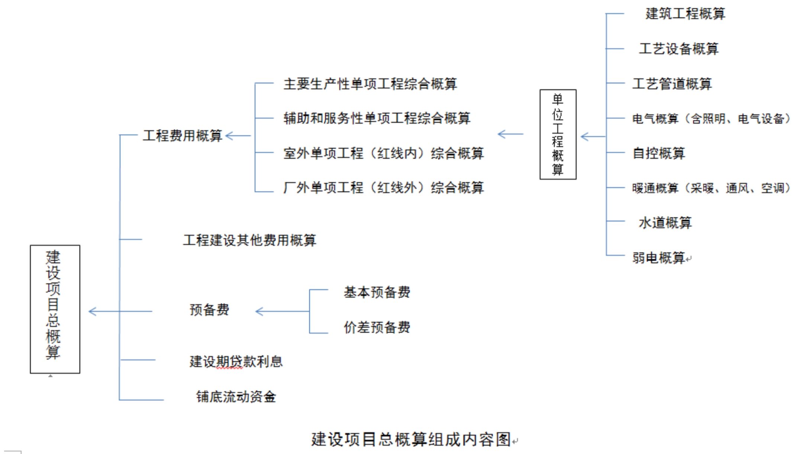
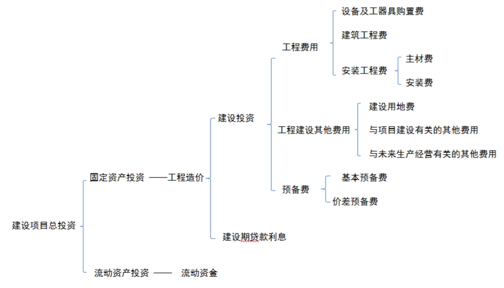
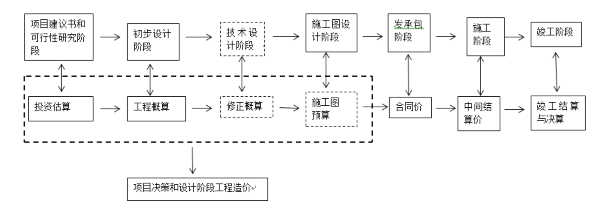

# 2019008. 项目决策及设计阶段造价知识

小结：不同类型的项目有不同的估算侧重点，作者针对不同的案例分享了一些投资估算经验。同时对施工图预算的编制内容、编制过程及方法做了分享。设计阶段造价编制原则：有理有据、能分能合、不漏不满；工程造价没有最准确的，只有更准确的。

## 01. 工程造价含义及相关概念

### 1.1 工程造价含义

从投资者角度而言：工程造价就是建设一项工程，预期开支或实际开支的全部固定资产投资费用，是对项目进行策划决策、建设实施（设计、施工）直至竣工验收等一系列活动所花费的全部费用，也是投资者作为市场供给主体「出售」工程项目时确定价格和衡量投资效益的尺度，建设项目工程造价也就是建设项目固定资产投资，二者在量上是等同的。

从市场角度而言：工程造价就是投资者和承包商共同认可的工程承发包价格。

### 1.2 工程计价特点

2.1 计价的单件性：每项工程都必须单独计算造价。

2.2 计价的多次性：工程计价需在不同阶段多次进行，以确保工程造价计算的准确性和控制的有效性，是一个逐步深入、细化不断接近实际造价的过程。（详见工程多次计价示意图）

2.3 计价的组合性：建设项目是一个工程综合体，可按单项工程、单位工程、分部工程、分项工程等不同层次分解为许多有内在联系的组成部分。因此工程造价的组合过程是，分部分项工程造价 → 单位工程造价 → 单项工程造价 → 建设项目总造价。

2.4 计价方法的多样性：因工程项目具有多次计价的特点，每次计价的依据与精准度也各不相同，由此决定了工程计价方法的多样性。比如投资估算方法有设备系数法、生产能力指数估算法等。概预算方法有单价法和实物法等。

### 1.3 工程造价相关概念

3.1 建设项目总投资：是指为完成工程建设，在建设期（预计或实际）投入的全部费用总和，包含固定资产投资和流动资产投资两部分。

3.2 固定资产投资：建设项目固定产投资也就是建设项目工程造价，包含建设投资和建设期贷款利息。

3.3 建设投资：按概算法分，包含工程费用、工程建设其他费用、预备费：按形成资产法分，包含固定资产费用（工程费用、固定资产其他费用）、无形资产费用、其他资产费用、预备费。

3.4 目前国家考核建设规模的总投资：建设投资与铺底流动资金即 30% 流动资金之和。

### 1.4 静态投资与动态投资

4.1 静态投资：是指不考虑物价上涨、建设期贷款利息等影响因素的建设投资，含建筑工程费主材费、安装费、设备和工器具购置费、工程建设其他费用、基本预备费以及因工程量误差而引起的工程造价增减值。

4.2 动态投资：是指考虑物价上涨、建设期贷款利息等影响因素的建设投资，除包含静态投资外还包含建设期贷款利息、涨价预备费等。

4.3 动态投资包含静态投资，静态投资是动态投资最主要的组成部分，也是动态投资的计算基础。

## 02. 现行建设项目总投资构成表

## 03. 工程多次计价流程示意图

## 04. 投资估算

### 4.1 投资估算概念

投资估算是在投资决策阶段，以方案设计或可行性研究文件为依据，对拟建项目所需总投资及其构成进行的预测和估计，是在研究并确定项目的建设规模、产品方案、技术方案、工艺技术、设备方案、厂址方案、工程建设方案以及项目进度计划等的基础上，依据特定的方法，估算项目从等建、施工直至建成投产所需全部建设资金总额并测算建设期各年资金使用计划的过程。

投资估算是进行项目决策、筹集资金和合理控制造价的主要依据，但决策阶段各项技术经济决策又对工程造价的高低有重大影响，在项目建设各阶段中，投资决策阶段影响工程造价的程度最高，达 70%-90%。

投资估算是设计阶段造价控制的依据，一但确定即成为限额设计的依据，对各设计专业实行投资切块分配，作为控制和指导设计的尺度。

### 4.2 投资估算阶段划分与精度要求

2.1 项目规划阶段：此阶段是按项目的规划的要求和内容，粗略的估算建设项目所需的投资额，其对应的精度的要求为允许误差大于 ±30%。

2.2 项目建议书阶段：此阶段有了建设规模、主要生产工艺、企业车间组成及初选建厂地点等，其对投资估算精度的要求为误差控制在 ±30% 以内，这份投资估算可判断一个项目是否需要进行下一阶段的工作。

2.3 预可行性研究阶段：此阶段是在掌握了更详细、更深入的资料的条件下，估算的建设项目所需投资额，其对投资估算精度的要求为误差控制在 ±20% 以内，此阶段投资估算可据以确定是否进行可行性研究的依据。

2.4 可行性研究阶段：可行性研究阶段的投资估算经审査批准之后，便是工程设计任务书中规定的项目投资限额，对设计概算起控制作用，并可据此列入项目年度基本建设规划，其对投资估算精度的要求为误差控制在 ±10% 以内。

### 4.3 投资估算的方法和步骤

3.1 投资估算的方法：

a）在不同的阶段投资估算的方法与允许的误差合不相同，但都应做到工程内容和费用构成齐全，不漏项，不提高或降低估算标准，计算合理，不少算也不重复计算。

b）项目规划和项目建议书阶段，投资估算精度略低，可采取简单的匡算法，如生产能力指数法、单位生产能力法、比例法、系数法等。

在可行性研究阶段尤其是详细可行性研究阶段，投资估算精度要求高，需采用相对详细的投资估算方法，即指标估算法。

3.2 投资估算的步骤：

a）分别估算各单项工程所需的建筑工程费、设备及工器具购置费、安装工程费。

b）在汇总各单项工程费用的基础上，估算工程建设其他费用和基本预备费。

c）估算建设期贷款利息。

d）估算流动资金，最后完成建设项目总投资的估算汇总。

### 4.4 项目的分类及估算侧重点

4.1 项目的分类：

项目根据所属行业的不同可分为：石化装置、精细化工（含医药、制剂）、仓储物流、大型储罐区、轻工等。

4.2 估算侧重点：

a）石化装置、精细化工可分解到单项工程，侧重点在主要生产项目的估算上，尤其是主要的工艺设备估算（要细算，并不忘合理扩大，因为可研阶段的工艺设备表不全，只是主要设备），工艺设备估准了，其他单位工程就可按主要设备系数法估算出工艺管道、自控投资，根据建筑面积按积累的大指标数据估算出建筑工程、水、电、暖等单位工程费用。

b）仓储物流项目也可分解到单项工程，但侧重于估算建筑工程费用，按不同的库型（单层库、双层库或高架库等）结合不同的建筑类别（甲类、乙类、丙类）以不同的大指标估算。

c）大型储罐区，估算方法不同于上两类，如按单项工程估算，有些专业的分界点很难确定，可分解到单位工程、按专业分单体分别估算后汇总，侧重点在罐表与建筑工程的估算上，其中罐表需按项目经理提供的条件按指标估算（要细），建筑工程估算的难点在地基处理及土石方工程上，一般数额都比较大，直接影响造价。

### 4.5 投资估算经验及案例分享

5.1 项目的投资估算，如果只是备案或配合业主拿地，那就简单估算，按总图所列单体，先估算建筑工程费用（这个费用一定要经得起推敲，因为这个数据很直观），再按项目所属类型，推算出设备购置费、安装工程费，只要能满足投资强度并符合政府部门要求就行了，往往与实际投资存在很大的差别。

5.2 上市募投的项目的投资估算，这类项目有了第三方参与者券商，估算的单体内容、详细程度很大一部分取决于券商，一切目的都是为了上市，业主与设计单位都得配合。这类项目首先要结合券商的意见并按设计单位技经专业的估算经验、估算汇总出一个投资（分解到单项工程，并有主要设备的估算表），如投资没有达到募投的要求，一定要三方协商解决（当然你也可以诉说自己的修改意见，如果券商之前有什么不妥的意见影响到造价，这时就可以说服、引导他改过来）；这个投资估算要满足多方的需求，首先是券商与业主、然后是政府部门备案、最后是上市后各部门的査验，数据不能出现大起、大落的差别。

5.3 如果是为业主提供投资决策依据的投资估算，这类项目往往会先做项目建议书、再到预可研、然后再详细可研，这类项目不是单靠设计单位技经专业的估算经验就能解决问题的，需要整个项目团队的合作，最好各专业都有估算条件，技经专业再根据经验査漏补缺，但最重要的还是要让业主定好主要的定型设备、自控设备的估算档次、服务性建筑的装修档次等影响造价的主要因素；这类项目估算要分解到单位工程，只要设计内容不变，投资估算的准确度会在 ±5% 以内。

5.4 投资估算难点在室外工程的估算上，如外管及外管架、室外水、电及土石方工程上，因为在可研阶段这些内容的工程量是很难量化的，会随着总图的布置方案改变，很难定一个估算的大指标，只能粗估，与实际会有较大的出入。

5.5 估算案例分享。（一个是化工装置项目化工装置项目估算，另一个是罐区项目罐区估算）

## 05. 设计概算

### 5.1 设计概算的概念及作用

设计概算是以初步设计文件为依据，在投资估算的控制下由设计单位根据初步设计或扩大初步设计的图纸及说明，利用国家或地区颁发的概算指标、概算定额、综合指标预算定额、各项费用定额或取费标准（指标）、建设地区自然、技术经济条件和设备、材料预算价格等资料，按设计要求、对建设项目从筹建至竣工交付使用所需全部费用进行的预计。

设计概算是工程造价在设计阶段的表现形式，不是在市场竟争中形成的，而是设计单位根据有关依据计算出来的工程建设的预期费用，并不具备价格属性，主要用于衡量建设投资是否超过估算并控制以后合阶段的投资。

设计概算一经批准，就是控制建设项目投资的最高限额，也是考核建设项目投资效果的依据，通过与竣工决算的对比，可以分析和考核项目投资效果的好坏。

### 5.2 设计概算编制内容

设计概算文件的编制采用单位工程概算、单项工程综合概算、建设项目总概算三级概算编制形式，价格水平符合编制时项目所在地水平。

单位工程概算，是以初步设计文件为依据，计算单位工程费用的成果文件，是编制单项工程综合概算（或项目总概算）的依据，是单项工程综合概算的组成部分，可分为：建筑工程概算、工艺设备概算、工艺管道概算、电气概算（含照明工程、电气设备）、自控概算暖通概算（含采暖、通风及空调）、水道概算、弱电工程概算等。

单项工程概算，是在单位工程概算的基础上汇总单项工程工程费用的成果文件，由单项工程中的各单位工程概算汇总编制而成。

建设项目总概算，它是由各单项工程综合概算、工程建设其他费用概算、预备费、建设期利息、铺底流动资金汇总编制而成。

### 5.3 设计概算编制过程及方法

3.1、首先根据构成单项工程的各个单位工程分别编制单位工程概算：其中建筑工程概算的编制方法主要有概算定额法，概算指标法等，建筑工程概算定额应采用项目所在省或项目所属行业的定额；安装工程概算编制方法有概算定额法、设备价值百分比法和综合吨位指标法等，目前常用的行业定额有《石油化工安装工程概算编制应用数据库（2017)》、《化工建设概算定额（2016)》。

3.2 单项工程综合概算，是在单位工程概算的基础上采用综合概算表汇总单项工程工程费用的成果文件。

3.3 建设项目总概算，是在单项工程综合概算表的基础上采用总概算表汇总各单项工程综合概算、工程建设其他费用概算、预备费、建设期利息、铺底流动资金的成果文件。

3.4 总概算文件包括：编制说明、总概算表、各单项工程综合概算表、工程建设其他费用表、单位工程概算表。（概算标准表格）

## 06. 施工图预算

### 6.1 施工图预算的概念及作用

施工图预算是以施工图设计文件为依据，在工程施工前对工程项目的工程费用进行的预测与计算，可以是按政府统一规定的预算单价、取费标准、计价程序计算而得的属于计划或预期性质的施工图预算价格，也可以是通过招标投标法定程序后施工企业根据自身的实力即企业定额、资源市场单价以及市场供求及竞争状况计算得到的反映市场性质的施工图预算价格。

施工图预算对投资者而言是控制施工图设计不突破设计概算的重要措施，是确定工程招标控制价的依据，也可以是确定合同价款、拨付工程进度款及办理工程结算的基础；对施工企业而言，是投标报价的基础，是预算包干的依据和签订施工合同的主要内容，也是施工企业控制工程成本的依据，更是「两算」对比的依据（施工图预算、施工预算）。

施工图预算需坚持结合拟建项目的实际，正确使用定额、费率及价格，按现行工程造价构成，按有关部门发布的信息价及价格调整指数据，尽可能的反映设计内容、施工条件及工程所在地当时的价格水平。

### 6.2 施工图预算的编制内容

施工图预算由建设项目总预算、单项工程综合预算和单位工程预算组成。建设项目总预算由单项工程综合预算汇总而成，单项工程综合预算由本单项工程的各单位工程预算汇总而成。

单位工程预算，是依据单位工程施工图文件、现行预算定额以及人工、材料和施工机具台班价格等，按规定的计价方法编制的工程造价文件，可分为：建筑工程预算、工艺设备预算、工艺管道预算、电气预算（含照明工程、电气设备）、自控预算、暖通预算（含采暖、通风及空调）、水道预算、弱电工程预算等。

单项工程综合预算，是由构成该单项工程的各个单位工程施工图预算组成的，具体包含：建筑工程费、设备及工器具购置费、主材费、安装费。

建设项目总预算，具体包含：建筑工程费、设备及工器具购置费、主材费、安装费、工程建设其他费用、预备费、建设期利息及铺底流动资金。

### 6.3 施工图预算编制过程及方法

3.1、首先根据构成单项工程的各个单位工程，分别编制单位工程预算，包含建筑工程费、安装工程费（为主材费与安装费之和）、设备及工器具购置费。建筑工程费、安装工程费在设计阶段主要采用的编制方法为单价法即工料单价法与全费用综合单价法。设备购置费由设备原价和设备运杂费构成，编制法同概算

3.2 单项工程综合预算，是由组成该单项工程的各个单位工程预算，采用综合预算表汇总而成的成果文件。

3.3 建设项目总预算，是由组成该建设项目的各个单项工程综合预算，以及经计算的工程建设其他费、预备费、建设期利息和铺底流动资金汇总而成的成果文件。

3.4 预算文件包括：封面、签署页及目录、编制说明，总预算表、综合预算表、单位工程预算表、附件等内容。

## 07. 设计阶段造价编制原则

有理有据、能分能合、不漏不满。

工程造价没有最准确的，只有更准确的。