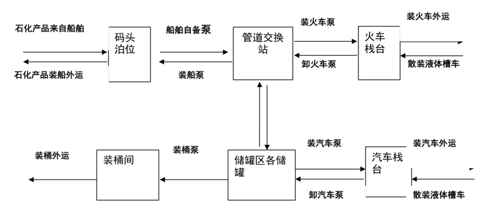

## 2019011. 油品及化学品的罐区设计和装卸设计

### 记忆时间

2020-01-13；

### 00. 总纲

目前梳理后主要分为两大模块：

1、罐区的设计，包含设计规范、流程、布置要点、配管要点、储罐安全附件。

2、装卸的设计，包含设计规范、流程、设备选型、布置。

### 01. 罐区设计

#### 1.1 设计采用的主要标准及规范

罐区设计采用的标准及规范主要有：

1、《石油库设计规范》（GB50074-2014）

2、《石油化工企业设计防火规范》（GB50160-2008）

3、《石油储备库设计规范》（GB50737-2011）

4、《石油化工储运系统罐区设计规范》（SH/T3007-2007）

5、《石油化工储运系统泵区设计规范》(SH/T3014-2012）

6、《海港总体设计规范》（JTS165-2013）

7、《建筑设计防火规范》（GB50016-2006）

8、《职业性接触毒物危害程度分级》（GBZ230-2010）

9、《爆炸危险环境电力装置设计规范》（GB50058-92）

10、《石油化工可燃气体和有毒气体检测报警设计规范》（GB50493-2009）

#### 1.2 储罐区的分类

1、储罐区分类。1）可燃液体地上储罐区（常压罐区）。2）液化烃、可燃气体、助燃气体地上储罐区（压力罐区）。

2、罐区的火灾危险性分类。1）可燃气体的火灾危险性分类。2）液化烃、可燃液体的火灾危险性分类。

3、 储罐的分类。1）常压储罐。设计压力小于或等于 6.9kPa（罐顶表压）的储罐。2）低压储罐。设计压力大于 6.9kPa 且小于 0.1MPa（罐顶表压）的储罐。3）压力储罐区。设计压力大于或等于 0.1MPa（罐顶表压）的储罐。

4、常压储罐适宜储存的介质及储罐类型 。1）适宜储存的介质。沸点 ≥45℃ 甲 B 类液体。2）储罐的类型。固定顶罐、浮顶罐。

5、压力储罐适宜储存的介质及储罐类型 。1）适宜储存的介质。可燃气体、助燃气体、液化烃；沸点 ≤45℃ 的甲 B 类液体。2）储罐的类型。压力储罐（球罐，立式、臣式压力罐）。

#### 1.3 储运的流程

1、收物料：船（火车、汽车）=> 管线 => 储罐 。

2、发物料：储罐 => 泵 => 管线 => 船（火车、汽车）。

#### 1.4 罐区的设备布置

1、储罐的布置。

1）储罐的布置应符合相关现行设计规范规定：《石油化工企业设计防火规范》《建筑设计防火规范》、《石油库设计规范》，等等。

2）甲、乙、丙类化学品储罐区、液化石油气储罐区、油品罐区、可燃及助燃气体储罐区、可燃材料堆场，应与装卸区、辅助生产区及办公室分开布置。

3）在同一罐组内，宜布置火灾危险性类别相同或相近的储罐；沸溢性液体的储罐与非沸溢性液体的储罐不应同组布置；液化烃的储罐不应与可燃液体常压储罐同组布置。

1-3『

很多专业名词的解释可以在相应的规范里找到，比如「术语」章节。

含水并在燃烧时产生热波作用的油品，如原油、渣油、重油等。《GB 50016-2006 建筑设计防火规范》；当罐内储存介质温度升高时，由于热传递作用，使罐底水层急速汽化，而会发生沸溢现象的粘性烃类混合物。《GB 50160-2008 石油化工企业设计防火规范》

』

4）固定顶罐组的总容积不应大于 12 万 m3，浮顶、内浮顶罐组的总容积不应大于 20 万 m3。

5）罐组内储罐的个数不应多于 12 个；但单罐容积均小于 1000m3 储罐以及丙 B 类液体储罐的个数不受限制。

6）罐组内的储罐不应超过两排；但单罐容积小于或等于 100m3 的丙 B 类液体储罐不应超过 4 排。两排立式储罐的间距应符合相关规范中的规定，且不应小于 5 m，两排卧式罐的间距不应小于 3m。

2、泵的布置 。

4.2.1 泵的布置方式。泵的布置方式有三种：露天布置、半露天布置和室内布置。

4.2.2 泵的布置要点：1）成排布置的泵应按防火要求、操作条件和物料特性分组布置。2）泵成排布置时，宜将泵端基础边线对齐，或将泵端出、入口中心线对齐；泵双排布置时，宜将两排泵的动力端相对，在中间留出检修通道；除安裝在联合基础上的小型泵外，两台泵之间的净距不宜小于 0.8m。3）泵的布置应考虑管道柔性设计要求。4）泵的基础面宜高出地面 200mm（视具体情况考虑）。5）泵区通道的最小净宽为 2m，最小净高为 3m，泵端操作通道宽度不应小于 1m。

1『两排泵布置时，电机端相对，中间再留个检修电机的通道，比如 800。』

3、罐区辅设施的布置。

1）罐区一般配备有控制室、配电室、变电站等设备。这些设备宜布置在罐区上风向或平行风向的独立建筑中，若不能单独布置时也应布置在泵区或泵房的一侧，且距离最近的泵大于 15 m。

2）配电室、变电站应尽量靠近用电设备布置。

3）控制室、变电站、配电室的设计应符合《爆炸性环境用防爆电气设备通用要求》的规定。

#### 1.5 防火堤

1、必须使用非燃烧材料构筑防火堤，且穿过防火堤的管路，必须用非燃烧材料严密填实。防火堤上的排水孔洞应设置「排水阻油装置」，或设水封井，或安装闸阀等措施，防止事故状态下油晶流到防火堤外。

2、地上储罐组应当设置防火堤。立式储罐防火堤的计算高度应保证堤内有效容积需要。防火堤的实高应比计算高度高出 0.2m。防火堤的实高不应低于 1m（以防火堤内侧设计地坪计），且不宜高于 2.2 m（以防火堤外侧道路路面计）。卧式储罐的防火堤实高不应低于 0.5m（以防火堤内侧设计地坪计）。

3、严禁在防火堤上开洞。管道在穿越防火堤时，应采用非燃烧材料严密填实。在雨水沟穿越防火堤时，应采取排水阻油措施。各罐组防火堤的人行踏步不应少于两处，且应处于不同的方位上。

4、地上立式储罐罐的罐壁至防火堤内堤脚的距离，不应小于罐壁高度的一半；卧式沺罐的罐壁至防火堤内堤腳的距离，不应小于 3m。

5、防火堤内的有效容积。固定顶油罐不应小于罐组内一个最大储罐的容积；浮顶罐、内浮顶罐不应小于罐组内一个最大罐容量的一半；固定页罐与浮页罐、内浮页罐布置在同一罐组内时，应取以上两款规定的较大值。

#### 1.6 罐区的配管

1、储罐的配管。

1）罐区内管线宜地上敷设，采用管墩敷设时墩顶高出地面不宜小于 300 mm。

2）储罐进出口管线靠近罐壁的第一道阀门必须用钢阀，对于腐蚀性的介质，用腐蚀性的阀门。

3）储罐进口或出口管线多于两根时，宜设一个总的手动切断阀。

4）储罐的进料管应在罐体下部与储罐连接，若进料管必须从罐体上部接入，应在罐内向下延伸至距罐底 200 mm 处。

5）储罐进口管线宜采用金属软管连接或其他柔性连接，以吸收罐体管口的位移。

6）对于高温管线或需要有蒸汽吹扫的管线应做好热应力计算，如果需要可在适当的位置设置补偿器，并确定好固定支架的位置，固定支架必须有足够的强度，以承受内压推力的作用。

2、 泵的配管。

1）宜承受进、出口管道和阀门的重量，泵的进出管道必须设支架。特殊情况的应根据介质温度和管径決定是否须作应力计算；

2）入管道应满足泵的「汽蚀余量」的要求，管道尽可能短、少拐弯，不宜有袋型，弯头要用长曲率半径的，避兔突然缩小管径；

3）入管较长时，宜设计成一定坡度，泵比容器低时宜坡向泵，泵比容器高时宜坡向容器。

4）工艺要求的前提下，泵的管道、阀门手轮不得影响泵正常运转及维修检査所需空间；

5）入管须变径时，吸入管由下而上进泵选顶平异径管；吸入管由上而下进泵选底平异径管；

6）过滤器应安装在泵进口切断阀与泵进口之间，要方便拆卸，安装。

7）出口管线上应设止回阀，且止回阀设在切断阀之前；

8）泵的特殊管线（保护线）：暖泵线、旁通线、安全阀线、防凝线等，在配管时也要符合规范。

7、储罐的安全附件。

1）梯子和栏杆。

2）金属软管。

3）呼吸阀：呼吸阀设在液体储罐的顶板上，是调节储罐内外压力，保护储罐储油安全的重要附件。

4）阻火器：储罐上的阻火器一般安装在位于罐顶上呼吸阀的下部。

5）安全阀：安全阀是装设在罐顶上，保护储罐安全的另一个重要附件。

6）喷淋降温裝置：喷淋降温裝置由钢管、喷头组成，裝于储顶部，用于夏季喷水降温。

7）通气阀：通气阀也叫透气孔，常裝在挥发性能差的物料储罐顶中央，使储罐接与大气相通，作为储罐进行收、发作业时的呼吸通道。

### 02. 装卸设计

#### 2.1 设计采用的主要标准、规范及法规

1)《石油库设计规范》（GB50074-2014)

2)《石油化工企业设计防火规范》（GB50160-2008）

3)《石油储备库设计规范》（GB50737-2011）

4)《石油化工储运系统罐区设计规范》（SH/「3007-2007 

5)《石油化工储运系统泵区设计规范》(SH/T3014-2012 

6)《海港总体设计规范》（JTS165-2013)

7)《建筑设计防火规范》（GB50016-2006）

8)《职业性接触毒物危害程度分级》（GBZ230-2010）

9)《爆炸危险环境电力装置设计规范》（GB50058-92)

10)《石油化工可燃气体和有毒气体检测报警设计规范》（GB50493-2009)。

11)《铁路危险货物办理站、专用线（专用铁路）货运安全设备设施暂行技术条件》（铁运【201이]105 号）

12）中国铁路总公司关于部分修订《铁路危险货物办理站、专用线（专用铁路）货运安全设备设施暂行技术条件》的通知 (铁总运 [2013]188号)

13)《石油化工液体物料铁路装卸车设施设计规范》（SH/T3107-2000)。

#### 2.2 装卸工艺流程

1、装车工艺。储存在储罐区储罐內的石化产品由装火车泵（属储罐区范围）加压后，将物料输送至火车或汽车栈台，经栈台上的装车鹤管液下装车。工艺过程为储罐区储罐 => 装车泵 => 装卸管线 => 栈台 => 鹳管装火车或汽车槽车外。

2、卸车工艺。根据国內火车卸车操作经验，对于火车卸油（液体）工艺主要有以下几种方式：主要包括潜油泵或潜油泵配合离心泵卸油、真空泵卸油、离心泵+容积式泵（扫仓用）结合卸油、容积式泵卸油等流程。具体不详述。

#### 2.3 设备选型

1、火车裝卻车鹤管。火车装车鹤管有大鹤管（DN200）和小鹤管（DN100）二种，卸车鹤管一般只有小鹤管（DN100）一种。

1）大鹤管。直径为 DN200，密闭浸没式外液压大鹤管是炼沺厂（或油库〕油品铁路装车的专用机械设备之一，用于炼油厂和装油站槽车装油系统中，使装油站台缩短，减少管架所占面积及许多附属设施，使操作集中，实现油品裝车自动化，大大地改善了工人的工作条件，便于维修与管理。可密闭浸没式装油液面平稳上升，自动控制阀门，油流与槽车底及空气的磨擦较小，从根本上解决了槽车敞口时的大量油气以及环境污染，静电电位高等突出矛盾。适用于单一油品、装车规模大的场合，不能用于卸车，需要槽车牵引设备-爬车。

2）小鹤管。直径为 DN100，一般选用带立柱和平衡装置的装卸鹤管，末端垂管为轻质材料，可用于装卸车。有上装式和下装式二种。

2、扫舱罐（分液罐）。扫舱罐，也叫分液罐、缓冲罐，一般采用卧式罐，容量应根据栈桥车位的多少合理配置，一般为 10-20 m3。

3、输送泵。

1）泵体和叶轮材质应与所装介质的性质、操作温度、压力及环境温度相适应。

2）装卸易挥发、易燃、易爆介质时，泵应采用机械密封及相应的铺助结构，配防爆电机。

3）装卸一般无特殊要求的化工品可选用离心式泵，输送毒性物料时，宜选用屏蔽泵，装卸粘度较高的物料宜采用螺杆泵。泵的流量应满足铁路部门对装卸作业时间的要求。

4）扫舱泵应选用自吸能力强运行平稳、低噪音、寿命长、可用于气液混输的容积式泵，如摆动转子泵、双螺杆泵等。

5）轻质油品应采用潜油泵铺助正压卸油工艺，以避免气阻现象发生，加快卸油速度。

6）不同品种的输送泵和管道应分别设置，管道不应互相连接防止混料。

4、备用泵的设置要求。

1）对运转中不允许因故中断操作的，应设备用泵。

2）输送职业性接触毒物（I、Ⅱ 级）和酸、碱、盐等腐蚀性介质的泵，均应设备用泵。

3）经常操作但非长时间连续运转的泵，不宜专设备用泵，但可与输送介质性质相近且性能符合要求的泵互为备用或共设一台备用泵。输送化工品介质的泵宜单罐单泵独立设置。

4）不经常操作或因故中断但不影响装卸的，不设备用泵。

5）输送同一介质的备用泵不得超过一台。

#### 2.4 火车装卸设施的布置要求

1、危险化学品的铁路专用线设计、建设及运行除符合国家和行业有关规定及相应标准外，还应符合国务院铁路运输主管部门的有关规定。

2、易燃易爆介质铁路罐车裝卸作业应划定危险区域边界线，禁止蒸汽机车、未设置阻火器的内燃机车进入。

3、铁路装卸区宜布置在库区的边绿地带，宜位于年最小频率风向的上风侧，并宜构成一个独立区域。与邻近的建、构筑物的防火间距，应符合防火规范的要求，以避免铁路油罐车的进出影响其它分区的操作和管理，减少铁路与库内道路的交叉，有利于安全和消防。

4、铁路槽车裝卸设施的规模，应考虑近期和远期液体石油化工原料、产品品种和运输量，按一次规划、分期建设的原则进行工程设计，并适当考虑发展的可能性。

5、铁路罐车裝卸线设置和罐车装卸线中心线至石化库內非罐车铁路装卸线中心线的安全距离，应符合现行国家标准的规定。

6、火车栈台在历年平均降水量大于 1000 mm，或最热月平均最高气温高于 32℃ 的地区，栈台上应设防雨或防热棚。

7、火车栈台宜为钢筋混凝士结构，雨棚可采用轻钢结构。

8、卸车泵可集中布置在泵棚（房）内或分散布置在栈桥下。布置在铁路栈桥下的设备与铁路的间距应满足规范的要求。

9、铁路卸油泵站应采用地上泵棚形式，极端最低气温低于 -30℃ 的地区，和极端气温在 -20 到 -30 ℃且风沙较大地区，可设泵房。泵棚（房）应附设值班室配电间、则所等房间。配电间门密应设在爆炸危险区域以外，若窗设在爆炸危险区域以內时，应为密闭固定窗。

10、泵棚柱应采用钢筋混疑土结构，当采用钢柱时，应在柱表面涂刷防火涂料使其耐火极限达到 2 小时。