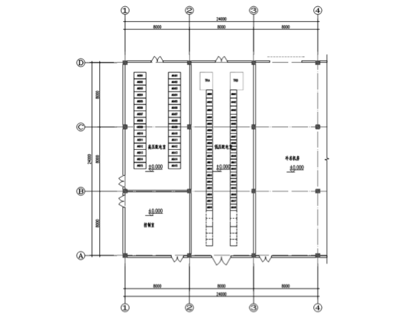
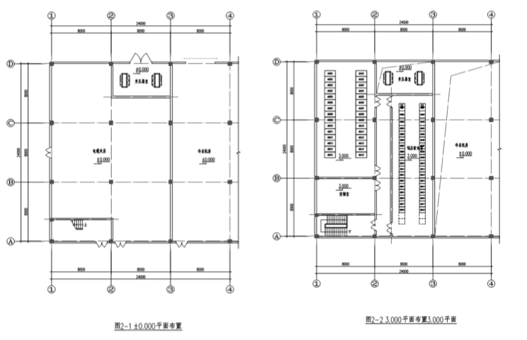
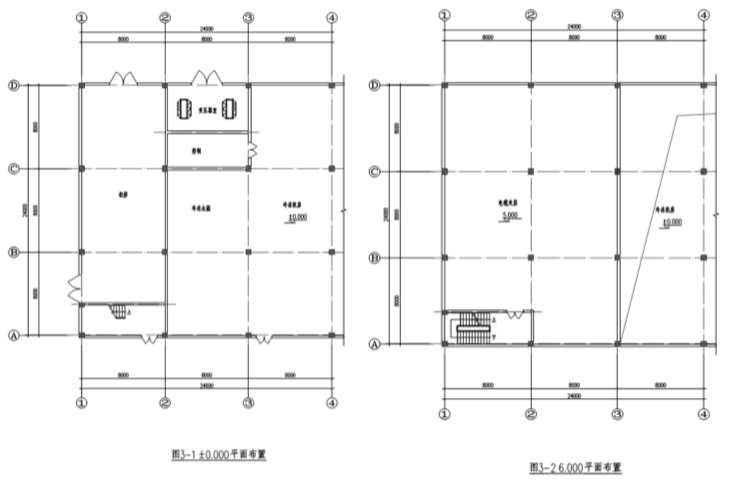
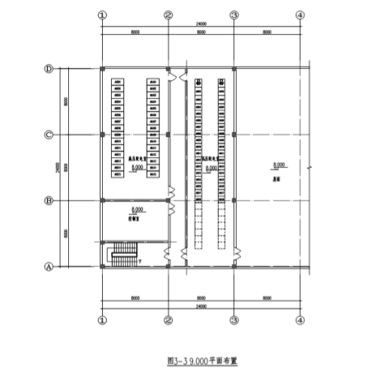
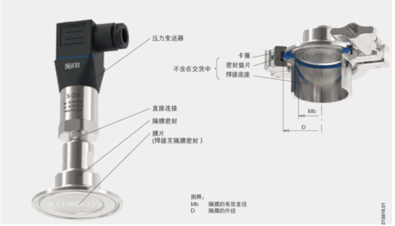

## 20200515电气专业培训化工厂变电所设置及布置.md

培训时间：2020-05-15

### 01. 变电所设置的原则

1、深入负荷中心，对于中小型精细化工项目尤为重要。

2、接近电源侧，对于大中型化工项目的 35kV 或 110kV 主变电所应考虑接近电源侧，并方便外部线路接入。

3、不应设在有经常积水场所的正下方，也不宜毗邻。

4、对于爆炸危险场所变电所，《石化规》不允许与甲乙 A 类设备房间合建且不在爆炸危险区域内，《建规》仅允许单体专用的变电所单面贴邻，并不在爆炸危险区域内。

### 02. 变电所电压等级的选择

1、电网供电电压等级 10kV、20kV、35kV、110kV，根据工程总用电负荷计算功率：1）8000kV 及以下可采用 10kV 供电；2）8000-30000kW 可采用 35kV 供电。3）30000kW 以上需采用 110kV 供电。

具体需要与当地供电部门确认。当项目采用 35kV 及以上电压供电时，总图布置应考虑总变电所场地。

2、设备配电电压等级 220/380V、（660V）、（6kV）、10kV：1）根据 SH3038-2000《石油化工企业生产装置电力设计技术规范》，160kW 及以上电动机宜采用中压供电。根据 JGJ16-2008《民用建筑电气设计规范》，250kW 及以上用电设备宜采用中压供电。2）对于大中型化工装置较大供电半径、大容量电加热以及数量较多且需要变频大功率电机（如发酵罐电机 250-500kW）可考虑采用 660V 电压。

### 03. 负荷等级及电源选择

负荷分级的概念：根据对供电可靠性的要求及中断供电在政治上、经济上所造成的损失或影响的程度，电力负荷分为三级。

一级负荷：1）中断供电将造成人身伤害时。2）中断供电将在经济上造成重大损失时。3）中断供电将影响重要用电单位的正常工作。

在一级负荷中，当中断供电将造成人员伤亡或重大设备损坏或发生中毒、爆炸和火灾等情况的负荷，以及特别重要场所的不允许中断供电的负荷，应视为一级负荷中特别重要的的负荷。例如：ESD、DCS 系统、大型机组的润滑油泵、防止反应爆炸的冷却水系统等。

二级负荷：1）中断供电将在经济上造成较大损失的负荷。2）中断供电将影响较重要用电单位的正常工作。

三级负荷：不属于一级和二级负荷者。

中断供电除一般停产损失外，没有其他重大经济损失或造成人员伤亡的均可列为三级负荷。一、二级负荷的定性应根据规范和工艺实际慎重确定。凡是能采取非电气保安措施者，应尽可能减少特别重要负荷的数量。

一级负荷的供电要求：一级负荷应由双重电源供电，所谓双重电源是指若干个电源中，任一电源因故障而中断供电时，不影响其它电源继续供电。譬如说两个发电厂；一个发电厂和一个地区电力网；或一个电力系统中的两个区域性变电所，都属于两个独立电源能够保证供电可靠性的情况下，同一变电所的两段母线也可以满足一级负荷要求。

对于特别重要的负荷应急电源的选择要求：主要是根据允许中断供电时间来选择。1）蓄电池不间断供电装置（UPS、EPS、DC）—— 毫秒级。2）带有自动投入装置的独立于正常电源的专用馈电线路。——0.6~1.5 秒。3）快速自起动发电机组 ——15s 以上。应急电源的工作时间应按生产技术上要求的停车时间考虑。

二级负荷供电要求：宜由两回线路供电，并且两回回路应尽可能引自不同的变压器和母线段；当负荷较小或地区供电条件困难时，允许由一回 6kV 以上专用架空线供电。

三级负荷供电要求：对供电无特殊要求，一般按其用电负荷大小来确定。

两回线路与双重电源的区别：两者都需要线路的独立性，但后者更强调电源的相对独立；此处电源是指工厂的电源，而不是设备的电源。

### 04. 变电所布置及优化 —— 精细化工变电所布置

目前公司承接的项目以精细化工及医药为主，大部分项目整体体量不大，用电量也不大，电源进线一般以 10kV 为主，空压、冷冻、循环水等公用工程用电量占比很大，变电所以附设在动力车间为主。常规附设在动力车间的变电所一般采用单层或一层半的结构，变压器采用独立设置或与配电合并设置的方式。

1、单层布置附设式变电所。变电所采用单层布置方案，一面或多面与动力车间合建，变压器如采用干变，一般与配电柜合并布置在同一个房间内，如采用油变，应设置独立的变压器室，电缆采用电缆沟出线的方式。目前一般采用干变与配电柜同室为主。

优点：1）布置简洁，设备搬运方便：2）如变压器与配电柜同室布置，连接母线较短，母线投资节约；3) 土建投资节约。

缺点：1）土地利用率不高，不能有效利用动力车间层高；2）采用电缆沟方式，电缆沟容易进水；3）由于变电所集中设置，电缆数量较多，采用电缆沟方式不利用电缆敷设及后续检维修；4）电缆相对较长，电缆投资较大；5）变压器、电力电缆与配电柜布置在同一个房间，且变压器整体散热量大，不利于配电室降温，如设置空调，将增加变电所运行能耗。

2、一层半布置附设式变电所。变电所采用单层布置方案，一面或多面与动力车间合建，变压器如采用干变，一般与配电柜合并布置在同一个房间内，如采用油变，应设置独立的变压器室，电缆采用电缆沟出线的方式。目前一般采用干变与配电柜同室为主。

优点：1）采用夹层方案，利于电缆敷设及后续检维修；2）将变压器、电缆夹层和配电室分开布置，利于配电室散热，降低配电室运行能耗；3）配电室架空布置后，不会受到后续由于场地排水不畅而导致配电室进水的问题，提高了变电所运行安全性。

缺点：1）土地利用率不高；2）土建投资较大；3）配电室最多只有两面通风，通风散热效果不好；4）变压器与低压进线柜母线较长，母线投资较大；5）设备搬运不便，应考虑吊装平台。

3、第三种附设式变电所。该方案是常规方案的改进，可以更好的利用动力车间层高以及空压冷冻之间层高差，节约土地和投资，变电所采用二层半的结构，三层设配电室，层高为 4m，楼面与屋面平二层为电缆夹层，高度为 3m，一层层高为 5m，除了布置变压器和高压柜外，留出的空间可以用于布置比较重的工艺设备或动设备，比如空压机等，或者用布置便于人员进出的机修、值班和控制等。

优点：1）极大提高了动力车间利用率。动力车间中一层空间比较宝贵，除了变压器占用少量的空间外，其余均可用于布置公用工程设备；2）便于设备搬运，变压器室采用独立布置方式，配电室位于三层，楼面与屋面齐平，不需要另设吊装平台，便于设备搬运；3）降低了电缆投资。由于电缆夹层位于二层，桥架引出高度为 7m 左右，基本与户外管架上桥架高度齐平或略低，可以极大降低电缆在变电所长度；4）利用电缆敷设及后续检维修。由于设有夹层且布置在二层，电缆可以直接上管架，不需要上翻，后续检维修及增加电缆也极为便利；5）配电室架空布置后，不会受到后续由于场地排水不畅而导致配电室进水的问题，提高了变电所运行安全性。6）将变压器、电缆夹层和配电室分开布置，利于配电室散热，降低配电室运行能耗；7）三层配电室可四面通风，散热较好，且可以利用自然采光。

缺点：1）多一层电缆夹层，土建投资较大；2）变压器与低压进线柜母线较长，母线投资较大。

三种变电所方案布置、投资又运行费用分析：

通过对上述三种附设式变电所的方案对比，采用第三种方案，有效的利用了动力车间的高度差，优化了变电所结构，节省了电气投资，降低了运行费用，减少了变电所的占地面积，提高了动力车间的土地利用率，是精细化工项目乃至大化工项目值得推广的方案。

### 05. 工艺或相关专业提出用电设备条件注意事项

提电气条件的目的：1）为了给电器设备提供电源。2）为了达到设备的工艺控制要求。

注意事项：

1、负荷等级：中断供电除停产损失外，没有其他重大经济损失或造成人员伤亡的均可列为三级负荷。一、二级负荷的定性应根据规范和工艺实际慎重确定。

2、控制方式应详细列出每个控制点的控制要求，比如 DCS 能不能开机，有没有 ESD 停机，连锁开 / 停机具体要求等。

3、变频器调速点如非必须，建议只在 DCS 调速。

4、状态返回信息根据运行所需要监视的实际参数确定，够用就行。

5、特别是工艺的统一规定应明确各车间的控制方式统一。

6、电机功率应附带电机级数（转速），相同功率不同转速的电机运行电流是不一样的。如果是屏蔽电机，需特殊注明。

7、对于电气专业来说仅提供总电源即可的（设备自带现场配电箱）才可称之为「成套设备」，成套设备如需要连锁、远程控制的，需向电气、自控专业分别提出条件。能提供厂家控制图最好。

8、防爆介质应尽可能详尽地描述车间具有的危险介质种类，特别注意 IIC 级介质（氢气、乙炔、水煤气）。释放源如不能精确提出具体点位，在设备布置图将介质工作设备的范围圈出。

9、安装视镜灯的设备需要明确指出。

10、车间有放空管高出建筑物的需要特别指出位置、管壁厚度。（壁厚大于等于 4mm 的钢质材料可直接作为接闪器）

11、防爆车间的静电消除器需要定位。