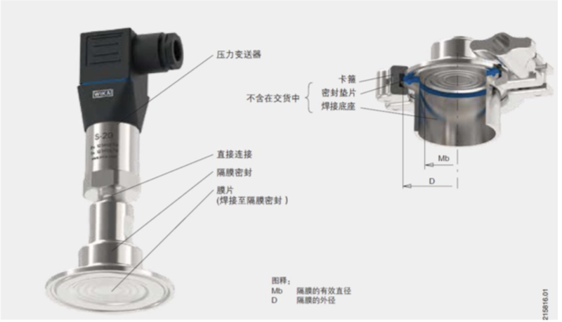
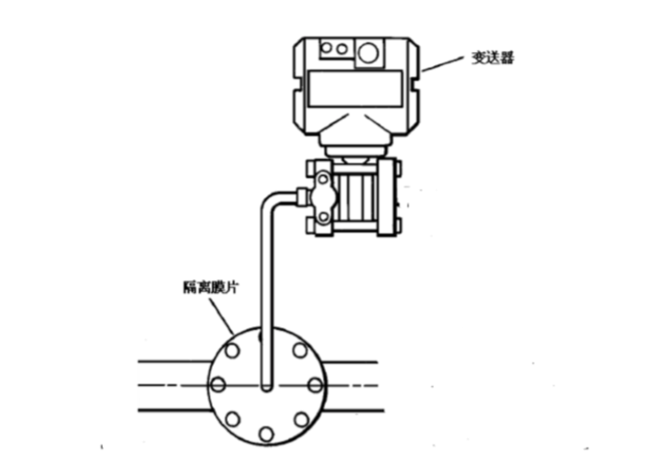

# 化工厂自控设计中压力变送器选型因素分析

在化学反应过程中，压力影响着化学物料平衡关系和化学反应速度，在化学品存储和流体输送中，压力也与管道、设备的安全性息息相关。

压力的检测和控制对保证化工生产的正常运行是十分重要的。压力检测是通过压力变送器实现的，压力变送器选型不合适或者使用不正确，或者错误的安装都会带来压力测量上的问题，会影响工艺生产中的产品品质，造成生产安全危险性等不良后果。做好压力变送器的选型，需要统筹考虑多方面的问题。

以下针对选型问题，结合规范和工作中的设计经验，归纳总结了压力变送器选型思路和安装上需要考虑的因素，为工程设计提供参考。

## 00. 引言

化工工厂中，压力变送器应用在压力、流量、液位测量的各个方面，根据不同的应用领域，采用的压力变送器的类型不同：

1、在单纯的压力测量中：会采用表压压力变送器、绝对压力变送器。对于非隔膜密封式的压力变送器又可以再分为管道直连式和导压管取压式两种类型。其中直连式的变送器，由于取压口在底部，可以和压力表一样，直接安装在管道上，安装十分方便。对于需要测量差压或者微小压力的场合，采用差压压力变送器。

2、在液位测量中：由于液体的静压和液位高度成正比，可以通过差压变送器来测量液位。

3、在流量测量中：通常采用差压变送器来配合节流元件，来流量检测。

因此压力变送器的选型涉及到各种领域，需要设计人员在选型中统筹考虑到各方面的问题，合理选型来达到测量目的。需要考虑的因素主要有：变送器的安全性、性能指标，环境条件、应用工况、安装条件、与经济性等。

## 01. 安全性

安全性是选型首要注意环节，压力的测量仪表无论在正常生产或故障情况都不应导致影响生产系统的安全，这分为几个方面：

1、压力仪表的耐压能力。在一些工况，工艺的正常操作压力和极端情况下的压力相差悬殊，如汽化器出口管线，这时候就需要压力变送器具备足够的耐静压能力，避免压力变送器超压爆裂，介质外泄的风险。

2、压力仪表的防爆。爆炸危险区域划分图是由电气专业设计的，压力变送器的防爆等级需要满足爆炸危险区域划分图中防爆等级要求。

3、压力仪表的防腐。压力仪表的测量元件的材质需要满足被测介质的腐蚀性要求，需要妥善选择仪表触液材质，避免泄漏的安全风险。对于环境腐蚀较严重的场合，如海边，也需要考虑好变送器外壳材质的耐腐蚀能力，避免减少仪表寿命，带来经济损失。

4、被测介质的特殊要求。对于强氧化性的介质，压力变送器的测量元件还需要做好禁油脱脂，避免产生接触氧化自燃的安全风险。

## 02. 性能要求

压力变送器需要在性能要求上考虑的内容有：1）量程选择。2）精确度。3）重复性、线性度。

### 2.1 量程选择

压力变送器的量程选择是变送器选型中的一个重要内容，由于各个厂家的各档膜盒的量程会有差异，因此当需要采购变送器时，应先确定所采用变送器的生产厂家及型号，然后再根据工艺测量要求确定变送器的量程，同时考虑一定的调整裕度。

根据设计规范，在测量稳定的压力时，正常操作的压力值应在仪表量程的 1/3-2/3 范围内；当测量脉动的介质压力，正常操作的压力值应在仪表量程的 1/3-1/2 范围内，这也是压力或差压变送器量程选择的基础。由于压力变送器的不同代码的膜盒只能适用于一定的量程范围，以罗斯蒙特` 3051S_T` 膜盒表为例，可见该款变送器分为五种代码膜盒，不同代码的膜盒测量上限差异悬殊。

3051S_T 膜盒 —— 表 1

在确定变送器的量程时，不能选极端，将变送器的使用量程定在膜盒的最小量程或最大量程，因为在生产现场，有时候会因为工艺调整，变更量程，选型需要留有量程调整的余地，避免选择的膜盒无法适用。比如选择膜盒代码 1 时，设定为 0-207kPa 的量程，如果需要向上调整就只能变更变送器了。

对于绝对压力变送器，还需要注意最小量程的取值问题，以几个品牌的压力变送器对比表 2 为例。

表 2 —— 几个品牌的绝对压力变送器的可测最小压力与最小量程

| 绝对压力变动器 | 可测下限（绝压） | 最小量程（mmHg）
| --- | --- | --- |
|  3051(S)CA   |  0   |  15.5 |
|  3051(S)TA   |   0  |  8.625 |
| EJA310    |  0.1   |  5.0 |
|  EJA510A   |  0.1   |  75 |

由表 2 可见，最下量程，和最小可测值各个品牌不同，有的可测下限并不是从「0」开始。对于法兰式隔膜压力变送器，就需要看填充液的饱和蒸气压来确定最小压力与最小量程。

### 2.2 精度选择

目前主流国际品牌的压力变送器的精度为 0.065% / 0.075%，国产压力变送器的精度相比较低。在正常生产一味得追求高精度其实并没有必要，由于压力的测量精度是一个系统的综合精度，压力的检测信号经过信号传输，控制系统的卡件转换，因此整个系统要考虑到压力变送器的误差和信号传输执行等环节的误差的影响因素。尤其是对于压力调节控制回路，由于调节阀有 2％ 左右的回差，是整体精度的短板，因此对于压力提过高的精确度要求也没有意义。现在压力变送器产品的高精度很多时候也是各产品供应商为了竞争性而提升的结果。精度的选择还是适合根据生产操作的需要来确定。

需要注意的是，仪表样本中的精度值是指引用误差（常用 ％F.S 表示)，代表满量程的百分比精度。大量程比的压力 / 差压变送器只是在一个较小的量程比范围内可达到目标精度。而这也会影响到变送器形式的选择。

同样以 `3051S_T` 为例，根据样本，引用误差为 ±0.055%，当量程比超过 10:1 时，精度如下：

```
精度 =±[0.0065x (量程上限 / 量程）] % —— 公式 1 
```

表 1 中的量程代号 1 的膜盒的量程上限为 207kpa，根据公式 1 可以计算得出：如果测量目标精度为 ±0.075%，临界量程值为 18kPa，当压力变送器的量程在 0-18kPa 至 0-207kPa 之间调整量程时，精度指标优于 ±0.075%，当量程低于 18kPa 时，就需要根据公式 1 计算附加误差，或者选择临界量程值更低的表压压力变送器或者差压变送器。

1『目前上面的计算示例没弄明白。（2021-01-08）』

### 2.3 重复性、线性度

重复性、和线性度是传感器的两个重要指标。

1、重复性：是指传感器在输入量按同一方向作全量程连续多次变化时，所得特性曲线不一致的程度。简而言之，重复性，就是重复测量同一个大小的参数，多次测量数据之间的误差。

2、线性度：定义为传感器输出量与输入量之间的实际关系曲线偏离拟合直线的程度。但是对于一些流量温压补偿计算时，为了提高动态计算精度，采取线性误差更低的压力变送器，对减少补偿后的流量计算误差更有利。

根据经验，除了用于贸易结算计量的工况，用于做温压补偿计算的压力变送器有必要高精度和高线性度外，用于工艺控制工况的压力变送器的重复性相对于高精度更重要。

## 03. 压力选型时需要注意的工艺参数

各类压力仪表会受到一些工艺参数的影响，所选择压力变送器要针对更多的条件进一步核对所选变送器类型是否合适。

### 3.1 高温工况环境

目前主流的罗斯蒙特 3051 和横河的 EJA 的膜盒都可以耐温至 120℃，高温环境下，测量介质的温度较高，过程的温度往往会超过变送器的正常工作范围，并且不能通过导压管把温度调整到正常范围内。那么就可以通过选择远传型变送器利用毛细管引压，避免变送器受到高温破坏了电子元件的使用性能。

需要注意填充液的温度范围，参见表 3。

表 3 填充液温度范围表

| 填充液 | 温度范围（℃） | 相对密度（25℃） | 热膨胀系数
| --- | --- | --- | --- |
|  DC200 硅油    |  -40~205   |  0.934  |  0.001080 |
|  DC704 硅油   |   0~315  |  1.070  |  0.000530 |
| 情性液    |  -45~175   |  1.850  |  0.000864 |
|  Sylther 硅油  |  -75~150   |  0.850  |  0.000666 |
|  甘油和水  |  -15~95   |  1.130  |  0.000190 |

对于采用隔离装置的，需要注意负压，高温的工况。高度真空时，灌充液的沸点大大降低，工艺温度超过填充油在该压力的沸点时，填充液可能会部分气化，气化压力会施加给膜片，同时也施加给变送器传感元件，给测量正偏差要看选用填充液在真空下的适用温度，一些类型不适合真空场合。

### 3.2 容易结晶的高黏度介质

介质一旦离开工艺设备，就很容易出现结晶现象，如果出现结晶或者介质的黏度太大，就容易导致导压管出现堵塞，不仅需要通过清理疏通而带来较大的工作量，还会造成测量结果不稳定。这种情况下，一般适合选择隔离式变送器，宜配冲洗环。如果结晶现象比较严重，就需要选择凸膜片型变送器。

### 3.3 腐蚀性的工作环境

腐蚀性工况一般指的是环境条件腐蚀性和应用工况的腐蚀性。

1、应用工况的腐蚀性。

如果管道是碳钢或者不锈钢材质，那么首选普通型的压力变送器。如果介质具有强腐蚀性，压力变送器应采用隔膜密封膜片隔离，其中最关键的选材是膜片材质和法兰材质，膜片材质应根据介质的不同化学特性进行选择，介质的浓度和温度不同，对材质的要求也不同。

隔膜压力变送器的隔膜厚度：一般为 0.06-0.12mm，需要考虑腐蚀裕度的影响，因此防腐能力需要极佳，才能避免腐蚀穿孔，工艺管道材料因为壁厚大，裕度也高。

有几个介质的膜片选材需要比较注意：

1、HF。哈氏合金 C 和蒙乃尔合金是两种常用的耐腐金属，对 HF 的耐腐能力不相伯仲，但是蒙乃尔合金在盐酸中，在常温下只能使用到 15% 的浓度，在 70 度时，5% 的盐酸对其腐蚀性就很强，并且如果充气的话，腐蚀率更高，因此盐酸和 HF 的混酸不能采用蒙乃尔，而 HF 如果含 HCL，就不适合采用蒙乃尔合金。

2、氯甲烷。氯甲烷由于在生产的过程中，氯化氢会有残留，因此耐腐要考虑到氯化氢的腐蚀。

远传涂层（PTFE）膜片一般不推荐使用，可以选用替代金属膜片时尽量选用金属膜片，必须选用涂层膜片时，必须满足以下要求：1）过程温度低于 200 度。2）不存在负压，即低于大气压的情况不会出现。3）介质不含颗粒，即只能是纯粹的气态或液态介质。4）安装时要注意膜片不能过度挤压，避免划伤等。

法兰连接的变送器一般有碳钢、304、316 三种材质可以选择，由于法兰不直接接液，因此，考虑到经济性要素，一般可以选用碳钢材质。

2、环境的腐蚀性。

变送器外壳材质一般有铝合金和不锈钢，在非腐蚀性环境中选用铝合金材质经济性更高，如果处于腐蚀性环境中，则更适合选用不锈钢材质。

### 3.4 低温的工作环境

对于普通的变送器，膜盒耐低温型可至 -40℃，通过取远引压可以测量更低温介质。对于隔膜远传压力变送器，需要注意选取高温硅油后要注意其黏度大于普通硅油，采用更粗的毛细管，使用温度一般从 0℃起，低温时可能会凝固，要注意环境温度的问题，见图，填充液凝固不会损坏变送器，但会影响测量，应考虑保温，伴热等措施，见表 4。

表 4 填充液的耐温范围表

| 填充液 | 温度范围（℃） | 相对密度（25℃） | 热膨胀系数
| --- | --- | --- | --- |
|  DC200 硅油    |  -40~205   |  0.934  |  0.001080 |
|  DC704 硅油   |   0~315  |  1.070  |  0.000530 |
| 情性液    |  -45~175   |  1.850  |  0.000864 |
|  Sylther 硅油  |  -75~150   |  0.850  |  0.000666 |
|  甘油和水  |  -15~95   |  1.130  |  0.000190 |

可见普通硅油膨胀系数不算低，但由于使用温度范围宽广，价格便宜，得到最广泛应用，除了一些卫生、需要禁油的使用场合，工艺介质中有氯、硝酸、过氧化氢等强氧化剂的场合，不得使用甘油，可以采用氟碳润滑剂或卤烃等惰性液。

### 3.5 卫生等级要求高的场合

采用卫生型连接 - 卫生型卡子连接 DIN 32676，能有效避免触液留有死角，滋生细菌，变送器外壳需要采用不锈钢材料，无死区，抗冷凝，表面光洁度也有要求。



### 3.6 高真空的场合

普通压力变送器的测量误差源于参考压力（大气压）变化：当被测对象的真空度恒定时，大气压力升高，DCS 示值降低，反之，示值升高。于是，根据本地大气压的变化，频频更改仪表的下限和量程。高真空下优先选择绝对压力变送器。

### 3.7 强氧化性

工艺介质中有氯、硝酸、过氧化氢等强氧化剂的场合，不得使用甘油，采用氟碳润滑剂或卤烃等惰性液。

### 3.8 富氢环境

氢气虽然没有腐蚀作用，但氢分子有渗透隔离膜片的能力。因为氢分子较小，它会进入金属的晶格里面，或当氢分压超过临界值时会引发材料的局部变形，形成金属鼓泡，这种现象称为「氢脆」。甚至有的氢分子还透过金属膜片，进入硅油内部，从而使填充液中含有气体，体积增大，迫使隔离膜片外鼓，造成仪表输出不稳，产生零点飘逸。含氢介质的变送器的测量原件（隔离膜片）选择建议：

1、氢含量为 1% 浓度时：＜100℃ 用 316L，＞100℃ 用镀金或陶瓷。

2、氢含量为 10% 浓度时：＜70℃ 用 316L，＞70℃ 用镀金和陶瓷。

3、氢含量近 100% 浓度时：用镀金或陶瓷。

## 04. 压力变送器在安装上需要注意的问题

### 4.1 引压管取压的压力变送器的安装

1、测量液体或蒸汽压力时，变送器宜低于取压点，使不必另加排气阀。

2、测量气体（特别是湿气体）压力时，变送器宜高于取压点，使不必设置分离器。

3、对于真空场合，变送器与取压口同在一水平线，或低于最低的取压口。

4、当管路中有突出物体（如测温元件）时，压力取源部件应安装在其前。

5、当检测温度高于 120℃ 的液体、蒸汽和可凝性气体的压力时，直接安装的压力变送器的取源部件应带有环型或 U 型冷凝弯。

### 4.2 隔膜远传的压力变送器的安装

对于隔膜压力变送器的取压，在水平管道上，如果液相中含气，法兰口宜旋转 45°-90°，避免在接管处形成气泡的聚集，见图 2。



图 2：隔膜法兰接管取压图

### 4.3 配合节流元件的差压变送器的安装

需要注意管道取压口的要求：

1、气体取压口在管道上部；液体取压口在侧面斜下方，避免沉积颗粒会堵着取压口的；蒸汽的话取压口在管道侧面。

2、测气体的话差压变送器放在管道上方，液体的话放在管道下部，测蒸汽如果有配冷凝罐的话，应当保持冷凝罐在同一水平面高度上。

对于一体式安装的压力变送器，可以配一体化温度 / 压力补偿，但是再安装时，取压口的方向原则不变，因此测量液体有排污问题。对于双法兰隔膜差压变送器的孔板，一般是筒体上带支架，因此，差压变送器不需要与地面高 1.4m。

## 05. 经济性

经济性也是一个重要得指标，体现在在满足工况需求的前提下，用更低的价格实现压力测量功能。除了不同品牌产品价格上的差异外，通过以下几个方面来提高性价比。

### 5.1 在膜盒的选择上

由表 1 可见：由于大量程的膜盒的量程覆盖小量程的膜盒量程，因此某一实际使用量程可能两个量程代号都合适，本来根据精度最高原则，应该应该选择与最大量程最接近的量程代号。但在个别情况下，如果这两个量程代号的膜盒价格相差较大，也可以这样综合考虑：牺牲一点精度，选用量程更大的量程代号。如量程 0~160kPa，从精度考虑，应该选择量程代号 1，但这膜盒压力范围低，加价幅度反而高，从价格最低原则考虑，可以选择量程代号 2 的膜盒。最后选用哪一个量程代号，应综合这两个因素确定。

### 5.2 在压力变送器类型的选择上

在测量微压力或低压力时，也有压力变送器和差压变送器两种选择，建议在满足工艺精度需求的前提下优先选择压力变送器，压力变送器的结构相对简单，价格也便宜。但是因为膜盒上限较微差压变送器高的多，测量微压时附加误差较大，需要复核精度，在化工自控设计规定 HG/T 20507-2014 中，5.3.1 条提出，压力测量宜选用压力变送器，测量微小压力（小于 500Pa）时，宜选用差压变送器。这个不能盲目套用，以 `3051S_T` 为例，在 500Pa 时，引用误差达到 2.6%。

因此在变送器的量程选择时，应该根据工艺要求的测量范围选择变送器的量程，在确定膜盒选型时做好以下几点：1）所选变送器的量程在变送器膜盒的测量范围内；2）所选变送器的量程在变送器的确保精度的量程比范围内。

在差压法液位测量中，通常采用隔膜密封式单法兰差压变送器（常压设备）和隔膜密封式双法兰差压变送器（有压设备），由于双法兰隔膜密封件价格昂贵，如果密封的容器的气相空间为氮封。适合采用隔膜密封式单法兰差压变送器，负压室采用引导压管连通氮封管线，这样性价高，见图 3。


图 3：单法兰差压变送器测量带压设备液位

## 06. 结论

做好压力变送器的选型，需要统筹考虑多方面的问题。针对选型问题，结合规范和工作中的设计经验，对压力变送器选型思路和需要考虑的因素做了归纳总结，包括：变送器的安全性、性能指标，环境条件、应用工况、安装条件、与经济性等，为工程设计提供参考。

## 专家简介

华雷，浙江省天正设计工程有限公司自控专业副主任工程师，国家注册安全工程师，高级工程师，TÜV 功能安全工程师。从事自控设计 16 年，尤其在石化装置、化工医药等行业有丰富的工程经验和安全咨询经验。浙江省安全专家。

获浙江省工程钱江杯（优秀勘察设计）优秀工程设计一等奖 1 次，中国石油和化工勘察设计协会优秀工程设计三等奖 1 次，实用新型专利 3 项。