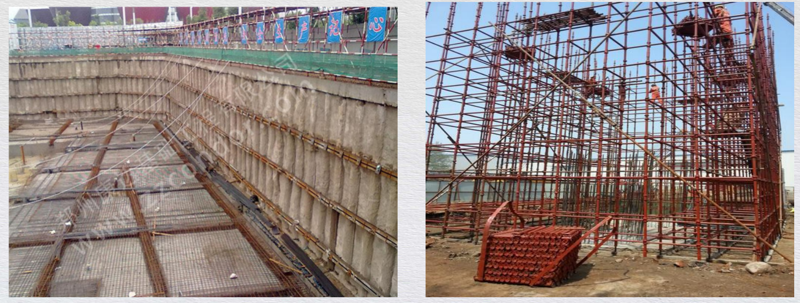

# 危大工程安全分享

## 01. 案例

在某工程项目现场检査，发现项目存在地下室大开挖，而且有高支模架，都属于超过一定规模的危险性较大的分部分项工程，需要有专项施工方案，而且需要组织专家论证后才可以实施。可是这个项目两个专项施工方案都还没有编制、论证，两个分部工程却都已经在实施。现场管理人员的理念是：「我赶快施工，把基坑回填了，把支模架拆了，也就没有题了。无非事后补一份资料。」这是属于存在合规性问题的严重安全隐患。

##  02. 原因分析及可能后果

造成这个问题的原因，是因为项目所在地为小县城，质量安全监管部门监管宽松，而且，施工单位与监管部门有长期合作的良好关系。这两个专项方案都是由当地的施工单位请当地的质监站退休老站长、老专家在编制。又当裁判，又当教练，还当运动员，大家自然相安无事，这是非典型工程现状的一个例子。

这个隐患存在巨大的风险：1）现场施工凭经验，施工方案失去指导意义，容易发生严重的质量安全事故。2）现场一旦发生质量、安全事故、事件，建设方、施工方、监管方都有无可逃避的责任。

## 03. 什么是危大工程

1、原建设部 2004 年《危险性较大工程安全专项施工方案编制及专家论证审査办法》。

2、现行有效：《危险性较大的分部分项工程安全管理规定》（住房城乡建设部令第 37 号），自 2018 年 6 月 1 日起施行；根据 2019 年 3 月 13 日《住房和城乡建设部关于修改部分部门规章的决定》（住房和城乡建设部令第 47 号）第一次修订。

第三条本规定所称危险性较大的分部分项工程（以下简称「危大工程」），是指房屋建筑和市政基础设施工程在施工过程中，容易导致人员群死群伤或者造成重大经济损失的分部分项工程。

附件 1：危险性较大的分部分项工程范围（危大工程）

1、基坑工程：2）开挖深度超过 3m（含 3m）的基坑（槽）的土方开挖、支护、降水工程。2）开挖深度虽未超过 3m，但地质条件、周围环境和地下管线复杂，或影响毗邻建、构筑物安全的基坑（槽）的土方开挖、支抑、降水工程。

2、模板工程及支撑体系：1）各类工具式模板工程：包括滑模、爬模、飞模、隧道模等工程。2）混凝土模板支撑工程：搭设高度 5m 及以上，或搭设跨度 10m 及以上，或施工总荷载（荷载效应基本组合的设计值，以下简称设计值）10kN/m2 及以上，或集中线荷载（设计值）15kNm 及以上，或高度大于支撑水平投影宽度且相对独立无联系构件的混凝土模板支撑工程。3）承重支撑体系：用于钢结构安装等满堂支撑体系。

3、起重吊装及起重机械安装拆卸工程：1）采用非常规起重设备、方法，且单件起吊重量在 10kN 及以上的起重吊装工程。2）采用起重机械进行安装的工程。3）起重机械安装和拆卸工程。

4、脚手架工程：1）搭设高度 24m 及以上的落地式钢管脚手架工程（包括采光井、电梯井脚手架）。2）附着式升降脚手架工程。3）悬挑式脚手架工程。4）高处作业吊篮。5）卸料平台、操作平台工程。6）异型脚手架工程。

5、拆除工程：可能影响行人、交通、电力设施、通讯设施或其它建、构筑物安全的拆除工程。

6、暗挖工程：采用矿山法、盾构法、顶管法施工的隧道、洞室工程。

7、其它：1）建筑幕墙安装工程。2）钢结构、网架和索膜结构安装工程。3）人工挖孔桩工程 。4）水下作业工程。5）装配式建筑混凝土预制构件安装工程。6）采用新技术、新工艺、新材料、新设备可能影响工程施工安全，尚无国家、行业及地方技术标准的分部分项工程。

附件 2：超过一定规模的危险性较大的分部分项工程范围（超危大工程）

1、深基坑工程：开挖深度超过 5m（含 5m）的基坑（槽）的土方开挖、支护、降水工程。

2、模板工程及支撑体系：1）各类工具式模板工程：包括滑模、爬模、飞模、隧道模等工程。2）混凝土模板支撑工程：搭设高度 8m 及以上，或搭设跨度 18m 及以上，或施工总荷载（设计值）15kN/m2 及以上或集中线荷载（设计值）20kN/m 及以上。3）承重支撑体系：用于钢结构安装等满堂支撑体系，承受单点集中荷载 7kN 及以上。

3、起重吊装及起重机械安装拆卸工程：1）采用非常规起重设备、方法，且单件起吊重量在 100kN 及以上的起重吊装工程。2）起重量 300N 及以上，或搭设总高度 200m 及以上，或搭设基础标高在 200m 及以上的起重机安装和拆卸工程。

4、脚手架工程：1）搭设高度 50m 及以上的落地式钢管脚手架工程。2）提升高度在 150m 及以上的附着式升降脚手架工程或附着式升降操作平台工程。3）分段架体搭设高度 20m 及以上的悬挑式脚手架工程。

5、拆除工程：1）码头、桥梁、高架、烟囱、水塔或拆除中容易引起有毒有害气（液）体或粉尘扩散易燃易爆事故发生的特殊建、构筑物的拆除工程。2）文物保护建筑、优秀历史建筑或历史文化风貌区影响范围内的拆除工程。

6、暗挖工程：采用矿山法、盾构法、顶管法施工的隧道、洞室工程。

7、其它：1）施工高度 50m 及以上的建筑幕墙安装工程。2）跨度 36m 及以上的钢结构安装工程，或跨度 60m 及以上的网架和索膜结构安装工程。3）开挖深度 16m 及以上的人工挖孔桩工程。4）水下作业工程。5）重量 1000kN 及以上的大型结构整体顶升、平移、转体等施工工艺。6）采用新技术、新工艺、新材料、新设备可能影响工程施工安全，尚无国家、行业及地方技术标准的分部分项工程。

## 04. 危大工程的管理要求

1、编制专项方案。

第十条，施工单位应当在危大工程施工前组织工程技术人员编制专项施工方案实行施工总承包的，专项施工方案应当由施工总承包单位组织编制。危大工程实行分包的，专项施工方案可以由相关专业分包单位组织编制。

第十一条，危大工程实行分包并由分包单位编制专项施工方案的，专项施工方案应当由总承包单位技术负责人及分包单位技术负责人共同审核签字并加盖单位公章。

2、组织专家论证。

第十二条，对于超过一定规模的危大工程，施工单位应当组织召开专家论证会对专项施工方案进行论证。实行施工总承包的，由施工总承包单位组织召开专家论证会专家论证前专项施工方案应当通过施工单位审核和总监理工程师审查。

3、与设计相关。

第六条，设计单位应当在设计文件中注明涉及危大工程的重点部位和环节，提出保障工程周边环境安全和工程施工安全的意见，必要时进行专项设计。

2019 年 12 月 18-19 日浙江公信认证专家对物流工程事业部进行现场审核，提出：「阿里健康余杭塘栖镇分拣设备生产及医药分拨中心项目《设计开工报告》明确的设计依据未包含住建部第 37 号《危险性较大的分部分项工程安全管理规定》《浙江省建设领域推广应用技术公告》和《浙江省建设领域禁止和限制使用技术公告》等要求。」不符合 GB/19001-2016 第 8.3.2 条、GB/T24001-2016 第 8.1 条、GBT28001-2011 第 4.3.1 条的要求。

4、与施工许可关联。

第九条，建设单位在申请办理施工许可手续时，应当提交危大工程清单及其安全管理措施等资料。（原 37 号令是「申请办理安全监督手续时」。）

## 05. 危大工程管理常见问题

1、专项方案往往由施工分包方编制并联系安排专家论证，总包方欠缺经验，疏于管理。编制及专家论证滞后。

2、专家论证后修改的本子没有及时存档。

3、专家论证提出的意见没有在相关管理文件中落实。

2018 年 12 月 11 日浙江公信认证专家对工程总承包部一中化蓝天霍尼韦尔新材料有限公司（EPC）项目进行现场审核，提出：「2018-06 13,《08 区大型设备吊装方案》专家论证提出 8 项修订完善意见。没有信息证实项目部已结合专家意见，对《HSE 管理计划》进行评审并作必要的补充完善。

2020 年 12 月 6 日浙江公信认证专家对工程总承包事业部中科院杭州湾新材料产业创新基地项目现场审核，提出：「2020-06-19《高支模架专项施工方案》专家论证提出 7 修订完善意见，但没有信息证实项目部相关人员已在施工方修订完善后重新进行了审査。」