## 20211228QHSE双年展

### 总结

1、设计时，应充分考虑设备的大小及实际使用情况，即在满足标准的情况下还需方便日后使用、维修等，需要有一定的前瞻性。

2、很多问题产生的原因在于专业间设计条件递交不及时或不齐全，最终导致现场施工时发生冲突。专业间良好的沟通可以避免不必要的问题，有利于项目提升进度、节约项目成本。

3、施工单位现场作业人员素质参差不齐，必定存在敷衍了事，施工不用心的情况，认为样子做好形状做出来就好了，不注意质量和细节，这需要我们项目管理人员更加用心，现场多走动，加强监督和交底，传达质量意识。

4、本次「双年展」仅收录了部分有文字描述和现场照片的问容，而非公司业务中遇到的所有问题，在项目执行过程中还有许多其他问题存在，需要项目成员尽心尽责，减少或避免类似情况的发生。

### 01 设计常见质量问题

#### 1.1 设备布置

深圳瑞华泰（G19R2）

1、现场操作柜未设计防雨棚，触摸屏太高，操作不便（图 1）。

福建舜跃（S18212）

1、V071305 水计量槽的放空管和上方的梁相撞，该设备在钢平台上，其他位置没有钢梁承重导致设备位置不能移动，只能将设备旋转，导致设备上的其他管道都需要绕一下布置。（图 2）

浙江益弹新材（S16707)

1、TPE 车间二楼在设计时对脱水机振动筛、上料机等设备的尺估计错误，导数现场一期施工完后对二期设备预留空间不足。（图 3）。

2、TPEE 车间二楼在设计时对冷凝器所接的管道尺估计错误，设计时没有在设备间预留足够的空间，导致现场一期施工完后对二期设备预留空间不足。（图 4）

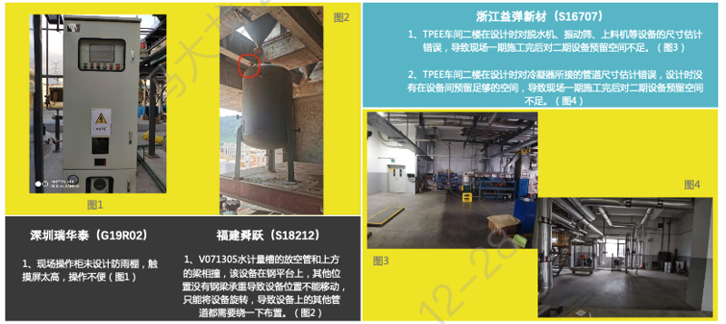

浙江中蓝新能源（S19H18）

1、一车间工艺设计管道与钢平台直爬梯碰撞。（图 5）

2、消防泵房 P04 设备基础设计与给排水不一致，基础不应该是竖向，应该是横向，与其他几台设备一致。（图 6）

甘肃二五七处（S15751）

1、储罐根部阀门操作区未设置现场操作平台，现场根据实际情况进行了延申。（图 7）

2、现场巡检柜的布置影响了通道设计。图纸中该巡检柜是靠墙放的，现在施工时进行了调整，主要是为了节省电缆，核实总图，发现主要还是总图布局所限，房间偏小（图 8）。

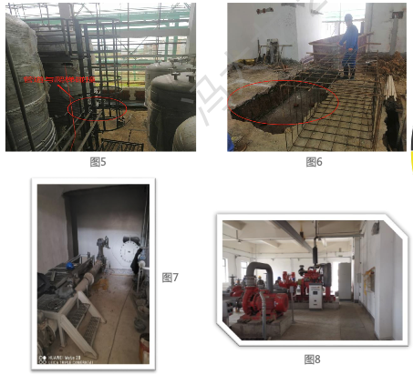

杭州谢菲尔考克（G16202）

1、泵位置设置不合理，需增加弯头绕过立柱。（图 9、图 10）

宁波神化（S18K08）

1、可燃气体报警器的位置与通风口较近，影响测量准确性，应当尽量远离一些，以便真实反映仓库内可燃气体的浓度是否超标。后经沟通，将可燃气体报警器位置按规范覆盖范围要求，尽量远离通风口布置。（图 11）

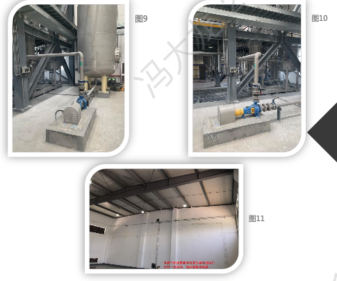

宁波润沃（S19J08）

1、动力车间变压器房间东侧墙上的边墙风机位置和电缆桥架位置干涉沖突，沟通确认之后调整风机位置。（图 12）

杭州逐真科技（S19K23）

1、S01 过滤器底部阀门过高，无法进行检修。（图 13）

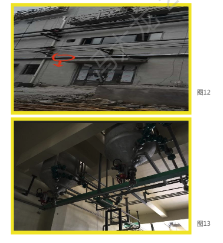

顺毅宜昌（S19C43）

1、设备基础位置调整，孔洞位置未调整，设备无法正常放置。（图 14）

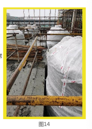

金华康恩贝（S19C24）

1、设备布置离柱子太近，配管不好接。（图 15）

福建康鸿（S17172）

1、轴流风机与外管廊管道有突。（图 16）

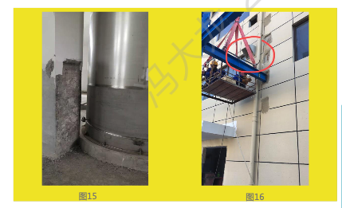

宁波神化（S18K8）

1、可燃气体报警器的位置与通风口较近影响测量准确性，应当尽量远离一些，以便真实反映仓库内可燃气体的浓度是否超标。后经沟通，将可燃气体报警器位置按规范覆盖范围要求，尽量远离通风口布置。（图 17）

1『该条错误全面有提到过，第二次出现。（2021-12-29）』

舟山麦哲伦（S19N21）

1、走廊上的消防箱要求入墙。（图 18）

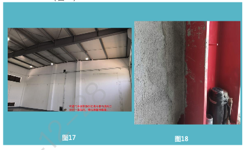

上海三菱瓦斯（S18108）

1、制模车间顶楼风机底部基础偏移问题。

解决方案：此处为前期无风机设计数据先行设计，后期调整风机参数及位置后设定的风机位置方案，后期需要重新浇筑设备基础。（图 19）

杭州湾工业园区（G20W01）

1、外管廊至循环水站支架自控图纸与外管图纸所示不符，而外管架结构图纸按外管图纸延伸，无法满足自控桥架需要，专业间协同存在失误，需增加桥架支架或者将外管架延伸。（图 20）

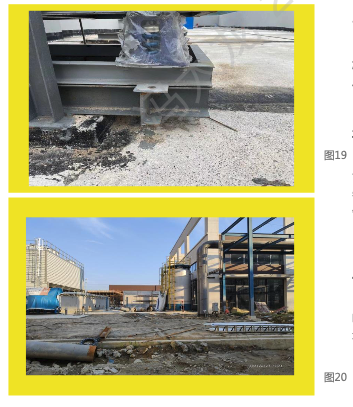

顺毅宜昌（G20RO2）

1、由于吸收塔未做建基础，我司设计未考虑没有基础的情况下磁力液位计下段排污口长度，导致现场液位计无法正常安装，采用 45 度弯头安装，现场安装不太美观。（图 21）

1『碰到不做基础的储罐，或者基础高度很低，脑子有根弦：如果装磁翻板液位计的话记得考虑底部的检维修空间是不是够的。（2021-12-29）』

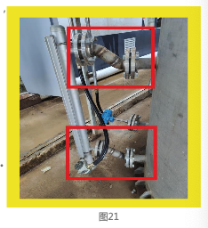

2、吸收塔进料手阀安装位置太高，无法正常操作；进料阀垂直高度过高，加上调节阀重量大，管道较细，无有效支撑，系统运行时管道晃动。（图 22）

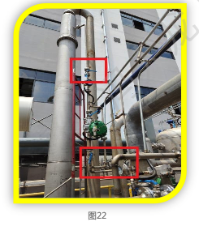

上海三菱瓦斯（S18J08）

1、罐顶人孔盖紧固螺栓过短，未露出螺母（图 23）

瑞恒空分（G20W04-a）

1、杭氧上塔压条问题。

问题情况：上塔压条设计角度有误。

解决方案：增加垂直方向压条焊接。（图 24）

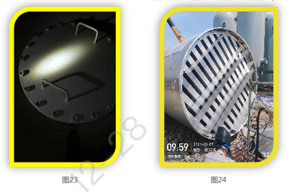

上海三菱瓦斯（S18J08）

1、制模车间顶楼风机底部基础偏移问题。

解方案：此处为前期无风机设计数据先行，设计后期调整风机参数及位置后设定的风机位置方案，后期需要重新浇筑设备基础。（图 25）

1『该问题前面已经列出，第二次出现。（2021-12-29）』

顺毅宜昌（S19C43）

1、循环水泵布置距离墙太近，配管后导致无法通行，只能后期架设平台。（图 26）

宁波合化（S18J18）

1、B3b 单体，罐顶部设备钢平台开孔与罐顶加强板碰撞。

解决方案：现场定位加强板位置后，重新出开孔条件图。（图 27）

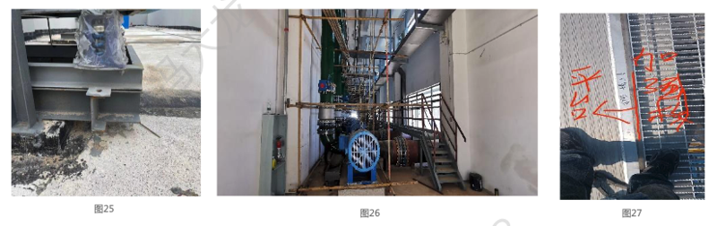

宁夏新安（S20H16）

1、草铵膦辅助车间，V0217AB 混盐溶液储罐液相出口与 P0224A/B 混盐溶液输送泵进口不在同一标高。

解决方案：调整 P0224A/B 混盐溶液输送泵基础使设备进出口在同一标高。（图 28）

2、草铵膦辅助车间，R0202B 草铵膦母液浓缩釜蒸汽进口管道 LS0208-50-2A1-H7 调节阀组挡住 R202B 草铵膦母液浓缩釜人孔。

解方案：调整蒸汽进口调节阀组位置，移至反应釜北侧。（图 29）

3、草铵膦车间一，±0.00 平面车间北侧 P0124AB 氨基氰真空泵真空进口管线 VA0110-150-3H1 标高为 +2.50，阀门位置无法操作检修。

解决方案：在合适位置增加操作平台。（图 30）

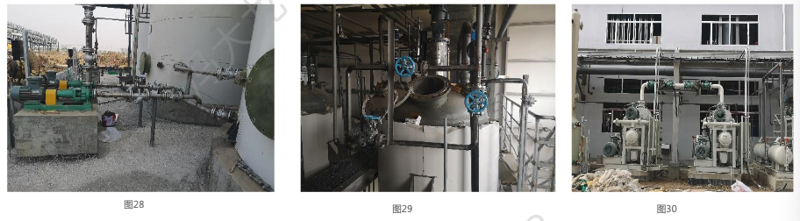

4、草铵膦辅助车间，V0205AB 膦醛脱溶液储罐罐顶阀门无法操作检修。比如氮气进口管线 NGa0202-25-2A2 氮封阀等。

解决方案：建议将相关阀门移至上层平面合适位置。（图 31）

5、草铵膦车间一，+17.50 平面 3-5/C-D 轴尾气处理系统，泵位于尾气处理塔北侧，无操作及检修通道。

解决方案：将泵调整至尾气处理塔南侧。（图 32）

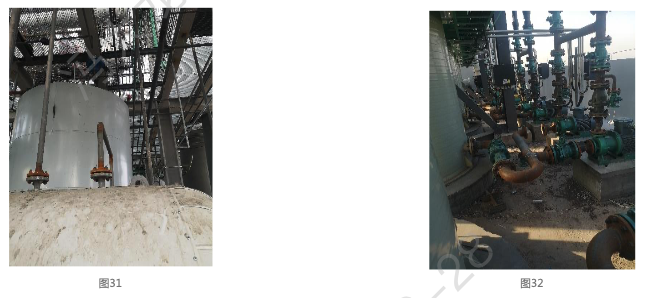

#### 1.2 管道布置

瑞恒一期罐区（G18W02）

1、配管问题。红色方框内换热器的液相液封管道，其高点高于废气进口管道的低点，液体从废气管道倒流。（图 1）

2、红色方框内的手孔和废气进口同方向，更换填料需要把废气管道拆卸。（图 2）

深圳瑞华泰（G19R02）

1、循环水管道阀门位置太高，操作不便。（图 3）

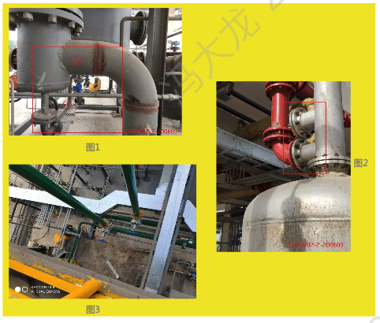

宁夏新安（S20H16）

1、草铵膦辅助车间，1-2/A 区域室外管廊进车间管线标高不一，不美观。（图 4）

孚宝尾气处理（G20R01）

1、吸收塔进口尾气没有设置气封，导致吸收塔喷淋液倒流至尾气管内。（图 5）

浙江中蓝新能源（S19H18）

1、动力中心循环水管与此门有干涉，无法正常通行。（图 6）

2、车间泵出口管道不太整齐美观。（图 7）

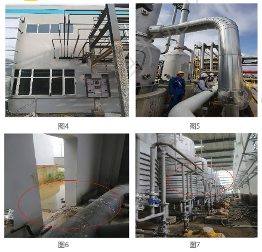

独山港管廊（G18W03）

1、管廊两侧各外挑一米五用于布置小型管道，但外管路线与检修走道在部分柱间支撑处相互沖突，导致检修走道断开，无法连通，并在柱间管架间断处增加部分外挑结构。（图 8）

2、管廊架下方计划安排滨海热力公司蒸汽管线，蒸汽管线在柱间支撑处通过时，与柱间支撑的剪刀撑发生冲突，由蒸汽管线改线处理。（图 9)

镇江江南化工（S18202）

1、弯头处做了弹簧，但是水平管道上还做了刚性架。（图 10）

杭州逐真科技（S19K23）

1、S02 流量计一般设有异径管，且有直管段要求，现场流量计与异径管直连。处理方案：修改异径管位置。（图 11）

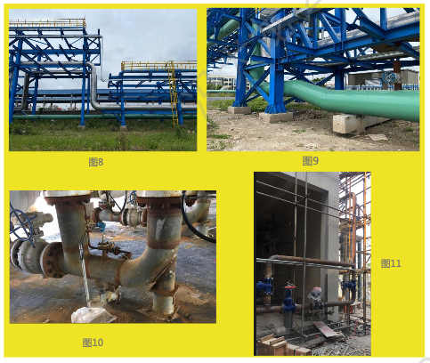

瑞恒一期罐区（G18W02）

1、管道排污口离地面太近，物料排出无接收器。增加弯头横向导出处理。（图 12）

2、管廊的桥架支架在设计中与主管廊采用栓悍的连接方式。由于桥架支架为后装作业，设置位置高，现场焊接作业困难。项目现场管理团队与施工方共同优化，经设计确认后采用加大连接板，四孔螺栓形式固定，可在减少作业和检查内容的同时避兔高空作业风险的安全风险。（图 13）

3、硝酸废气回收管道低处有积液，造成管道堵塞，废气无法到达碱塔。增加三通和阀门排放积液。（图 14）

深圳瑞华泰（G19R02）

1、保温管道间距太小，现场施工困难。（图 15）

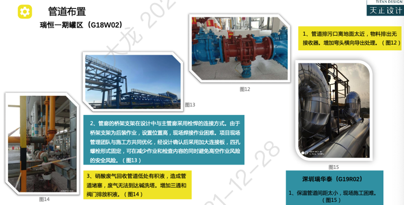

杭州中美（S18155)

1、消防喷淋支管贴梁太近，影响喷淋效果。原因：在布置喷淋支管时未考虑次梁的位置。后续根据现场情况调整，距离梁边小于 600mm 的喷头，溅水盘与梁底的距离统一改为 50mm。（图 16）

山东新发药业（S19D05）

1、消防立管挡住门出口。原因：设置消防管道时未考虑对通道的影响，后续该消防立管重新拆除后更换位置。（图 17）

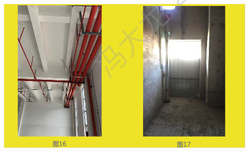

天津施维雅（G17101）

1、洁净区下喷淋总管未考虑管架自身的高度，而导致下面的吊顶净空不满足要求。后续将喷淋主管改道提升后，才能满足下方吊顶争空要求。（图 18、图 19）

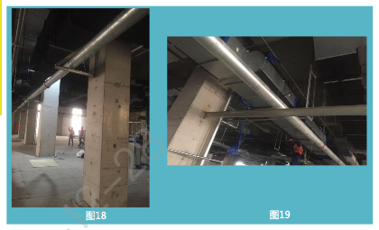

浙江医药（S18202）

1、送、排风管上下重，上送风口被下风管挡住了。（图 20）

2、空调送风口在吊顶上，吊顶当住了风口。（图 21）

3、管架规格多，安装不整齐。（图 22）

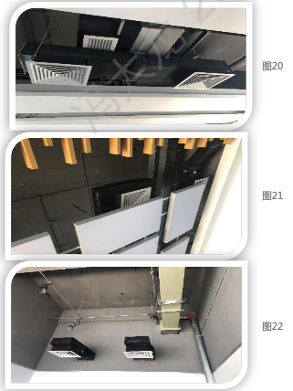

宜昌东阳光（S18C05）

1、现场暖通风管孔留孔过大不利于封堵。（图 23、图 24）

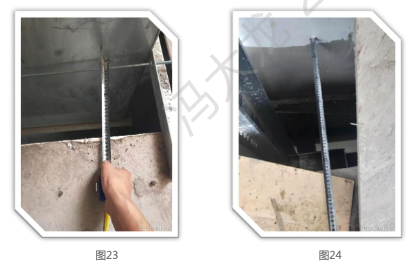

上海三菱瓦斯（S1808)

1、制模车间配料间消防水管高度设计不够。

解决方案：消防水管南侧高度重新设计做抬高，北侧使用弯头使其不变。（图 25、图 26）

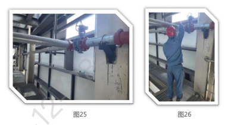

2、顶楼风机管道布置问题：此处为未有风机设计数据先行设计，后期风机设计参数返回时，原有「女儿墙」高度过高导致进出口管道需要穿过「女儿墙」才能与设备连接，但「女儿墙」较厚，打孔难度极大，且打孔可能会触碰「女儿墙」内部结构，损伤结构，故最后设计方案是使得进出口管道从女儿墙上方「绕行」，再与设备连接。（图 27、图 28）

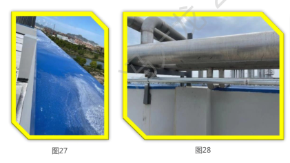

杭州湾石化物流（S18K23）

1、罐组防火堤外设有水封井，消防管道将其围在里面，没法操作和维修。（图 29）

宁波青峙码头（S18K07）

1、进罐组消防管线太靠近罐组的梯子且标高不足，上下梯子存在撞头的风险。（图 30）

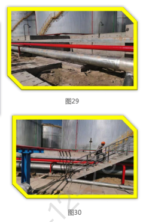

孚宝泊位扩建（S20K62）

1、施工方按照我们提交给业主审核的电子版图纸进行施工，电子版图纸非最终入库蓝图，部分管道无需设置放空，后现场回放发现实际上已经开设了放空口，处理方案为现场对该管段进行更换。（图 31）

2、在自控阀门数据表中未注明执行机构方向，厂家供货均按照平行管道方向，导致现场安装空间较为局促，无较大质量问题；后续设计中应当吸取经验，根据配管要求在自控阀门数据表中规定执行机构方向。（图 32）

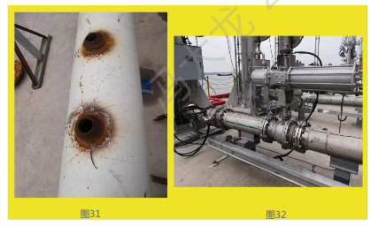

上虞中试（G20W01）

1、消防地管出地面上外管架位置（总体给排水）与外管循环水管（外管）碰撞，给排水专业与外管专业没协调好，现场调整解决。（图 3）

浙江亚峰（S19D03）

1、职工倒班宿舍 2-4 楼的大梁底标高和配电间以及临走廊的窗户标高不协调，如按原设计吊顶，将导致吊顶后配电间门无法打开，只好将本来沿大梁底布置的电缆和消防管线高，在已经完成施工的大梁上打孔通过，由于打孔的数量比较多，所以产生的工作量和费用都比较高。（图 34）

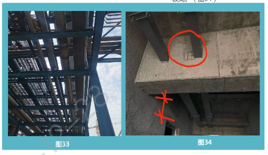

江山网营物联一期（S18M18）

1、室内排烟风管部分位置未设置抗震支架。（图 35）

上海三菱瓦斯（S18J08）

1、C1 单体，VA-N8-100030-AA1-8"-C1 风机入口的第个弯头为短半径弯头，现场做成长半径弯头，并且管廊的标高 EL.+2200，现场为 EL.+2130，导致 FAD-S3-2509-2"-SA3-ST112-C1 与 VA-N8-100030-AA1-8"-C1 间距不够，无法安装。

解决方案：调整 VA-N8-100030-AA1-8"-C1，弯头改回短半径弯头，风机入口水平段缩小 50mm，立管缩短 50mm。（图 36）

2、JAO-S3-2265-3"-SA3-HW 管线撞钢柱基础。

解决方案：泵出口直管段缩短 100mm，压力表移动至第一个弯头之后。（图 37）

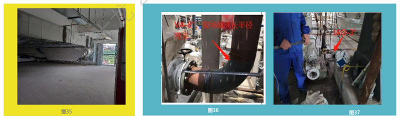

孚宝尾气处理（G20R01）

1、尾气管配管没有遵循步步低原则出现袋形，导致低点积液。（图 38）

瑞恒管输（G21W05）

1、丙烯管线平面图纸与管廊公司提供剖面图纸不对应，后期定位时明确按剖面图纸调整。（图 39）

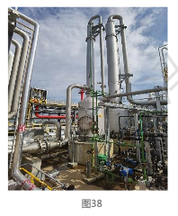

2、泵原先图纸位置与现场实际接点位置不付，现场实际增加工程量（图 40）

合州朗华（G20W05）

1、四层半现场消防箱设计位置与屏蔽泵以及管道位置有交叉，调整消防箱安装位置予以处理。（图 41）

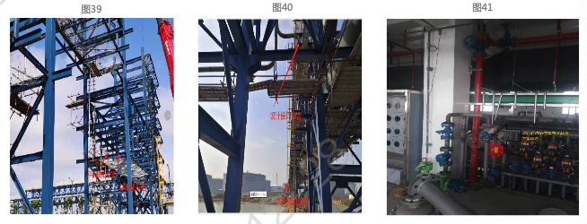

#### 1.3 给排水

宁波神化（S18K08）

1、洗眼器的排水应接到旁边的污水井，周边地坪应硬化，以便排水能流入井内，而不是渗入地下。经过设计人员与业主沟通，业主接受将该处硬化，并埋管接入旁边的污水井。（图 1）

2、场上的雨水沟盖板开槽方向平行于水流方向，初期雨水有可能不能全部进入雨水沟而流出堆场外，进入厂区清浄雨水沟。该段雨水沟因要过重车，所以设计采用了重型盖板，但未对开槽方向做出规定，鉴于业主不愿意更换盖板，且该段位于场进出口位置，经过双方协商，将堆场入口处抬高，坡向堆场，尽量避免初期水流出堆场外。（图 2）

甘肃二五七处（S15751）

1、汽车台附近的排水沟，靠近内侧（窄）的属于工艺污水收集沟，外侧的属于棚顶水排放暗沟，设计中要求排放暗沟设重型盖板，但业主单位反馈这个雨水排放暗沟盖板处的缝隙会对车辆通行造成不便，提出是否可以做混凝土现浇？后续经过设计单位内部讨论后改为箱涵做法，局部留出清扫孔。（图 3)

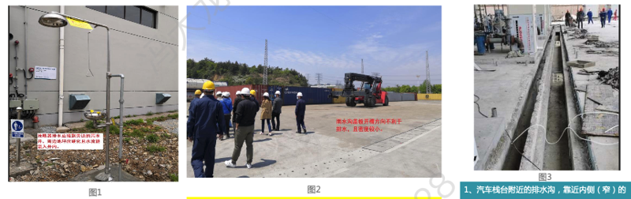

武汉智能骨干网三期（S18M03）

1、落水管接管未按设计要求埋地接入室外雨水井。（图 4）

福建博鸿（S17175）

1、丙类仓库危废间未设计排水沟及集水井。（图 5）

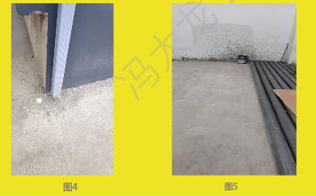

武夷山农夫山泉（S17606）

1、化学品仓库内的污水无法通过虹吸管排入污水井（图 6）

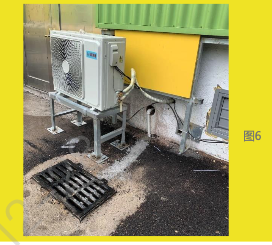

浙江亚峰（S19D03）

1、三楼董事长办公室临时增加了个厕所，厕所的下水管道直通到一楼大厅，无论是外观还是下水道的冲水声音，业主认为非常不合理。（图 7）

余杭菜鸟（S19M21C）

1、阴凉库空调冷凝水管在出户位置存在未组织排放，散流情况，应整改。（图 8）

江山网营物联一（S18M18）

1、室外二层卸货平台下方的消防水管未做保温处理。（图 9）

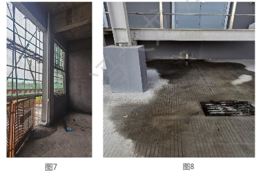

台州朗华（G20W05）

1、一层洁净区通道处设置的消防箱，因三面均为双开门，没有空间安装，调整消防箱安装位置予以处理。（图 10）

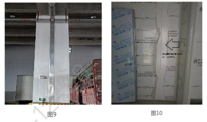

#### 1.4 土建

宁波台化（S18J18）

1、桩头箍筋因承台配筋较多较密难以施工取消。（图 1）

福建舜跃（S18212）

1、综合楼雨棚的梁和楼梯平台的梁原设计各自做梁，但现场施工的过程中发现高度上有重合的部分，经核实修改最终把两个梁合并做一个大梁。（图 2）

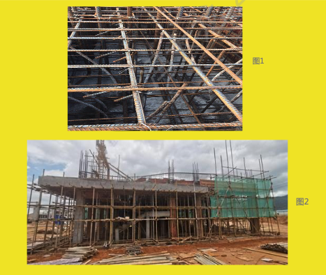

宁波青峙（S18K07）

1、对于消防水收集池，设计时未考虑地基处理，施工期间增加松木桩，减少沉降。（图 3）

2、设计条件调查不周全，罐区管架在基础施工过程中，发现基础下淤泥层较厚，为保证今后的安全运行对其四周进行了换填。（图 4）

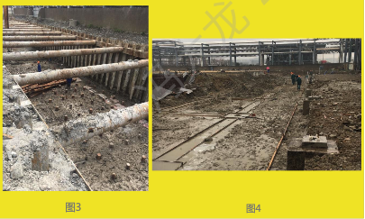

宁波神化（S18K08）

1、设计条件调查不周全，开挖基础后发现地下有 DN450 消防管占位在管廊位置上，需要修改基础图、钢结构管架图及其它相应施工图。（图 5）

2、管架钢结构连接节点详图示意图上的螺栓数量要大于梁柱连接节点表显示的数量，不便理解，导致监理理解错误不同意验收钢结构单项。（图 6）

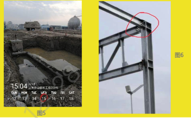

湖州长和热电（S18322）

1、横梁太多，并且挡住了楼梯。（图 7）

衢州华友（S18228）

1、结构图纸没有标注高度，现场按边上平台的高度进行设计，出联系单修改，增加牛腿。（图 8）

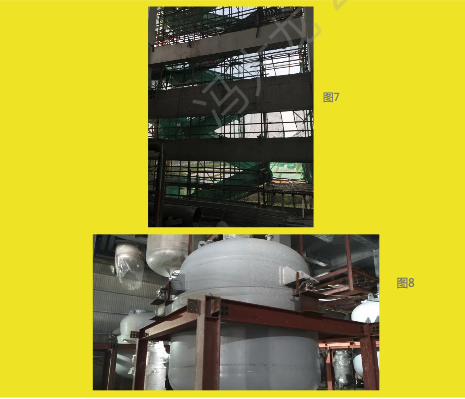

昌海万古霉素（S19C03）

1、设备基础短柱和预埋件做法不太合理，现场施工困难。（埋件尺寸太大，混凝土浇筑影响，埋件锚筋位置和基础钢筋易沖突）（图 9）

福建博鸿（S17175）

1、新材一门斗夹层上面砖墙未明确标高。（图 10）

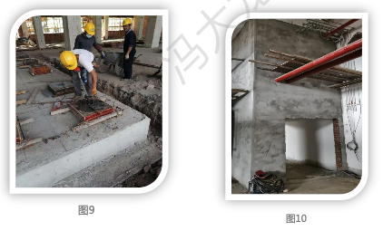

武汉智能骨干网三期（S18MO3）

1、二层楼面防撞墙在连廊通行位置未截断。（图 11）

2、楼面二层外墙在空调防雨百叶处末做封堵处理。（图 12）

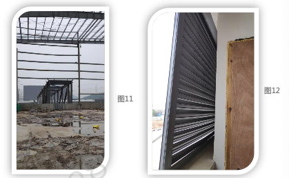

浙江潜阳（S19A06）

1、预留孔洞过小。（图 13）

2、预埋板过低（图 14）

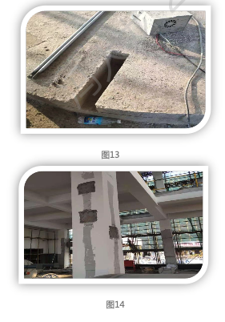

浙江万丰（S18A36）

1、柱子变小，现场难看，不好处理。（图 15）

山东新发药业（S19D05）

1、电梯基坑尺寸跟二层以上井道尺寸不一致。

原因：未考虑地梁宽度的影响，以及上下梁位置未对应，结构专业未好好核对图纸。后续通过变更电梯尺寸即非标电梯来满足基坑尺寸大小。（图 16）

浙江竹子制药（S19A71）

1、雨棚高度不一致。（图 17）

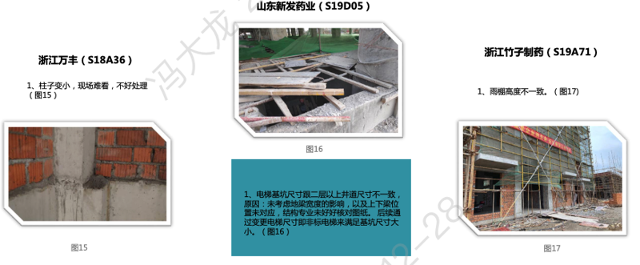

福建康鸿（S17172） 

1、发酵一楼西面工艺管墙洞未预留。（图 18）

2、五金维修间电缆从梁中间穿下来。（图 19）

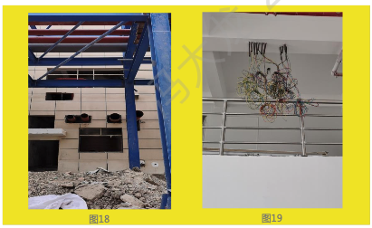

武夷山农夫山泉（S17606）

1、成品仓库装货区雨棚长度不够，装货时货车的一部分露在雨棚外面。（图 20）

2、锅炉房和水箱间地沟没有设置盖板，不安全。（图 21）

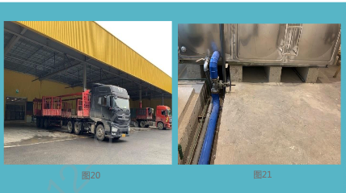

浙江亚峰（S19D03）

1、一楼大厅的大门中间有了一根柱子将大门一分为二，大门设计不够大气。（图 22）

孚宝设施升級（S20K30）

1、墙和柱按规范要脱开，但设计没有给出缝隙封堵的做法。（图 23）

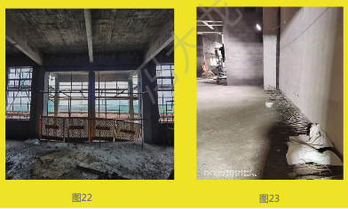

顺毅宜昌（S19C43）

1、墙体风机孔未留，后期现场追加。（图 24）

四川弘达（S18c31)

1、楼梯间的梁下净高太小，通行高度不满足规范要求。（图 25）

安徽普利（S18C18）

1、离心机设备与基础打架（图 26）

2、楼梯一层门与结构梁打架，无法使用，后期取消。（图 27）

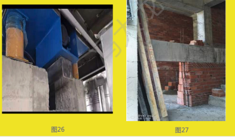

江山网营物联一期 (S18M18）

1、二层楼面以上的混凝土在楼面板以上 1.2m 范围内未设置防撞措施。（图 28）

宁夏新安（S20H16）

1、区域机柜间南侧的雨蓬，雨蓬梁一侧是窗户，雨蓬梁只好在雨蓬下增设一根柱子支撑蓬梁。（图 29）

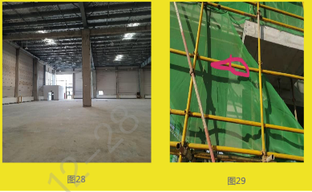

瑞恒管输（G21W05）

1、同一张图支座焊接，一个标有焊接要求，一个未标示，导致施工误解，产生隐患，现场也缺失有漏焊现象。（图 30）

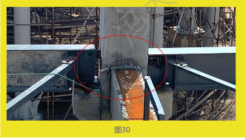

瑞恒公辅（G20W06）

1、楼面周边无挡水，无排水组织。不符合 HSE 要求。（图 31）

2、楼面未留管道孔，后凿大孔并缺翻边。（图 32）

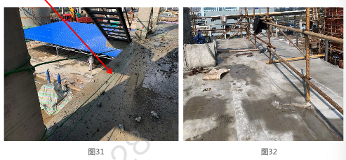

1、楼梯坡度不统一、楼梯过宽。（图 33）

2、楼梯平台柱上单边悬挑，受力不合理。（图 33）

3、梯宽过大，导致悬臂增加。（图 34）

江西天新药业（S18A37）

1、车间凹槽梁的问题。结构的图纸表示不清楚，平面图上有些有虚线，有些没有，剖面图也只有一个。所以业主跟施工方都误以为只是个牛腿。导致制模钢筋都错了。虽然补救方案进行加固了，但造成返工。第二，凹槽梁的尺寸偏小，一个是 400 的梁下沉 250，只有 150 的厚做设备的支撑，明显不够，后通过加钢梁补救，造成返工。（图 35、图 36）

#### 1.5 专业间协调

瑞恒公辅（G20W06）

1、工艺有操作检修平台，但土建未见设计，导致预留孔遗漏。（图 1、图 2）

连云港罐区（G20W07）

1、设备之间的平台等栏杆，现场已基本统一材料。但图纸设计设备与结构专业两个专业的栏杆材质、规格都不一样，甚至样式也不同，引起业主的疑问。（图 3）

江西天新药业（S18A37）

1、离心机基础问题。工艺跟结构脱节，六车间的二楼的 3 台离心机基础，因订货确认时间较晚，确认之后因时间间隔长，工艺设计人员忘记提基础条件，结构没做设计。发现问题后，采用加梁，后置筋，存在安全隐患。（图 4、图 5）

### 02 施工常见质量问题

#### 2.1 土建施工

惠州迪芬尼（G19W3）

1、二次结构施工阶段，部分机房墙体预留机电套管高度与机电包图纸不符，例如：F2 冷冻机房砌筑墙体预留套管高度为 2.75m，机电包图纸预留套管高度为 2.96m。通过调整套管高度进行处理。（图 1）

福州智能骨干网一期（S19M17）

1、屋面防火吊顶彩钢板开洞后末做防火封堵。（图 2）

2、墙体墙与彩钢板墙衔接位置末做彩板泛水板收边。（图 3）

甘肃二五七处（S15751）

1、阀门的操作井口周边未设置防水翻边。（图 4）

武汉智能骨干网三期（S18M3）

1、位于防火墙轴线上的柱间支撑部分未包封防火板，其耐火时间无法达到 4h 的要求。（图 5）

宁夏新安（S20H16）

1、原料仓库铺助车间 1.2M 高是 C 形钢，C 型钢下的压顶不好施工（C 型钢下的空间无法浇满）。（图 6）

顺毅宜昌（S19C43）

1、装饰线条未画到梁上。（图 7）

武夷山农夫山泉（S17606）

1、配电房电缆沟盖板与地面不平齐，这样的盖板定位差、易变形。（图 11）

太原京东（S20M15）

1、二层卸货平台和汽车坡道的交接位置，建筑面层有开裂情况，已要求修。（图 8）

2、外挑卸货雨棚檩条部分位置平整度不够，需要重新调平。（图 9）

3、平台外挂逃生楼梯未见建筑粉刷，需要补充。（图 10）

甘肃二五七处（S15751）

1、现场未经设计同意，提高地坪高度，导致管道阀门与路面过近，容易引起腐蚀。（图 12）

舟山麦哲伦（S19N21）

1、管廊在拐弯处高度没交接好，存在 200mm 高差。（图 13）

合肥智能骨干网（S19M30）

1、单层厂房钢柱顶在钢梁范围内应涂刷厚型防火涂料。（图 14）

2、位于防火墙轴线上的钢梁未包封防火板，其耐火时间无法达到 4h 的要求（图 15）

1『此条之前有汇报，重复信息。（2021-12-29）』

3、二层混凝士柱浇筑质量不佳，存在峰窝麻面情况，需要修补。（图 16）

杭州传祥物料搬运（S18911b）

1、汽车坡道变形缝处未设置变形缝盖板。（图 17）

2、汽车装卸平台与仓库在山墙交接处存在空挡，有人员坠落风险，需要尽快修补完善。（图 18）

3、仓库二楼平台外挑月台下方封堵不严密，造成该处形成漏水点。（图 19）

余杭菜鸟（S19M21C）

1、首层门庁位置彩钢板内墙与内部砌体墙接缝处，节点收边做法效果不佳。（图 21）

2、首层冷库区域局部地坪存在裂缝，需要修补。（图 22）

3、厂房南侧装卸平台下方与外墙位置，缺少封头盖板，需要补充（图 23）

4、厂房内办公区内消防疏散指示标志安装过高，建议调至距离地坪 300 高度左右。（图 24）

1『获得零碎知识点：消防疏散指示标志，位置距离地面 300。（2021-12-29）』

江山网营物联一期（S18M18）

1、仓库端部办公区未按照设计要求做吊顶。（图 25）

2、仓库内有吊顶，挡住排烟口，吊顶需拆除。（图 26）

3、仓库内有小隔间，与施工图不符，需拆除。（图 27）

衢州华友（S18228）

1、现场将排水沟移位，导致泵布置在排水沟上了，出联系单修改，移位泵并且修改配管。（图 28）

汉智能骨干网三期（S18M03）

1、柱间距过密，荷载过大（图 29）

金华康恩贝（S19c24）

1、雨水管和钢梁打架了。（图 30）

#### 2.2 设备管道施工

瑞恒空分（G20W04-a）

1、仪表空气储罐/工厂空气储罐梯子方位问题，问题情况：仪表空气储（115-V0116）与工厂空气储罐（115-V-0117）提梯子平台方位时未考虑安装方位，如按原先方位将重合。

解决方案：取消一个梯子；两个环形平台组成一个联合平台。（图 1）

2、空分后备系统液氧汽器安装问题。情况：液氧水浴式汽化器（115-E-1702）设备与基础地脚螺栓孔不匹配；且安装单位施工时未经允许私自切除地脚螺栓。

解决方案：裙底板边缘焊接一块钢板套在现有地脚螺栓里。（图 2）

宁波台化（S18118）

1、C1 单体，MAN-N9-101003-SA3-2"-CR1 和 MS-N9-101003-SA3-3"-CR1 上翻管廊处撞。

解决方案：由于施工偏差引起相撞，在靠近过滤器的两处直管段缩短。（图 3）

福州智能骨干网一期 (S19M17）

1、落水管接管未按设计要求埋地接入室外雨水井。（图 4）

宁波台化（S18118）

1、W5 单体，WW-412-12"-SA1 和 WW-259-2-14-SA1 与已有管线碰撞。

解决方案：与业主讨论后，旧管线 10" 拆除，WW-412-12"-SA1 走旧管线的管位；WW-259-2-14-SA1 与既有电气穿线管撞，从北側绕开。（图 5）

2、C7 单体，3 楼（EL. +7700) 拆除楼板时，拆除位置和既有设备 F-1205A 支腿位置干涉。

解决方案：支腿南北向留 1300mm，东西向留 800mm，切斜角绕开支腿。（图 6）

顺毅宜昌（G20R02）

1、循环泵出口门采用的是球阀，调节性能不佳。采用截止阀较好。（图 7)

#### 2.3 电仪施工

合肥智能骨干网（S19M3）

1、消防水泵房内电缆桥架未架空，造成房间内人员通行需要跨越电缆，既不方便也会造成桥架盒子破损，现状情況下只能增加跨越人行钢制平台。（图 1、图 2）

### 03 施工现场常见 HSE 问题 

合规性管理

金华康恩贝（G19C01）

1、项目管理及监理资料混放，部分文件标识不清，应按照要求分开管理。（图 1）

连云港罐区（G20W07）

1、受限空间作业票不全，无进出记录、检测记录。（图 2）

2、安全交底不符要求。（图 3）

上虞中试（G20W01）

1、违规住宿。（图 4）

福建高宝（G20W03）

1、消防管喷漆未佩戴个人防毒口罩。（图 5）

瑞恒空分（G20W04）

1、安全帽带未正确系挂。（图 6）

连云港罐区（G20W07）

1、作业人员劳保用品穿戴不全。（图 7）

2、现场人员衣衫不整，不符合着装要求。（图 8）

高处作业

脚手架作业

开挖与回填

动火作业

吊装作业

环境与健康

临时用电

机械设备与材料