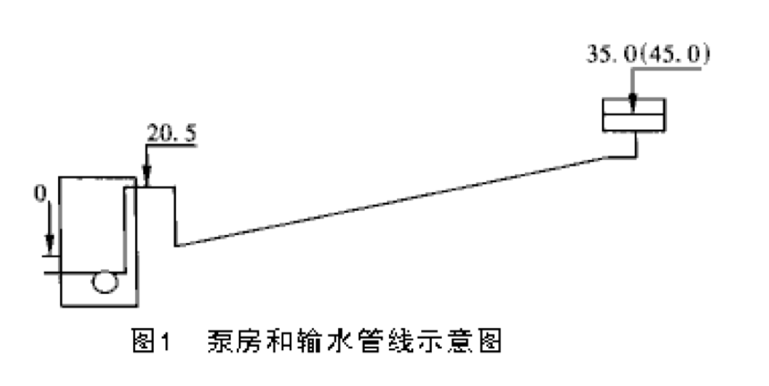
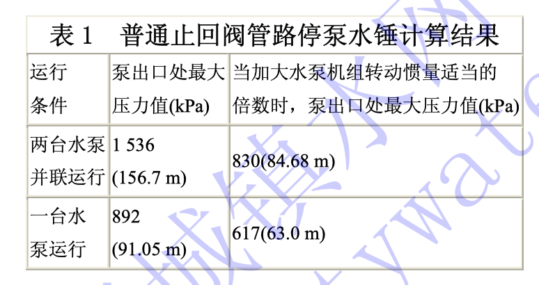
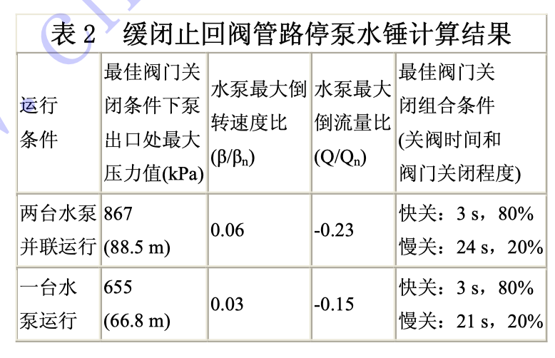
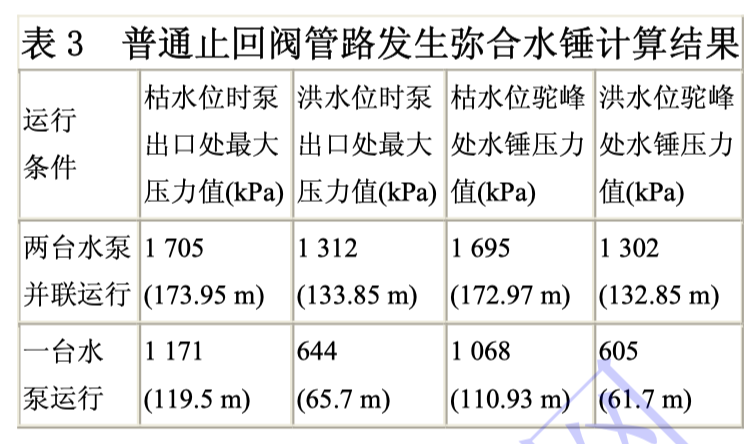
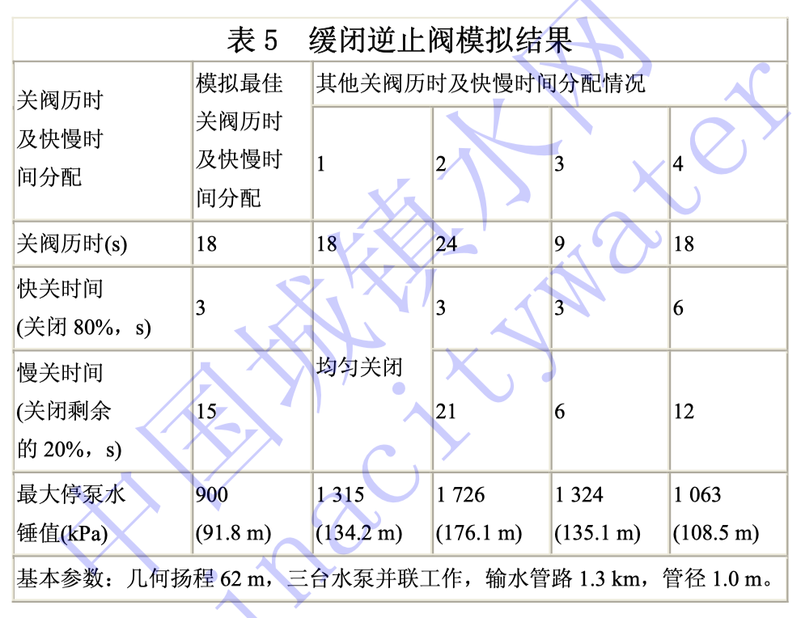

# 2020001. 停泵水锤计算及其防护措施

杨远东，邓志光

中国市政工程中南设计研究院

摘要：简要介绍了停泵水锤的计算依据，并采用计算机软件模拟实际工程的停泵水锤工作情况。根据多项工程的实测和计算机模拟结果，提出了泵房和输水管线设计中应注意的问题以及停泵水锤的防护措施。

停泵水锤是水锤现象中的一种，是指水泵机组因突然断电或其他原因而造成的开阀状态下突然停车时在水泵及管路系统中，因流速突然变化而引起的一系列急剧的压力交替升降的水力冲击现象。一般情况下停泵水锤最为严重，其对泵房和管路的安全有极大的威胁，国内有几座水泵房曾发生停泵水锤而导致泵房淹没或管路破裂的重大事故。

停泵水锤值的大小与泵房中水泵和输水管路的具体情况有关。在泵房和输水管路设计时应考虑可能发生的水锤情况，并采取相应的防范措施避免水锤的发生，或将水锤的影响控制在允许范围内。我院在综合国内外关于水锤的最新科研成果并结合多年工程实践的经验，以特征线法为基础开发了水锤计算程序。这程序可较好地模拟各种工况条件下水泵及输水管路系统的水锤状况，为高扬程长距离输水工程提供设计依据。

## 01. 停泵水锤的计算原理

停泵水锤的计算有多种方法：图解法、数解法和电算法。其基本原理是按照弹性水柱理论，建立水锤过程的运动方程和连续方程，这两个方程是双曲线族偏微分方程。

运动方程式为：

在波动学中，直接波和反射波的传播在坐标轴中的表现形式为射线，即特征线。它表示管路中某两点处在水锤过程中各自相应时刻的水头 H 与流速 V 之间的相互关系。为了方便计算机的计算，将上述方程组变换为水头平衡方程和转速改变方程，即成事故停泵时水泵的两个边界条件方程式：

通过上述两式的联立，采用牛顿-菜福生迭代公式，可以解出 y 和 β 的近似数值。将水泵的全面性能曲线改造为仅与转速和流速有关的全面性能曲线，以便计算机在解方程时取值，即：

## 02. 几种边界条件下水锤工况的模拟结果

根据我国南方某城市取水泵房的水泵及输水管线的实际情况，采用计算机程序模拟水锤情况如下（均按最低枯水位计算）:

基本情况：

水泵机组：XX，近期单台运行，远期两台运行。

输水管线：DN=1400 mm, L=5750 m，几何扬程：35 m（近期）,45 m（远期）。

泵房和输水管线如图 1 所示：

### 2.1 假设为有阀管路停泵水锤

#### 01. 普通止回阀

普通止回阀管路停泵水锤计算结果如表 1 所示。

表 1 中所列数据为假设水泵出口处的流速为零时，阀门即刻关闭所产生的水锤压力值。实际工况中，阀门关闭总要一段时间，因此实际水锤值将与表中所列数据有出入。根据计算机模拟结果，如果在此条件下适当增加水泵机组的转动惯量可以将水锤压力值明显降低。

1『听陈总推荐会时也有提到，提高泵转动惯量的信息。』

#### 02. 缓闭止回阀

缓闭止回阀管路停泵水锤计算结果如表 2 所示。

经过计算机模拟，当关阀时间和快慢组合与最佳模拟条件不同时，泵前最大压力值都将有所增加。因此一个装有两阶段关闭阀门的输水系统，其阀门的操作过程应经过计算确定，并应在试运行中调整。此种设备定货时应向制造厂提出具体的技术要求（快、慢关闭时间及可调性）。

#### 03. 管路发生断流停泵水锤（即弥合水锤）

此泵房出水管在穿越大堤处（距泵出口 40 m）形成了驼峰，经计算，此处将发生弥合水锤。实际观测与计算机模拟的结果相近，计算机模拟结果如表 3 所示。

从表 3 得知，当管路中发生断流的停泵水锤（即弥合水锤）时，水锤值很大，达到几何扬程的 4 倍以上，必须引起高度重视。

3『

[水锤现象详解 - 知乎](https://zhuanlan.zhihu.com/p/86545033)

[断流弥合水锤_百度百科](https://baike.baidu.com/item/%E6%96%AD%E6%B5%81%E5%BC%A5%E5%90%88%E6%B0%B4%E9%94%A4)

当管道流量调节过快或突然停泵等造成局部压力骤降并出现断流空腔时，空腔两端的水柱会在压力波反射后迅速回冲，弥合断流空腔并引起较大的水柱撞击升压，称之为断流弥合水锤。

你可能对水锤的概念并不陌生，但对水锤产生的危害可能还认识不足。水锤发生时产生的力，有时会大到你想不到，甚至能破坏管道系统中的阀门和水泵。在压力管道中，若突然关闭阀门，水流由于具有惯性，会产生击波，就像锤子敲打一样，这就是我们通常所认识的水锤。

什么样的水锤更具破坏力呢？下面我就给你介绍几种能产生巨大危害的水锤现象。

在温度高于 100℃ 的压力管道系统中，是由于管道内的蒸汽与冷凝水的相互作用会产生水锤。这类水锤现象主要分为两种形式，一种是由于蒸汽的流动速度比水高很多，在气流的冲击下，水以较高的速度冲击管道系统。

另一类是蒸汽急速冷凝，体积骤减（1000 倍左右），管道内短暂形成真空，造成冷凝水相互间的撞击。

这两种水锤产生的原理听上去好像挺高深的样子，不懂没关系，你只要知道一点，如果管道内同时存在高温蒸汽和低温冷凝水，那么这将是一件非常危险和可怕的事情。并且，这两种水锤是发生频率较多、产生危害较大的水锤现象，严重时会造成人员伤害和设备的永久损坏。

另外，若管路系统多起伏，且具有明显折点，则发生停泵时，整个管路系统中便会产生多处「水柱分离」的情况。由于「水柱分离」时，管道系统中将产生真空或负压，热水会迅速汽化，这个时候极易发生危害很大的「断流空腔弥合水锤」，如下图。

在常见的供水系统中，循环泵的接口处也是水锤现象常发生的地方。若此处发生事故骤停，则水在惯性的作用下，泵出口处压力会突然下降，产生负水锤。而此时在循环泵的入口，压力将突然升高，产生正水锤。此时会在系统供水压力的基础上，产生较大的瞬间压力，也会造成管道和设备的破坏。

在家庭供水系统中，由于水管流量有限，且供水线路一般情况下不会很长，所以水锤现象虽然客观存在，但力量其实很有限。在一般冷水系统中，通常情况下管壁的承压能力是可以抵御水锤的。但是，在热水系统中，就不一定了，需要注意防范热水系统中的水锤。

如在使用燃气热水器时，家庭热水温度一般会在50℃以下，但是电热水器、太阳能热水器温度就有可能超过这个温度。另外，控温不好的燃气热水器，打燃的瞬间温度会很高。而对于PPR管路系统，这个时候才是真正的考验。

由于水锤现象的客观存在，一旦发生水锤事故，破坏力极强，特别是在结构复杂、长距离输送的高温集中供热系统中，水锤现象更是不容忽视的。面对难以避免的水锤现象，合理的结构设计、可靠管路系统和温控系统就显得尤为重要。

』

### 2.2 结论性意见

停泵水锤的大小主要与泵房的几何扬程有关，当几何扬程 ≥30 m，其各种工况下的最大水锤压力值（Hmax）与几何扬程（H）的比值，水泵最大逆转转速 βmax、与额定转速 β，的比值分别列入表 4。

为了避免停泵水锤的危害，可在如下方面采取措施：

#### 01. 对于无逆止阀的管路系统

这种停泵水锤的情况并不严重，最大的水锤值为几何扬程的 1.40 倍左右，须注意的是水泵机组倒转和水大量倒流造成的损失和危害。一般情况下，无逆止阀管路主要应避免水泵机组的长时间过度倒转，以防水泵轴套松脱和机组共振。通过计算程序模拟有如下规律：输水距离在 1.2~5.0 km 范围，管线愈长，停泵水锤值愈大，水泵机组倒转愈严重。管线长度超过 5.0 km，长度继续增加对水锤值影响较小。几何扬程增高，最大水锤值和水泵机组倒转值均有增加，当几何扬程 ＞50 m 时，水泵机组倒转值将持续超过额定正转速，超过规范的允许范围。在这种情况下应与水泵制造厂联系采取相应的技术措施以确保水泵在倒转运行工况下安全。

对于无逆止阀管路选用转矩（Mn）较小、转动惯量（GD^2）较大的水泵机组将有利于改善停泵水锤发生时的水泵和管路工况，推退水泵的倒转，降低倒转值。

#### 02. 对于装有普通止回阀的管路系统

这种停泵水锤的情况较为严重，最大的水锤值为几何扬程的 1.90 倍左右。输水距离在 1.2~5.0 km 范围时，管线愈长，停泵水锤值愈大。管线长度超过 5.0 km，长度继续增加对上述参数影响较小。几何扬程增高，停泵水锤值也愈大。对于取水泵房，若条件许可（输水管路较短，水泵允许短时间倒转），可取消普通逆止阀。如果采用了普通逆止阀，则水泵机组、管路配件和管路系统的耐压等级和稳定性均应考虑最大水锤压力值。

#### 03. 对于装有缓闭逆止阀的管路系统

缓闭逆止阀对于降低停泵水锤有明显效果。缓闭逆止阀的使用应结合具体情况，快慢两个阶段的关阀历时应根据泵房水泵性能和输水管路的边界条件进行计算机模拟，得出最佳的理论时间组合，并在试验运行中调整，以期获得最佳关阀历时和快慢两个阶段的关阀历时的分配。如果关阀时间长于或短于最佳关阀历时或快慢两个阶段的关阀历时采用不当，均会导致产生很大的水锤压力值。

计算机模拟结果表明：调整理想的缓闭逆止阀管路的停泵水锤值可控制为几何扬程的 1.45 倍左右，而非理想状况下的缓闭逆止阀管路的最大停泵水锤值可达几何扬程的 2.5~2.8 倍。此外，快慢两个阶段的关阀历时的选用也是很有讲究的，般要求停泵后 5s 内应关闭阀门的 80% 以上。若整个关阀历程是匀速的也会导致产生较大的水锤压力，模拟结果如表 5。

#### 04. 普通逆止阀管路中有弥合水锤发生

在输水管路布线时应尽量避免纵坡的突然变化，特别要防止出现「驼峰或膝部」，否则可能导致发生弥水锤，而弥合水锤的最大压力值为几何扬程的 3-5 倍，其对泵房和输水管路系统将产生极大的危害般情况下，驼峰出现处的高程为几何扬程的 30%~80% 时最为不利（水锤值最大）。根据模拟运算，当几何扬程在 25 m 以上且管路中一定的高程位置存在「驼峰或膝部」，其最大弥合水锤值将超过 980 kPa (100 m 水柱）。对于弥合水锤不可避免的情况（已经建成的输水系统中存在驼峰），则应采取工程技术措施进行水锤防护。

## 03. 停泵水锤防护措施

由于停泵水锤可能导致泵站和输水系统发生严重事故（如泵房内设备或管道破裂导致泵房淹没，输水管破裂导致沿途房屋渍水），因此有必要根据具体情况采取相应的措施来消除停泵水锤或消减水锤压力。

1、降低输水管线的流速，可在一定程度上降低水锤压力，但会增大输水管管径，增加工程投资。

2、输水管线布置时应考虑尽量避免出现驼峰或坡度剧变。

3、通过模拟计算，选用转动惯量 GD^2 较大的水泵机组或加装有足够惯性的飞轮，可在一定程度上降低水锤值。

4、设置水锤消除装置。

1. 双向调压塔：在泵站附近或管道的适当位置修建，双向调压塔的水面高度应高于输水管道终点接收水池的水面高度并考虑沿管道的水头损失。调压塔将随着管路中的压力变化向管道补水或泄掉管路中的过高压力，从而有效地避免或降低水锤压力。这种方式工作安全可靠，但其应用受到泵站压力和周边地形的限制。

2. 单向调压塔：在泵站附近或管道的适当位置修建，单向调压塔的高度低于该处的管道压力。当管道内压力低于塔内水位时，调压塔向管道补水，防止水柱拉断，避免弥合水锤。但其对停泵水锤以外的水锤如关阀水锤的降压作用有限。此外单向调压塔采用的单向阀的性能要绝对可靠，一旦该阀门失灵，可能导致发生较大的水锤。

3. 气压罐：国内使用经验不多，在国外（英国）使用较广泛。它利用气体体积与压力的特定定律工作。随着管路中的压力变化气压罐向管道补水或吸收管路中的过高压力，其作用与双向调压塔类似。

4. 水锤消除器：80 年代以前曾经广为采用。它安装于止回阀附近，管道中的水锤压力通过开启的水锤消除器泄掉。某些水锤消除器无自动复位功能，容易因误操作导致发生水锤。

5. 缓闭止回阀：有重锤式和蓄能式两种。这种阀门可以根据需要在一定范围内对阀门关闭时间进行调整。一般在停电后 3~7 s 内阀门关闭 70%~80%，剩余 20%~30%的关闭时间则根据水泵和管路的情况调节，一般在 10~30 s 范围。可以利用计算机模拟最佳时间，并现场调试确定。值得注意的是，当管路中存在驼峰而发生弥合水锤时，缓闭止回阀的作用就十分有限。

    1『水锤分析软件的陈总说，不要用缓闭止回阀，就用普通的，缓闭是错误观念。这个信息待确认。』
