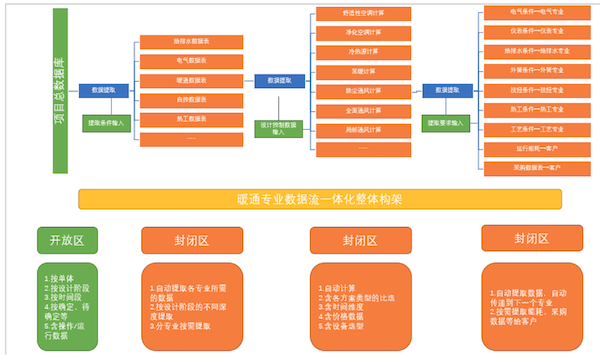

## 20200413暖通专业数据流一体化原始想法

### 01. 目标 

近期目标：通过 excel 贯穿设计项目所有数据，在可控的条件下，实现数据的自动提取、计算、传递、输出等，消除所有数据处理界面，实现客户数据输入 => 数据自动处理 => 数据输出的一键式。 

远期目标：多次梳理、完善 excel 数据流后，实现软件化。探索数据与流程图的联动可能性？

项目总数据库 => 数据提取、自动计算、数据输出一体化 => 方案选择、流程图、方案规划图 => 数字化协同设计 => 成品输出。

1、取消计算过程的校审，取消数据条件的校审及传递。

2、通过数据一体化，降低人力成本，提高数据准确可靠性，减少设计交叉面。

3、总的原则：所有数据都通过数据流总的控制、处理、传递、输出，取消目前所有的数据界面。

### 02. 暖通专业数据流一体化整体构架

2『找个好用的软件（OmniGraffle），把各个专业的数据流画出来。』

### 03. 主要内容 

本次计划涉及到的内容： 

1、全面通风计算、局部通风计算、洁净空调计算、舒适性空调计算、冷热源计算、采暖计算等。

2、暖通专业的数据输入、输出界面。 

3、含不同方案。

以下为内容，边做边想中还需多推敲。

2『把各个表里需要的输入数据做成属性字段，一个计算书按一张数据表单考虑。』

### 04. 执行时间

总的时间计划：

2020 年：1）全面翻新、完善、提升目前所有计算书文件；2）剥离、拓展输入输出两端的数据；3）固化中间数据处理过程（含不同方案、时间、价格等）。

2021 年：1）根据不同设计阶段，分解数据梳理模式；2）对项目总数据库按阶段提出数据需求；3）完善输入、输出端数据；4）再次重新梳理、完善整个 excel 的数据流；5）软件化（视情况而定，可能不执行，无能力执行）。

从相对比较成熟的开始，拟按顺序洁净空调计算——全面通风计算——局部通风计算——舒适性空调计算——冷热源计算——采暖计算，完成洁净空调数据流程。

### 05. 洁净空调计算

谢工，得问你要 2 个信息，你那边有空的时候回复我就行。

1、你的个人简介。你的那篇文章我编辑好了，预览模式下你可以看看，是否有需要修改的地方（另：有更好的配图可以提供给我，我没找到满意的跟主题相关的配图）。最后我想加一个你的个人简介，主要包括职务职称、擅长的领域、获奖成就等方面，我一会发你一个赵总的模板供参考。

2、有关数据流一体化的相关咨询。我想知道一般哪几个专业是作为你们暖通上游，会给你们提条件作为数据输入。搭建数据库这块我理了理思路：

1）我打算以一个专业一个专业为中心来建库。这个专业需要哪些数据输入：各个上游专业的条件、公共数据（比如物性数据等）、规范标准里的数据。我打算先从你们暖通专业开始试验，因为有你那边的配合。

2）以任务为最小单元收集数据。以具体的一个任务为中心单元，比如做一个计算书、提某个专业的条件，一个任务做一张数据库表单。以你最成熟的洁净空调计算为例，这个计算设计的输入数据有单体、层数、房间号、面积、吊顶高度、温湿度等，每一个数据我会做成表单里的一个属性字段。

你所说的「共性数据和专用数据」，我要用我这边划分的三类数据包含掉你所定义的这两类。公共数据我能从网上或文档里爬取，规范里的数据可以从规范里抽（我目前有能力从 word 和 excel 里抽数据）。扣掉公共数据和规范数据，其余还需的数据我打算都放入「新的上游条件表」里。

我目前最关心的事有 2 个：一是如何划分一个任务里输入数据字段所归属的类比，我看你的计算书里已经详细列出了需要的输入数据，但如何划分我这边需要帮助；二是划分好之后，如何把新增的数据「属性字段」做成一个「新的上游条件表」，这个「新表」得满足可以自动被我抓出来，我块内容我会找赵总协助。

所以我跟你前面要对接的就是，如何把你列出来的任务（比如计算书）里的输入数据分类。谢工，你那边哪天有空我们可以碰下。

### 06. 有关数据流一体化后续工作的建议

赵总，上次听谢工汇报完后我整理了下搭建数据库的思路，昨天也跟谢工这边碰了下。对后续工作的计划安排有一些建议：

01关于数据库的整体构建方法。

1、以一个专业一个专业为中心来建库。这个专业需要哪些数据输入：专业数据（各个上游专业的条件）、公共数据（比如物性数据、各专业规范里固定的规则等）。先从暖通专业开始做，因为有谢工那边的配合，工艺专业第二个做。

2、以各专业在某个项目里具体的任务为抓手。比如提某个下游专业的条件、做某个计算书，一个任务做一张数据库表单，各个表单里的数据我会打标签清洗后传到总数据库（专业数据和公共数据 2 个大库）。暖通专业跟谢工沟通后，先做洁净空调及通风数据两个模块；工艺专业这边我想先做的任务有提各专业的条件、做设备一览表、安全专篇里自动生成本项目涉及的危化品数据表。

以洁净空调计算为例，计算涉及的输入数据有单体、层数、房间号、面积、吊顶高度、温湿度、压差、设备散热量、设备散湿量、室外气象等，每个参数在数据表单里做一个「属性字段」。两大类数据的提取：公共数据我这边可以直接从网络或文档（excel/word）里提取；专业数据这边以工艺专业牵头，跟每个专业开个会确定要收集的属性字段，实现的手段包括：1）在现有的各专业条件表基础上新增「信息」形成「新版条件」表，该「新表」要能批量抽取数据。2）有些数据可以直接在图纸里做成块，直接提前块属性。

备注：与谢工沟通后，他这边会在 4 月 20 日前将洁净空调及通风计算的「专业数据」整理完毕提供给我。

02关于 4 月份会议方面。

同步进行的另一条线，工艺牵头以会议形式确定「专业数据」的要收集的属性字段。建议节后开始，每周对接完 2 个专业。会议方面我可以辅助赵总您，包括：1）参会人员会前背景知识的宣贯；2）会议议题的确定；3）会议记录及整理；4）会议室预定等。

另：建议节前可以把「数据流一体化」要做的东西告知参与此事的工艺人员，先让大家有个感性认识和准备，这块工作我可以来做，得赵总您这边确定下涉及的人员。

以上是个人对「数据流一体化」后续工作计划的建议。

### 07. 介绍汇总

数据流一体化介绍：

通过建立条件数据中台，实现公用工程各专业间数据的自动提取、传输、计算和输出。

把项目里的数据都放到一个数据中台里，数据中台包括上游专业提供的数据、一些公用数据还有如何处理这些数据的固定算法。设计人员在提某个专业的条件、做某个计算或者做某个成品图纸的时候，可以直接从后端调相关数据，尽可能的减少设计人员自己输数据的环节，把固定的、可复用的数据处理全交给机器来做，最终目标是实现各专业间数据的输入、处理和输出一体化。

实施办法一个是以各专业为中心，一个专业一个专业来。第二个是以专业里某个具体任务为抓手，比如提某个专业的条件、做某个计算、做设备表之类的，一个任务一个任务的打通。先以暖通专业为试点，先做洁净空调和通风计算。

好处：

通过数据的复用性，从生产端提供设计人员的效率。且不会造成额外的工作，输出的条件表可以直接上传到 D4 里。优势在于数据的利用。1）范围上来看，用的范围更大，这里的「公共数据」，不同项目甚至不同专业间的公共数据都可复用。2）固化的东西可以交给机器做，而且可以在后端设控制逻辑，效率和质量都可以提高。1）数据颗粒度小很多，以前提的条件可能就一个文件，比如 CAD 图纸、excel表、word，现在的数据时一个个结构化的字段，对应着属性值，颗粒度小会大大提高后续使用数据的场景范围。

## 20200516戴强交流

1、分支的命令约定。

2、服务器上只有 master 分支，而且服务器上只能 pull，必须保证服务器的「干净」。

3、分支管理还是使用图形界面方便。在 VS Code 里用 GitLens 管理。

4、不走 http 请求。网页会超时，不走 http 请求的好处是，当脚本运行时长很长的话（比如导数据），就没关系，因为没延时。导数据的时候用这种方式。戴强用 PHP 做数据清洗的时候用这种工具的。

5、处理完逻辑 logic 后会得到一个 info 信息。这个逻辑不能写在控制器里，控制器只做 2 个事情，一个是获取参数，一个是验证参数，最后是返回，控制器约定只做这 2 个功能。控制器是永远就那么几行，一个方法是一个接口。业务逻辑都写到逻辑层（服务层）那边去。

6、laravel 很重的。从入口进去，自动加载、框架启动、处理、发出消息......整套下来的话，需要 100ms，再加上自己的逻辑处理，加起来做的接口起码要 300-400ms，这是一个请求的过程。Java 就很好，就一个架包启动，java 写的接口基本上都能控制在 100ms 以内。

## 20200524戴强交流

1、以业务为单元模块。比如管理员登录、比如项目城市信息查询等。

2、自动组装 json 格式，然后返回 json 格式数据。在全局变量里去捕获（相当于把组装数据格式抽象一层封装起来）。

3、原始 laravel 的问题是，一个文件对应一个接口，接口很多的话话那么文件就很多了。现在的是一个方法对应一个接口。

4、本项目框架的实用性。针对的业务场景，一个用户模型可以用一个 controller 搞定的，比如管理员相关的行为用一个 AdminController.php 可以搞定的，像戴强他们公司里的项目，一个管理员相关的行为是当一个项目来做的，这种项目的话本框架就不适合了。再比如他最近在用 java 写的那个搜索功能，4 个人做，这个功能就当作项目来做的。现在这种框架结构的控制器里就很干净。

5、laravel 里多用 `dd()` 函数，哈哈。