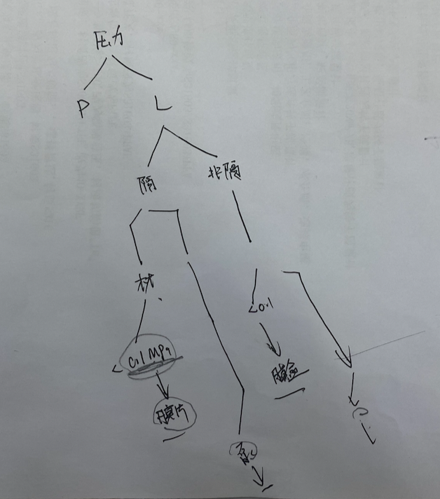

## 20210110华雷交流压力表选型

1、选型基本逻辑。

看就地压力表，先看是不是适合隔膜。

隔膜。隔膜的会先涉及到材质的问题。往下走，小于 0.1MPa 的选膜片，大于 0.1MPa 的就是非膜片的隔膜压力表（振动工况比如泵出口，就选抗震）。

非隔膜。非隔膜的先不管材质问题。往下走，小于 0.1MPa 的选膜盒，大于 0.1MPa 的就是普通的非隔膜压力表（振动工况比如泵出口，就选抗震）。

注意：1）膜片和膜盒都没有抗震的。如果量程比较小，是那种 kPa 级别的，都没抗震的。2）这里的 0.1MPa 是量程上限。

2、标准化的压力表分六档：膜片压力表、膜盒压力表、隔膜压力表、抗震隔膜压力表、不锈钢压力表、抗震不锈钢压力表。

3、工艺条件先做一些处理。1）工艺条件出来条件要先处理，只有就地（PG-XX）和远传（PT-XX）两大类仪表。2）核对流程图里的管道，管道有伴热、夹套的。3）腐蚀性的。4）易凝固介质，比如冰醋酸、液碱，这种介质工艺一般是不做夹套的。

4、抗震的情况：泵的进口和出口、压缩机的进口和出口。

5、比如这次的总包 C3 项目，在连云港，零下 20 度，循环水水管的压力表都选的隔膜，因为水是不会用 2H1 管子、电伴热，所以你不能通过这两个点来做判断。

6、还有一种情况是要用隔膜的，剧毒的介质。剧毒的目前压力表可以不用，没规范要求，是我们院自己提高要求的。但温度计必须用法兰的，不能用螺纹。氨气可以用，但液氯（腐蚀性）不行。

7、隔膜压力表，压力表平时为了省钱，材质优先考虑的是钢衬，如果温度是大于 100 度或者是负压（-5kPa 以上），那么就必须用金属膜片了，这只是压力表。压力变送器都是金属膜片。温度高的话，膜片中的硅油就用「高粘度硅油」，普通的只是写的「硅油」。如果碰到洁净区场所，硅油是不能用的，要用氟油或者卤代烃。

8、隔膜的，优先使用 DN50 的法兰，变更的逻辑详见华雷的选型逻辑里的第 29 条（DN25 的和工字型法兰）。补充：隔膜的是这 3 档，普通的不锈钢压力表和膜盒，连接规格 M20 的，如果管道口径小于 DN15，连接规格都更改为 M14x0.5。不锈钢压力表上面的表头从 φ100 更改为 φ60，精度 1.6 更改到 2.5；膜盒的只改连接规格，上面的表头相关参数不变。

9、之前的逻辑表只是针对化工的，医药的还不太一样。医药的卫生级别的用卡扣连接的，薄壁管的也不同。

10、工艺那边也需要有自查的机制。好几百度竟然用的钢衬四氟的管子。同一个点上，参数（温度、压力）竟然不相同。比如同一个点，自力式调节阀的阀前压力提的是 0.2MPa，储罐压力表又提的是 0.6MPa，根本对不起来。

1『工艺这边，做这种核查的逻辑很有必要。（2021-01-11）』