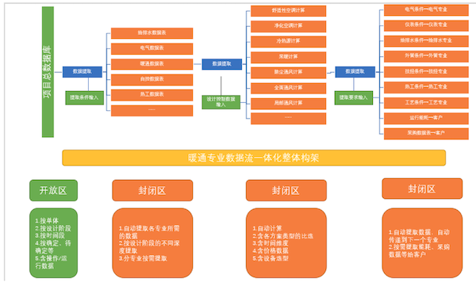

# 0101原始想法

## 01. 暖通专业数据流一体化

### 1. 目标 

近期目标：通过 excel 贯穿设计项目所有数据，在可控的条件下，实现数据的自动提取、计算、传递、输出等，消除所有数据处理界面，实现客户数据输入 → 数据自动处理 → 数据输出的一键式。 

远期目标：多次梳理、完善 excel 数据流后，实现软件化。探索数据与流程图的联动可能性？

项目总数据库 → 数据提取、自动计算、数据输出一体化 → 方案选择、流程图、方案规划图 → 数字化协同设计 → 成品输出。

1、取消计算过程的校审，取消数据条件的校审及传递。

2、通过数据一体化，降低人力成本，提高数据准确可靠性，减少设计交叉面。

3、总的原则：所有数据都通过数据流总的控制、处理、传递、输出，取消目前所有的数据界面。

### 2. 暖通专业数据流一体化整体构架

2『找个好用的软件（OmniGraffle），把各个专业的数据流画出来。』

### 3. 主要内容 

本次计划涉及到的内容： 

1、全面通风计算、局部通风计算、洁净空调计算、舒适性空调计算、冷热源计算、采暖计算等。

2、暖通专业的数据输入、输出界面。 

3、含不同方案。

以下为内容，边做边想中还需多推敲。

2『把各个表里需要的输入数据做成属性字段，一个计算书按一张数据表单考虑。』

### 4. 执行时间

总的时间计划：

2020 年：1）全面翻新、完善、提升目前所有计算书文件；2）剥离、拓展输入输出两端的数据；3）固化中间数据处理过程（含不同方案、时间、价格等）。

2021 年：1）根据不同设计阶段，分解数据梳理模式；2）对项目总数据库按阶段提出数据需求；3）完善输入、输出端数据；4）再次重新梳理、完善整个 excel 的数据流；5）软件化（视情况而定，可能不执行，无能力执行）。

从相对比较成熟的开始，拟按顺序洁净空调计算——全面通风计算——局部通风计算——舒适性空调计算——冷热源计算——采暖计算，完成洁净空调数据流程。

## 02.各表单属性

### 洁净空调计算

