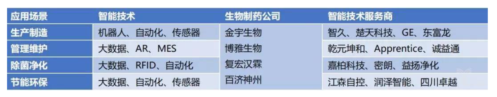

# 前瞻研究：生物制药行业智能制造技术应用现状及展望

[前瞻研究：生物制药行业智能制造技术应用现状及展望](https://new.qq.com/omn/20190620/20190620A0G8D7.html)

[生物制药行业，智能制造技术应用进入快速发展期？-亿欧](https://www.iyiou.com/p/103414.html)

「十三五」是我国生物医药产业重点发展的时期，也是中国生物制药企业走向全球化的关键时期。实现生物制药行业的智能制造，关键在于制药装备和药品生产过程的革新。生物制药智能工厂需要以智能装备为基础，利用自动化、信息化、大数据等先进技术，结合生物药品生产工艺与 GMP 等法规要求，实现从原料到仓储全流程环节的柔性化、定制化、智能化药品生产。缩短产品上市时间、增强生产灵活性、实现节能增效，则是生物制药行业转型升级的目的所在。

作者 | 付海天、樊晓芳

## 01. 生物制药行业基本情况

1、生物药物制造全流程：原料生产、分离纯化、制剂生产和包装分发。

2、国内外生物制药市场规模。据中国产业信息网数据，2013 年至 2022 年间，全球生物制药市场复合年增长率预计为 9.4%，并于 2022 年达 4040 亿美元，中国生物制药市场预计将从 2013 年的 140 亿美元增长至 2022 年的 755 亿美元，复合增长率 20.6%。中国制药市场整体规模预计将于 2022 年增至 3305 亿美元，同期复合年增长率 8.3%，增速低于中国生物制药市场。2022 年中国生物制药市场预计约占中国制药市场整体规模的 22.8%，约占全球生物制药市场的 18.7%。

3、生物制药工厂智能制造产业链。设备及建厂原材料供应商（建筑材料、设备零部件、设备原材料等）、智能制造解决方案商（信息化软件、智能工厂、自动化机器人等）、药企/CMO（疫苗、血液制品、诊断试剂、重组蛋白、单克隆抗体等生物药剂制造企业等）。

## 02. 生物制药工厂相关法规及智能化升级需求

1、生物制药工厂建造生产相关法规。国内生物制药工厂建造生产遵循的法规主要分为三个类型：环保法规（水污染、大气污染等）、药品生产质量法规（GMP 等）、工厂建造相关标准等。生物制药过程以药品生产质量法规为核心，以新版 GMP 标准（2010）为主，出口型企业也会参照国际标准，如 EU GMP 或 FDA GMP 等。

2、生物制药工厂存在升级需求。国内生物制药企业自动化、信息化、智能化程度普遍不高，距离「制药工业 4.0」尚有距离。

生产设备自动化：大多数生物制药企业还停留在设备控制的单体自动化阶段，自动化水平较低，存在对整体生物制药生产过程自动化的需求。

制药过程信息化：生物制药生产过程信息依赖人工采集，难以实时了解生产现场资源和加工任务状态的动态变化，需要应用传感器和软件系统进行信息化升级。

生产控制智能化：基于自动化和信息化，应用数据挖掘等技术，能够对生产数据进一步进行实时分析并输出洞见，辅助生产决策过程。

## 03. 中国生物制药工厂智能化方案

1、生产制造数据收集：通过传感器采集药物生产过程相关数据，如生产数据（pH、氧含量、导电率等）、环境数据、微生物数据等，并实时接入内部网络中，传输到中央系统，上传至私有云平台等，能够对药品在工艺流程的实时环境状态进行有效的监控和追溯，实现一系列的数据采集、存储、追溯以及分析。

2、智能工厂管理：通过将设备与中央系统对接，整个工厂生产流程变得透明可视，各个工序相关人员可以根据工序完成度来安排工作，工厂管理人员也可更有效率的综合管理生产，减少冗余生产步骤，实现生物制药企业的生产计划管理、工艺路线管理、物料管理、容器管理、生产过程控制管理和实时数据分析等。

3、生产线自动化：生物制药生产过程的自动化能够扩大生产线产能，减少岗位操作人员，提升生产效益。以制剂过程为例，通过采用智能化配液系统、洗灌封、灭菌和灯检，能够实现配液系统在线称量、在线清洗、在线灭菌，以及洗瓶、烘瓶、灌封、灭菌、晾干、灯检、检漏到印字等生产过程的全自动运行。

4、批次连续生产：传统药物生产需要经历一系列分开的步骤，连续生产即指在生产过程中实现批次连续上样，消除分批生产中各个环节的暂停阶段。连续生产可以做到实时质量监控，随时撤下不达标的中间产品，减少生产成本，降低人为操作失误几率，加速药物生产过程。

## 04. 智能技术在生物制药工厂中的应用分布

图里的智能技术服务上，备选为后面发展的目标。包括：智久、楚天科技、GE、东富龙、乾元坤和、Apprentice、诚益通嘉柏科技、密朗、益扬浄化、江森自控、润泽智能、四川卓越。

## 05. 中国生物制药企业智能化产品代表案例

智久 AGV 机器人：智久 AGV 模块化的结构可根据客户的具体需求定制方案和配套的物料承载设备，当生产环境发生变化时，可根据需要调整布局。智久 AGV 可在高压、有毒等不适合人工操作的环境中工作，配合协作机器人完成药物生产过程中原材料和包装材料的分拣配送，消除药品生产过程中的混药和交叉污染，减少室内尘埃细菌污染。

乾元坤和 MES：乾元坤和制药行业 MES 解决方案能够实现生产计划与生产控制信息联通，部门间信息共享，生产数据实时处理。MES 主要关注点有以下几个层面：GMP 管理、计划管理、生产管理、质量管理、仓存管理、设备管理。所有重要生产参数基于计算机的永久监视，降低错误和缺陷，基于计算机的生产规划和调度，降低了生产成本，更充分地利用工厂产能。

楚天预灌封系统：楚天科技 SFSR 系列智能机器人无菌预灌封生产系统，具有生产速度快，性能稳定，无交叉污染等特点，与传统设备相比占地面积更小，降低了生产与人工成本。两台无菌机器人采用协同控制技术，可实现预充式注射器撕膜、去内衬、灌装、加塞、称重等工艺流程全自动化，提高了生产速度；无人化操作，解决了人工操作带来交叉污染的风险。采用六自由度关节型机器人，可完成复杂动作轨迹及路径切换。

百济神州 GE KUBio 工厂：美国通用电气公司 (GE) 推出的 KUBio 是一种创新的即用型模块化工厂，其设备部件都是由 GE 的一次性生产技术 ——ReadyToProcess 组成的，能够在 18 个月之内设计组建完成工厂并使之符合 cGMP 标准。百济神州计划在该工厂中采用一次性细胞生长发酵和灵活工厂技术进行抗体原药生产，采用无人接触、自动灌装线进行药品针剂制备，为百济神州在研的抗肿瘤药管线中多个抗体新药品种的生产制造节约 25%-50% 成本。

## 06. 智能技术在生物制药行业的应用趋势及挑战

趋势：

1. 模块化生物制药工厂建造模式逐渐推广。

2. AR 技术应用于生物制药生产管理过程。

3. 生物医药智能制造机器人应用更加广泛。

4. 柔性制造提高生物制药生产效率。

5. 3D 打印技术应用于药物定制化生产。

挑战：

1. 生物制药旧生产线改造工程复杂。

2. 疫苗管理的单独立法使得对研制、生产、流通过程的要求更严格。

3. 生物制药生产过程信息化水平不够充分。

4. 生物制药工业环保标准日益严格。

5. 本土药企产品出口需求对生产效率、质量提出更严苛要求。

* 本文为「智周」系列报告「核心版」，相应「深度版」的推出计划将在后续公布，敬请大家关注。针对「生物制药行业智能制造技术应用现状及展望」这一主题，有哪些方向或主题，你希望在报告深度版中读到更详细的阐述与分析，欢迎留言，这将成为我们制作报告深度版的重要参考。

