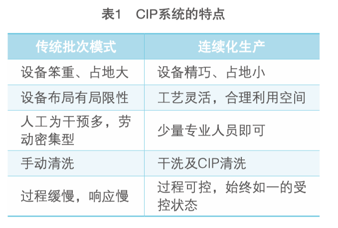

# 原料药生产新趋势 —— 连续化生产

摘要： 随着原料药行业的竞争日益激烈，原料药生产企业对于生产的效率、产能等要 素的要求不断提高，而目前传统生产模式（批次模式）显然已不能满足生产需求。本 文通过对连续化生产概念及过程的阐述，改变传统生产模式，对工艺设备提出新的技 术要求，为原料药生产提出更经济、更灵活的新方案。同时，质量源于设计，新工艺 离不开专业设备及专业技术的支持。本文将介绍几款连续化生产设备，为推进连续化 生产的进程做出努力。

随着科学与技术的长足进步，连续化生产的概念在制造研讨会及原料药生产企业 之间逐步被提及并日渐熟知，此项新的生产模式为药品生产提供了一个更高效、更经 济、更具柔性的可行性方案。

## 01. 国内目前原料药生产模式及其弊端

目前，国际流行或者说大多数企业所采用的原料药生产 模式依旧是传统生产模式即间歇性批次模式（或者说是 一系列操作的串联），在生产过程中，每个单元生产 结束后都需要进行检测，检验合格后方能进入下一 个单元。一个批次产品从投入到产出所对应的 工艺阶段及时间均是高度一致的，一旦某个环节检验出产品不合格，即将同一批次的所有 产品均视为不合格品并抽调出来，进行复验 等工作。间歇性批次生产模式中每个单元实际 生产耗时并不长，而大部分时间主要用于产 品周转与检验。为了缩短生产时间、提高效 率，大多数生产企业在建厂之初均采取加大 每批次投放量的方法，以减少取样次数及中 间检验次数，达到缩短时间、提高效率的目 的，与此同时也带来了相应的弊端：一是设 备体积、重量等越来越大，变得笨重、不灵 活；二是由于投放量的增加，用于周转的料 桶随之增加，大量的周转桶堆积在厂房内，占用大量厂房空间，降低厂房的利用率；三 是增大设备成本、维护、维修、保洁等费 用；四是库存难以预测，更换批次时间长，市场反应慢等。

## 02. 原料药生产新趋势 —— 连续化

面对以上各种弊端，更多的企业管理者 开始思考新的方向，是否可以有效地将中间 环节缩短从而减少中间品占用的时间，或者 能否有新的工艺来完成生产，从而对市场信 息做出快速响应，甚至订单化生产，由此连 续化生产模式的概念应运而生。

目前，国内的海正药业、联邦制药及东 富龙等厂家已经在连续化生产的道路上不断前 进，成为我国连续制造领域开发的先行者，也充分验证了原料药连续化生产的新趋势。

北京大学连续制造研讨会于 2016 年 3 月 在北京召开，它达到了近年来连续制造国际 专题研讨会的最高水准。Pfizer、Merck、 GSK、Novartis、Lily、BMS、Vertex 等药企负责人就连续制造的最新技术进行了交 流；美国 FDA、欧盟药监部门和 CFDA 监管部门的审评专家分享了对于连续制造的关注 和思考；国内先进药企和药机制造企业介绍 了在先进制造技术方面的研究进展；行业同 仁共同讨论了对于连续制造的见解、问题甚 至是质疑。目前，关于连续制造的研究与实 践已经渐渐深入各大药企。

## 03. 连续化生产的新要求

连续化生产是指企业将原材料投入到设 备中，按照实际工艺需求，按顺序连续不断 地加工，最后制成终端产品进行销售。连续 化生产是依靠现代化的控制方式以及可靠、 稳定的工艺过程来保证最终产品品质的一 致性。

连续化生产工艺相对于传统的批次生产 模式，对设备的硬件与软件均提出了一定的 技术要求。

（一）自动化

原料药，被用于药品生产，关系到人们 的生命安全与健康。为了使药品的质量得到 保证，药品的生产过程必须符合 GMP 规范等 一系列严格的质量管理规范。整个药品的生 产过程中，需要严格、可追溯并且可验证的 监控，同时采用辅助手段如在线取样等，使 得整个生产过程始终处于受控状态。自动化 避免了人为干预，对生产的质量管理和控制 均有极大益处。

自动化不仅包括设备的自动化，还包括 生产的自动化、数据采集的自动化、生产管 理的自动化，这样才能保证连续化生产的高 效、稳定、可靠，产品始终如一。

（二）密闭性管道安全输送

将传统的单元操作之间的周转步骤改为 密闭管道输送，使连续化生产在密闭环境下 进行，具有卫生、安全优势。

密闭性管道输送不但可避免产品与环境 的交叉污染，还可避免不同产品之间的交叉 污染，极大地改善了操作者的生产环境。

密闭性管道输送可以隔绝粉尘与环境的 接触，甚至可以使用惰性气体进行输送，或 者增加静电检测及静电消除装置，从而大大 降低粉尘爆炸的风险。

密闭性管道输送可以做到系统集成，在 一套设备上可完成多道工序。密闭管道输送 使得设备占地面积减小，设备规模也变得紧 凑，生产线的安排会更加合理，空间得到有 效利用。

（三）节能环保

科技进步的同时，能源危机蔓延，环 境污染加剧，节能环保的呼声越来越高。「十二五」规划指出，制药工业毫不例外地被 纳入环保攻坚的重点治理范围，这也将是原 料药企业选择新型工艺及设备的又一切入点。

连续化生产使工艺流程缩短，生产设备 精巧，设备主要使用洁净气源，无污染且系 统耗能低。

（四）GMP 的考量及 CIP 的应用

药品的质量不仅要符合质量标准，而且 整个生产过程还应符合 GMP 生产标准。连 续化生产减少人为干预，员工通过触摸屏操 控设备，将更容易降低产品污染的风险。此 外，连续化生产更容易实现集中除尘、集中排水，保证生产车间的洁净度以及最终产品 的品质。CIP 的应用彻底摆脱了设备清洗环节对 操作人员的依赖，且自动化程度高，降低了 生产过程中潜在的质量风险，同时解放了原 本人工清洗所占用的大量时间与能源。结合 现代的分析技术以及自动化控制系统，应根 据不同设备的不同结构与动作方式最终确立 CIP 的具体架构，帮助企业建立可靠的 CIP 系 统（见表 1）。

## 04. 连续化生产的典型设备

（一）正压、负压以及正负压密相输送 系统

正压、负压以及正负压密相输送系统 （见图 1）是目前正在被应用且发展趋势好、 占地少、成本低的现代化输送方式，其优点 是模块化设计、使用灵活，既可以将多个位 置的粉料输送到指定位置，也可将指定位置 的粉料输送至多个位置。它可运用到粉料混 合前的进料，也可在粉料混合后将粉料输送 至指定位置。此外，可用于压实机的进料以 及包装机的进料等各个不同生产阶段。

输送中可能遇到不同摩擦系数的粉料及 腐蚀程度不同等问题，需相应地更换不同结构的蝶阀即可保证输送效率。对于一些特殊 的原料药粉末可以使用惰性气体输送，在保 证粉料品质的同时满足输送要求。设备清洗 维护方便，可集成 CIP 系统。

（二）气动混合设备

气动混合设备（见图 2）进料及出料形式 多样，混合效率高，能更好地适应多种生产 条件和生产工艺。

该设备适应连续化生产，混合比例高达 1:5000，减少了比例放大的工艺流程。混合 适用粒径范围大，0.05~12mm 的粉粒体均 适用。粉料密度差高达 9:1，同时粉料颗粒破 坏小、混合周期短、均匀度高。设备体积利 用率高，单批次混合量大，可有效减少产品 生产批次数。

设备配置压力传感器、粉尘浓度传感器及 静电检测等，可最大限度降低安全隐患。对于 特殊粉料，可以采用惰性气体混合和输送。

清洗维护方便，系统附加干洗功能，同 时可集成 CIP 系统。

（三）耐磨型金属蝶阀

目前在原料药、乳粉、保健品行业中，粉料特性多样，在特殊粉料输送过程中，阀 门往往带压操作，阀体磨损非常严重，造成 密封不严、阀体泄露，影响设备乃至整个系 统的使用。

耐磨型金属蝶阀，在增加耐磨性的同时 保证不破坏粉料颗粒。自产品上市以来，已 成功应用于多种严苛环境下，受到广大客户 的高度好评。

（四）在线计量配料

在线计量配料技术在连续化生产工艺中 占有很重要的位置。区别于普通模式，在线 计量配料系统配料时间短，称量准确。

在线计量通常采用减重计量与真空计量 的方式，已成熟运用于众多企业的配料称重 系统，能够很好地适应连续化生产的要求。减重计量的原理是利用粉料带气的特性，在 粉料流态化时进行精确计量。而真空计量是 在真空条件下进行粉料计量充填，同时保证 无粉尘飞扬。两种计量方式各有千秋，能够 更好地适应不同的粉粒物料。

配料自控系统具备远程维护功能，能 实时处理设备问题。首先，该系统具有实时 数据库，可实现在线数据实时上传、实时分 析，从而保证产品的最终品质。其次，数据 库可为追溯系统提供完整的数据。

（五）粉末设备 CIP 系统

CIP 系统是生产工艺终端的一个质量控 制点。粉末设备 CIP 系统有别于普通液体设 备 CIP 系统，其程序复杂、清洗点及控制点 多，清洗方式、压力、水温等均需根据实际 设备配置。同时，CIP 设备中的阀类、密封 类型及材质选择等也是重中之重。此外，CIP 系统应包括自检，提示系统中某个部件 应当更换，并在部件更换后，自检确认部件 是否达到原安装要求。

综上所述，安全、可靠、成熟的 CIP 系 统需要自控工程师对生产清洗工艺深入理 解、深刻认识工作环境、控制系统使用娴 熟，这样才能最终确保整个 CIP 系统合理、 科学、有效地运行。

（六）自控系统

成熟的自控系统来源于设计，更离 不开多年实际生产经验的总结。随着科学 与技术的进步，伺服技术、RFID 技术、 PROFINET 通信技术、数据库技术等均已成 熟运用于自控系统中。优秀的远程监控及维 护功能更大大地方便了现代化企业的管理与 运行。自控工程师能够结合实际的连续化生 产工艺，更好地优化系统设计，最终整体提 高企业的生产效率。

## 结语

连续化生产是原料药生产的新趋势。随着制药行业标准与质量规范的日趋 完善，以及大数据时代的到来，原料药企业 必将迎来新的变革，连续化生产的优势将更 加明显，给设备制造企业带来新的机遇与挑 战。新趋势召唤我们在提高产品质量和技术 水平的道路上共同前进，为推进连续化生产 的进程做出努力，最终推动原料药生产乃至 中国制药工业更快发展！

