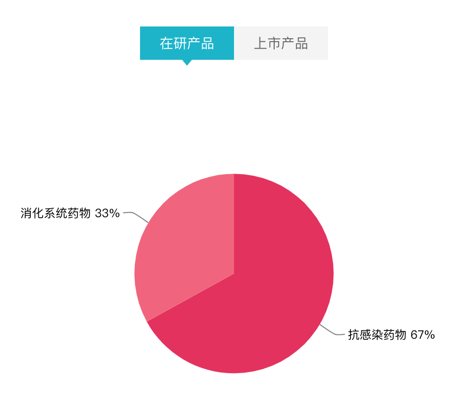
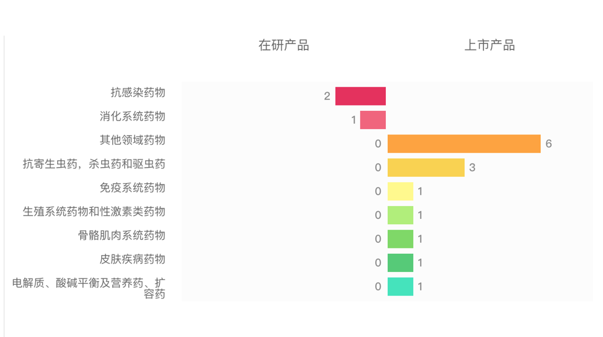

# 新和成控股集团有限公司

## 01. 基本信息

### 1. 公司行业细分

在研产品占比情况：

75%，化学仿制药；25%，化学改良型新药。

### 2. 上市产品占比情况

92%，化学仿制药；8%，中药。

### 3. 各治疗领域产品占比

### 4. 公司概况

#### 基本信息

成立时间 1989-02-14 

上市时间 2004-06-00 

官网 www. Cnhuaroup. Com 

注册资本 12000 万人民币

下载年报暂无该企业年报

子公司 10 家

#### 产品概况

查看产品生命周期视图

申请临床成分数

批准临床成分数

临床试验中成分数

申请上市成分数

批上市成分数（无文号

批上市成分数（有文号）15 

最新获批上市药品：同异亮氨酸 Ketoisoleucine

## 02. 企业动态

## 03. 在研产品

## 04. 上市产品布局

## 05. 财务情况

