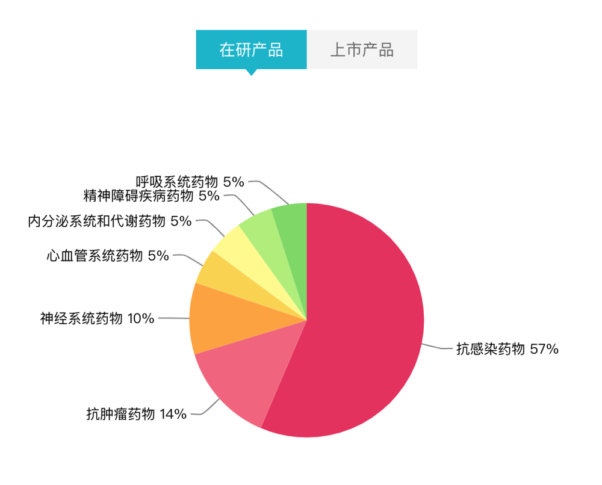
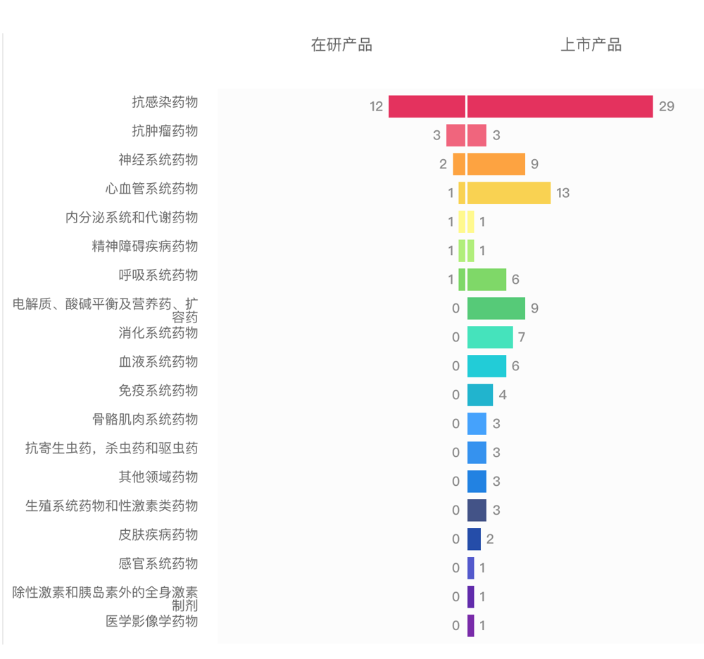

# 浙江医药股份有限公司

## 01. 基本信息

### 1. 公司行业细分

在研产品占比情况：

14%，化学创新药；5%，生物药；76%，化学仿制药；5%，中药。

### 2. 上市产品占比情况

6%，化学创新药；88%，化学仿制药；6%，化学改良型新药。

### 3. 各治疗领域产品占比

### 4. 公司概况

#### 基本信息

成立时间 997-05-16 

上市时间 999-10-21 

官网 www. Laibay. Com 

注册资本 96525.8 万人民币

下载年报：2017 年年报 2016 年年报

子公司 12 家

#### 产品概况

查看产品生命周期视图

申请临床成分数

批准临床成分数

临床试验中成分数

申请上市成分数

批上市成分数（无文号

批上市成分数（有文号 101 

最新获批上市药品：左氧氟沙星 levofloxacin

## 02. 企业动态

## 03. 在研产品

## 04. 上市产品布局

## 05. 财务情况

