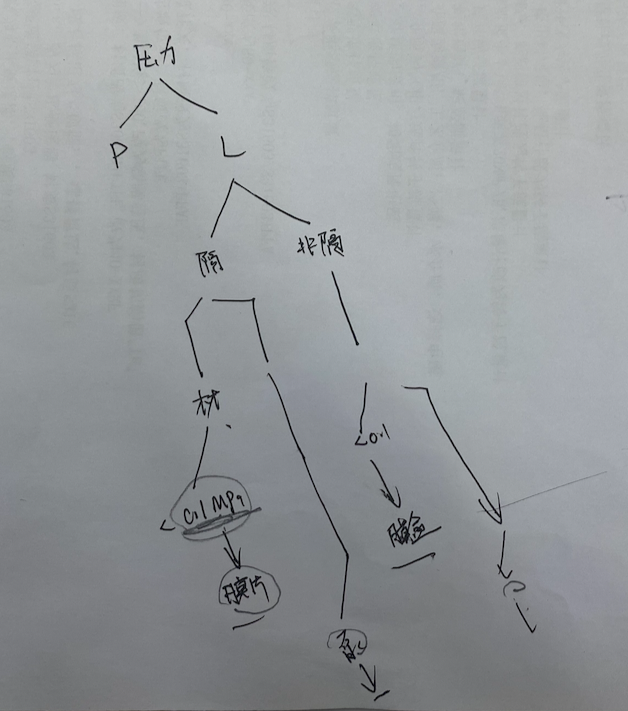

## 20200516戴强交流

1、分支的命令约定。

2、服务器上只有 master 分支，而且服务器上只能 pull，必须保证服务器的「干净」。

3、分支管理还是使用图形界面方便。在 VS Code 里用 GitLens 管理。

4、不走 http 请求。网页会超时，不走 http 请求的好处是，当脚本运行时长很长的话（比如导数据），就没关系，因为没延时。导数据的时候用这种方式。戴强用 PHP 做数据清洗的时候用这种工具的。

5、处理完逻辑 logic 后会得到一个 info 信息。这个逻辑不能写在控制器里，控制器只做 2 个事情，一个是获取参数，一个是验证参数，最后是返回，控制器约定只做这 2 个功能。控制器是永远就那么几行，一个方法是一个接口。业务逻辑都写到逻辑层（服务层）那边去。

6、laravel 很重的。从入口进去，自动加载、框架启动、处理、发出消息......整套下来的话，需要 100ms，再加上自己的逻辑处理，加起来做的接口起码要 300-400ms，这是一个请求的过程。Java 就很好，就一个架包启动，java 写的接口基本上都能控制在 100ms 以内。

## 20200524戴强交流

1、以业务为单元模块。比如管理员登录、比如项目城市信息查询等。

2、自动组装 json 格式，然后返回 json 格式数据。在全局变量里去捕获（相当于把组装数据格式抽象一层封装起来）。

3、原始 laravel 的问题是，一个文件对应一个接口，接口很多的话话那么文件就很多了。现在的是一个方法对应一个接口。

4、本项目框架的实用性。针对的业务场景，一个用户模型可以用一个 controller 搞定的，比如管理员相关的行为用一个 AdminController.php 可以搞定的，像戴强他们公司里的项目，一个管理员相关的行为是当一个项目来做的，这种项目的话本框架就不适合了。再比如他最近在用 java 写的那个搜索功能，4 个人做，这个功能就当作项目来做的。现在这种框架结构的控制器里就很干净。

5、laravel 里多用 dd() 函数，哈哈。

## 20190706数据流汇报后吴总评论

当时试验了 cadworx 的智能 PID，没推行下去。

从流程图里做整合。当时信息技术部的李元东，工作量太大，后来走了。

设计条件数据链的连接，之前没想到时以你这种方式，我们想的是，工艺的条件是以 excel 的方式，直接传递到仪表专业，仪表那边直接做计算。仪表那边，之前陈刚新桥的那个软件比较慢。其实我们很羡慕结构专业的，它的 PKDM 上来以后，可以说是工作量大减。校审人员只管输入参数就行了，数据库它不管的。但对我们专业整个构建来说，确实是比较难的。

确实量很大，所以我们考虑好一步步的进展。即便推广也是在设计行业里推广，三级校审制度必须做进去。把数据丢进这个库，本质上还是提条件的概念。丢进去之前的数据，三级校审是要认可的，包括刚刚说的前端校审。

1『重点：三级校审制度。』

数据具体实现的形式还可以商讨，通过块也是一种形式，我们的只能 PID 也是有的，当时买的是跟着 cadworx 一起来的，有些软件授权在这，直接可以用。这里顺便提下，软件使用稳定性的问题，之前林俊的事。软件很容易崩溃，数据丢到哪去了都不知道。Autodesk 公司，它的 cad 的数据不是很好的，所以它上了三维后要上 Davie，而不用自己的平台，毛病就在这里。现在你这种直接数据出来进 MySQL，也是一种思路。

着重要建议的是，我们一步步前进的步骤，我们要踩稳了。你在往外推广之前，公司内部肯定得认可。

插曲：散发量法计算，审图公司肯定是认可的，因为是规范规定的。以前是因为换气次数法简单所以用的它。

上游专业数据该了，后端要收到提醒，而且要知道哪些地方改了。

仪表这些条件，块属性是一个很合适的方式，但暖通全面通风就不一定合适了，有待商量。

孔总：现在很多提的条件不全的，缺胳膊少腿。

校核方面，我以流程图举例，校审看你的条件，实际上不是看一般条件表，条件表只是个导出嘛，它应该是看流程图，一个个看你块上的属性，这才是正确的思路。

陈杰：我们这边接到项目，大家就直接开干了。我了解到的一些其他院，他们会做一些输入确认。现在我们所项目，做一半，业主说该，我们一点办法都没有。但我们如果有前面的东西的话，业主一点话都没得说。

对 URS 这块，我是不太期望业主能给我传递数据，只是把数据给我锁定，能达到这个目的就行。从谢雨东的未来构想来看，我们设计行业未来干的就是「翻译」，把业主的需求，翻译给机器。后面的那堆东西不见得是工程师在弄，AI 就能搞定。从 AI 来说，我们行业的条条框框比民用的多的多，条条框框越多越好。前几天看的新闻，深圳这边已经开始 AI 审图了，说明已经有人在玩这个了。以后的模式就是我们跟业主谈，谈后半夜里把数据输给机器，第二天就出图了，跟律师一样，按小时收费。这个时候经验就很值钱了，只有你懂，才能翻译给机器。

2『如何数据的锁定？固定掉规格么，有时间找吴总确认下。』

陈杰：后台数据，要加入的属性：填入人员、校核人员，而且后台数据的来源一定要有。担心数据的准确性，同样的数据我发现不同标准上都不一样的。其实数据是不能碰的，现在公司的管道等级，之前就没有考虑好，大家都能在里面改。之前我发给你的那个物性数据，都是标注来源的，你可以参考下。

1『收获点：数据需要添加的属性：录入人员、校审核人员、数据来源。』

电气专业那边我交流过，他们其实也做了不少数据方面的工作。举例，如果工艺能够在电气设备的电机部位，打上一个块的属性，按天正电气的方式，它可以让电缆跟着这个块走，跟到接线点去。他们现在是自己在一个个手动点的。

叶赟：如果布置图上有电机数据提取出来，中间我这边的配电柜的回路就可以做出来了。

你现在的关键是把现在各个专业在做的串起来，连成网。

叶赟：盛江的那个东西，我现在发现，因为里面有选型的东西，输入的多了根本算不过来，会卡死。所以，我把不常用偏门的删掉了。还有个问题，一旦成表后想再该就难了。我现在的想法：把它做成单个设备的，我们做系统图本身是个柜子，柜子里有很多回路，我的想法是单个设备、单个回路做成一个数据对象，这样的话我可以按回路、设备来选，这样我就不怕改了。现在用的最大的问题，就怕改，改了就得重新做一遍。

修改的提醒一定要做到，新增的、修改的要显示出来。实在不行，机器如果能连续性起来，再重新算一次也行的。让人工干预尽量少。只做前端干预，中间不干预。

1『前端一定要先确认好，通过校审核，没问题了，点一下，后面自动更新。』

你现在构架已经起来了，你现在要去跟各个专业，都去了解下。第一，已经在做哪些自动化的过程了。第二，他们有些什么样的设想，什么样的需求。再汇总，添加进我们这张图，拿笔画，这个干了，那个干了，看能不能连起来。肯定是工艺开始。

1『提醒要分两大类，一类是新增的，一类是变动的。时间也要标出来。最好加不同颜色区分重要程度。』

先可以做内部云。

靳淳：有块后，对于新员工与业主交流有一个指导的作用，其实很多设计人员在跟业主交流的时候已经把这些参数写进流程图里了，比如温度、压力。

夏晓寒：增加输入参数的复用性。

你找个时间跟信息技术部沟通一下，内部云架构的事，找闵主任。到时要打报告的。信息技术部这边也在考虑做内部云。

2『跟信息技术部沟通内部云架构的事。』

你的实现模式，你到时抽个时间，我把信息技术部的人叫上，我们一起来探讨一下。他们对架构这块还是比较熟的。你的这个架构是不是够简单，包括数据库到时是 SQL 还是 MySQL，公司 sql 是有版权的。

## 20200922吴晓军总交流

1、保护的事情，用 lisp 写的，没有编译。用了那么多外协，考虑下保密的事。

你东西的好处，是一步一步的都有优化，整合在一起当然是更好，每一步都是可以产生效益的。

2、要用起来他们才会感受到好，才会给你提反馈意见，才会一步步迭代变好，是个正向循环。

3、目前还是限制在工艺专业内部，尽快跨出去。

我的感受来说，仪表那边，陈刚那边的「天桥」系统还没给我解决，这个应该问题不大，它是后端，它主要要调整的是它的输出表格。你这边输入的信息倒是可以跟他们对接。

我们最大的两块数据，应该是仪表和电气的，仪表的最多。优化的同时（用户用给反馈你这边改），你要开始向专业转移了。

4、仪表的选型逻辑。

选型逻辑华雷给你是没有问题的，但他们专业内要有一个共识，我会跟沈奕锋沟通下，让他来指导下。有一两个不能选的，没有问题，我们把大部分解决掉就行了。在你的这套系统上（以管道数据表、管道等级为基础），可能要「分细」，等级要在我们的基础上分的更细一些。我们的等级有的时候是这样的，比如 2A1 的等级，我用的一般是溶剂，什么时候我边上有根水，我可能也就用了这个等级，或者交叉的那个部分，它的检测等级就不一样了，在这种情况下，得有个判断必须要让它分开。如果以介质来区分的话，有人会把介质写的比较含糊，那么你用介质来做判断的话就比较困难。

我的建议，你可以做好一个模块，每个项目可以对这个模块进行修订。每个项目进行的时候，工艺专业负责人，对我这里的介质的情况做一些描述，做一些分类。比如说，我这个项目，出现了丙酮，把丙酮加到我这个甲类等级库里去，只要含有丙酮的话，那就按甲类的做，我那个东西含有异丙醇，我就把异丙醇加进去。这样的话你的库就不需要做的特别大，我举的这两个介质，你的库里当然都可以有，我主要是想说那些特殊的介质。你可以分成两层架构来做，你可以用我的，没有问题，为了你更好，你可以修订成你自己的。

5、暖通的东西。

我现在想做的一件事情是，要去找一些数据，我们车间里的，正常状态（没有那种敞口的情况下），我通过法兰这些泄露点，它有一个文件认可的泄露率的。我们有那么多项目，我直接查这个车间有多少片垫片（几寸几寸的罗列出来），我可以整理出一个库出来。我在设计的时候（估计），我认为像我们这样的，在什么样的当量，我有多少泄漏量，这些泄漏量会产生的气体，然后暖通就不用上来就 12 次的。然后，有敞口的我们敞口的来，真有敞口的我们就拿吸风罩来。

1『这个思路给我的感觉，可以用机器学习来做，前提是项目的数据多，这点我们院完全满足的。（2020-10-07）』

6、跟现有的工具联合起来。

往前推，你要产生效果，跟外专业联动。可以跟盛江联系下，之前我跟他探讨过这事（后面没跟下去），现在天正电气里有一个功能，只要把电机的定位点定好，可以在工艺的设备模块上加上这个信息，工艺专业多干一点点，电气专业可以少干很多。

1『

电机的位置这点可以深挖。目前觉得可以把设备块电机的中心点作为块的插入点，批量读取出来。（2020-10-07）

20190706 汇报的时候，叶赟提供的信息好好研读一下。

叶赟：如果布置图上有电机数据提取出来，中间我这边的配电柜的回路就可以做出来了。

你现在的关键是把现在各个专业在做的串起来，连成网。

叶赟：盛江的那个东西，我现在发现，因为里面有选型的东西，输入的多了根本算不过来，会卡死。所以，我把不常用偏门的删掉了。还有个问题，一旦成表后想再该就难了。我现在的想法：把它做成单个设备的，我们做系统图本身是个柜子，柜子里有很多回路，我的想法是单个设备、单个回路做成一个数据对象，这样的话我可以按回路、设备来选，这样我就不怕改了。现在用的最大的问题，就怕改，改了就得重新做一遍。

』

关键点在于怎样跟现有的工具（软件）联合起来，整合在一起。比如天正电气、「天桥」软件。就跟我们数字天正一样，不是单一的一个软件，它实际上是一些列软件的组合，数据是共用的。目前的思路是先利用原有的工具软件，数据通过网络平台来进行提取和导出。以后我们能够做到比较顺之后，可以把这些工具封装起来。一步步来，还是先把量拉起来。

方便的话可以跟陈刚聊下，以后公司应该就用那套「天桥」系统来做，如果那些它能做，就让它做。比如说它的选型逻辑，它这套系统已经有了，那就改它的系统，用它的逻辑，我们就不重复造轮子了。

不光要找热心的人，多去找有兴趣的人，很多人都有一些「小东西」，虽然不是软件，但他们的「思路」是可以用的，把「已有」的知识收集起来。

## 20200929孔总重点工作任务

体现在 2 个方面：

1、五个工作提升方面，要做成哪些亮点。

2、改革创新。

设计流数据一体化是改革创新。要有量化指标，对明年完成的程度要理一理，明年要达到一个什么样的目的、目标。量化的指标。

1、2020 年项目的使用量上。比如多少个项目使用了。

2、项目执行，真正使用上，产生哪些效益。这个是最重要的。

工艺每个功能模块节省的时间。

数字化研究院这边很明确，有 2 个任务。1）金康项目的总结。明年的时间点是否合适有待商榷。2）以 C3 项目为基础，要拿到总体院的，数字化交付全部的标准。

## 20201228与吴总交流仪表选型

1、跟沈奕锋交流过，沈说仪表选型（仪表数据表规格书）有 80% 的量可以用算法来支持。

2、仪表选型逻辑跟工艺的管道材料表一样。每个项目开始的时候，选型的算法逻辑，作为仪表专业统一规定的一个内容，需要审批的。审批完之后可以留出一部分，比如什么介质改用什么材质需要人工判定的。70-80% 的量用规则给算完。校审就很简单了，就只需要校审算法（规则）即可。

剩下 20% 的方案：1）给你预选，标不同的颜色。2）你自己选。那 20% 的数据跟 80% 的数据一定要分开。

我们先解决仪表专业规格书数据表的自动化，CAD 画图（平面布置相关）咱们先不管。

电气的道理也是差不多的，盛江他们应该有现成的算法，去问问他们。

3、一定要评估下，其他专业哪些工作对减少他们的工作量是最明显的。

4、先乔他们之前推是觉得有用处的，特别是后端标准图集方面的东西，你可以去了解一下。我的希望也是你可以在它的基础上「嫁接」。

5、我更看重的仪表、电气这两块内容，因为规则算法我们在我们手里，我们有绝对主动权来审核。工艺的算法太难审了，很多涉及到业主的需求，得跟业主去谈。

6、如果工艺的管道数据表上有确定不了的问题，也可以借用刚刚说的仪表 80/20 数据处理的逻辑，用特别的方式（比如颜色）把这两块数据区分开来。

## 20210110华雷交流压力表选型

1、选型基本逻辑。

看就地压力表，先看是不是适合隔膜。

隔膜。隔膜的会先涉及到材质的问题。往下走，小于 0.1MPa 的选膜片，大于 0.1MPa 的就是非膜片的隔膜压力表（振动工况比如泵出口，就选抗震）。

非隔膜。非隔膜的先不管材质问题。往下走，小于 0.1MPa 的选膜盒，大于 0.1MPa 的就是普通的非隔膜压力表（振动工况比如泵出口，就选抗震）。

注意：1）膜片和膜盒都没有抗震的。如果量程比较小，是那种 kPa 级别的，都没抗震的。2）这里的 0.1MPa 是量程上限。

2、标准化的压力表分六档：膜片压力表、膜盒压力表、隔膜压力表、抗震隔膜压力表、不锈钢压力表、抗震不锈钢压力表。

3、工艺条件先做一些处理。1）工艺条件出来条件要先处理，只有就地（PG-XX）和远传（PT-XX）两大类仪表。2）核对流程图里的管道，管道有伴热、夹套的。3）腐蚀性的。4）易凝固介质，比如冰醋酸、液碱，这种介质工艺一般是不做夹套的。

4、抗震的情况：泵的进口和出口、压缩机的进口和出口。

5、比如这次的总包 C3 项目，在连云港，零下 20 度，循环水水管的压力表都选的隔膜，因为水是不会用 2H1 管子、电伴热，所以你不能通过这两个点来做判断。

6、还有一种情况是要用隔膜的，剧毒的介质。剧毒的目前压力表可以不用，没规范要求，是我们院自己提高要求的。但温度计必须用法兰的，不能用螺纹。氨气可以用，但液氯（腐蚀性）不行。

7、隔膜压力表，压力表平时为了省钱，材质优先考虑的是钢衬，如果温度是大于 100 度或者是负压（-5kPa 以上），那么就必须用金属膜片了，这只是压力表。压力变送器都是金属膜片。温度高的话，膜片中的硅油就用「高粘度硅油」，普通的只是写的「硅油」。如果碰到洁净区场所，硅油是不能用的，要用氟油或者卤代烃。

8、隔膜的，优先使用 DN50 的法兰，变更的逻辑详见华雷的选型逻辑里的第 29 条（DN25 的和工字型法兰）。补充：隔膜的是这 3 档，普通的不锈钢压力表和膜盒，连接规格 M20 的，如果管道口径小于 DN15，连接规格都更改为 M14x0.5。不锈钢压力表上面的表头从 φ100 更改为 φ60，精度 1.6 更改到 2.5；膜盒的只改连接规格，上面的表头相关参数不变。

9、之前的逻辑表只是针对化工的，医药的还不太一样。医药的卫生级别的用卡扣连接的，薄壁管的也不同。

10、工艺那边也需要有自查的机制。好几百度竟然用的钢衬四氟的管子。同一个点上，参数（温度、压力）竟然不相同。比如同一个点，自力式调节阀的阀前压力提的是 0.2MPa，储罐压力表又提的是 0.6MPa，根本对不起来。

1『工艺这边，做这种核查的逻辑很有必要。（2021-01-11）』