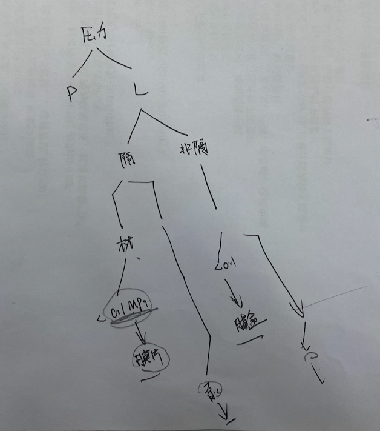

## 20210110华雷交流压力表选型

1、选型基本逻辑。

看就地压力表，先看是不是适合隔膜。

隔膜。隔膜的会先涉及到材质的问题。往下走，小于 0.1MPa 的选膜片，大于 0.1MPa 的就是非膜片的隔膜压力表（振动工况比如泵出口，就选抗震）。

非隔膜。非隔膜的先不管材质问题。往下走，小于 0.1MPa 的选膜盒，大于 0.1MPa 的就是普通的非隔膜压力表（振动工况比如泵出口，就选抗震）。

注意：1）膜片和膜盒都没有抗震的。如果量程比较小，是那种 kPa 级别的，都没抗震的。2）这里的 0.1MPa 是量程上限。

2、标准化的压力表分六档：膜片压力表、膜盒压力表、隔膜压力表、抗震隔膜压力表、不锈钢压力表、抗震不锈钢压力表。

3、工艺条件先做一些处理。1）工艺条件出来条件要先处理，只有就地（PG-XX）和远传（PT-XX）两大类仪表。2）核对流程图里的管道，管道有伴热、夹套的。3）腐蚀性的。4）易凝固介质，比如冰醋酸、液碱，这种介质工艺一般是不做夹套的。

4、抗震的情况：泵的进口和出口、压缩机的进口和出口。

5、比如这次的总包 C3 项目，在连云港，零下 20 度，循环水水管的压力表都选的隔膜，因为水是不会用 2H1 管子、电伴热，所以你不能通过这两个点来做判断。

6、还有一种情况是要用隔膜的，剧毒的介质。剧毒的目前压力表可以不用，没规范要求，是我们院自己提高要求的。但温度计必须用法兰的，不能用螺纹。氨气可以用，但液氯（腐蚀性）不行。

7、隔膜压力表，压力表平时为了省钱，材质优先考虑的是钢衬，如果温度是大于 100 度或者是负压（-5kPa 以上），那么就必须用金属膜片了，这只是压力表。压力变送器都是金属膜片。温度高的话，膜片中的硅油就用「高粘度硅油」，普通的只是写的「硅油」。如果碰到洁净区场所，硅油是不能用的，要用氟油或者卤代烃。

8、隔膜的，优先使用 DN50 的法兰，变更的逻辑详见华雷的选型逻辑里的第 29 条（DN25 的和工字型法兰）。补充：隔膜的是这 3 档，普通的不锈钢压力表和膜盒，连接规格 M20 的，如果管道口径小于 DN15，连接规格都更改为 M14x0.5。不锈钢压力表上面的表头从 φ100 更改为 φ60，精度 1.6 更改到 2.5；膜盒的只改连接规格，上面的表头相关参数不变。

9、之前的逻辑表只是针对化工的，医药的还不太一样。医药的卫生级别的用卡扣连接的，薄壁管的也不同。

10、工艺那边也需要有自查的机制。好几百度竟然用的钢衬四氟的管子。同一个点上，参数（温度、压力）竟然不相同。比如同一个点，自力式调节阀的阀前压力提的是 0.2MPa，储罐压力表又提的是 0.6MPa，根本对不起来。

1『工艺这边，做这种核查的逻辑很有必要。（2021-01-11）』

## 20210423方全利交流

1、工艺专业提的条件也变成一个 excel 表，把以前设备条件里需要的数据都放进去。

2、储罐加一个设备类型属性。容器类：1）平底平盖。2）立式平盖椭封，圆钢支腿。3）立式双椭封，角钢支腿或圆钢支腿。4）带搅拌器的立式双椭封，角钢支腿或圆钢支腿。5）带夹套的立式双椭封，角钢支腿或圆钢支腿。6）立式双椭封，挂耳。7）卧式双椭封，鞍座。8）大型储罐，有加热器和无加热器。

### 记录

1、不能从上游专业的直接提取的数据，给一个默认值，并且用橙色高亮显示。

还是空着比较好，直接给个默认值弄着弄着可能会弄混淆掉，工程图的问题倒不大，毕竟工程图跟施工图还是有一定差距的。或者给个默认值也行，不过要用另外一个颜色标记区分出来（比如橙色）。上游过来的也有一个颜色高亮，比如绿色。这样工程图，我要审核的数据也就那些橙色的数据。

其实我们有一个 BGCAD 的，我们一直没用它，其实它的成图是很快的，不过它里面的图形不咋样。

2、工艺过来的数据是需要核的（比如法兰）。

因为我们之前模式，即使你们工艺专业校审核之后给了我们，我们也是需要去核的。比如说你这个法兰等级的问题，有些人可能会填错的。比如是 PN16 的法兰，它是一个公称压力，如果材料是不锈钢的，其实其实际使用温度是比较低的，有时这里工艺人员会错的（核的时候根据工作温度来核对）。比如现在 200℃ 的温度，它的最大允许使用压力随着温度的升高降的很快的，比如不锈钢的 200 ℃ 只有 10.2 公斤，现在它的设计压力可能有 12 公斤，已经超过 10.2 了，那么你工艺提过来的「条件」就是错的了。

我们设备专业是拿着条件去核这种问题的。实际上也是可以简单去判断的，你看看温度比较高的，已经接近了的，就要注意了，错的地方容易在这里。我们可以根据一些限制条件，进行一个初步的筛选，把有可能错的数据用一种颜色表示出来。那么可以把绿皮书法兰的数据（最大允许工作压力）、材料的数据都做进数据库里。

刚刚演示的是规范「HGT20592」的法兰数据，那么把 615 的数据也做进去。

3、其他类型的要复杂很多。

目前这个只是最简单的立式支腿储罐，其他类型的设备要复杂很多，规则也更多。

4、需要在用的过程中不断提问题，很多东西现在考虑不好的。

5、筒体壁厚和封头壁厚的计算。

之前自动画图时，多次出现的数值 25，是封头的直边高度。设备专业的计算软件是针对施工图的，里面可以算的东西很多。但其实对于工程图，我要的就是壁厚，筒体和封头的壁厚计算，也就 2 个公式。这两个公式可以当算法做进去，只能算内压容器。

2 个壁厚有可能会一样的，但常规封头的壁厚比筒体的壁厚更厚一点。举例：`EHA 700x8(7.1)`，这里的 7.1 是成型后的厚度，8mm 的钢板，是要去冲压的，冲压后它是要变薄的，冲压后最小的厚度是 7.1。

计算公式最后再嵌入，作为改进项，目前先自己填。

6、介质密度是绝的密度而非相对密度。

7、材料表格也拎出来。

按设备类型来划分，储罐一个材料数据表、换热器一个、塔器一个等等。

8、管口定位。

那么管口应该要加几个属性（工艺条件 excel 表）。1）顶部、底部、筒体侧。2）侧面定位，离上面焊缝线或切线的距离。

储罐顶部管口的位置最好做在 0.8D 之内。管口的定位数据，也要做成人工干预的数据，橙色高亮。有时不能简单的用 0.8D 来套，比如 DN700 的储罐，有 3 个比较大的管口放在上面，你罐顶中间一般放一个手孔的，这种放置，你管子做的做不了的。

管口的定位规则需要好好商量。一般情况下：1）直径大的，我会稍微往中间靠一些。直径小的（比如 DN500-600），上面管子多的话，我管口肯定尽量往边缘排，小的往中间靠管子一多肯定会碰到。

9、支撑的数据。

支撑的数据单独一个数据表，数据按类比去划分。

图形数据可以直接用 HGCAD 里的图形。

NB/T 47065.1 - 2018 鞍式支座

NB/T 47065.2 - 2018 腿式支座

NB/T 47065.3 - 2018 耳式支座

NB/T 47065.4 - 2018 支撑式支座

10、设备重量数据。

重量也单独拉一张数据表出来。重量（净重量）这一块的工作量蛮大的。重量主要是筒体和封头，还有支座、法兰接管，一项一项把它提取出来。封头有标准的，把直径、厚度、直边高度、材质密度输进去后，封头的重量就出来了。筒体一个公式马上也出来了。另外就是接管法兰，也串进去，多少的接管多少的法兰。还是就是支座。所有的组件，重量全部加起来。

1『封头的标准，HGCAD 里可以看到，比如 EHA、EHB、THA、THB 等，而且它已经做好了自动计算内表面、外表面积、容积和重量。（2021-04-28）』

做重量的时候，把不锈钢的单独拎出来。这样可以统计出不锈钢部件的重量了。比如不锈钢设备，其他都是不锈钢的，支座除了垫板以外其他都是碳钢的。那么这个设备总重是多少、不锈钢的是多少、碳钢的是多少，全部可以出来了。

净重量出来以后，操作重量和充水重量也就出来了。净重是纯粹钢的重量，操作重量是正常操作时的重量，包括物料（充装系数 x 容积 x 密度）、保温材料。充水重量，也可以把保温给放进去。

11、全容积数据。

计算公式很简单的。封头是有标准的，多少直径，标准封头容积是多少的。2 个封头的容积加一个筒体的容积，全容积就出来了。算重量的时候这个全容积要用到的。

12、试验、检测、热处理数据。

试验数据放到前面的「主要数据表」里，顺便按我们的习惯调一下我们数据的顺序。

位号、直径、高度、全容积、筒体壁厚、封头壁厚、设计使用年限、工作压力、设计压力、工作温度、设计温度、工作介质、介质特性、介质密码、腐蚀裕量、焊缝接头系数、装量系数、安全阀整定压力、最高允许工作压力、水试验压力、气密性试验压力、筒体检测率、封头检测率、CD 类焊缝、热处理、保温材料、设备净重、其中不锈钢重量、设备操作重量、设备充水重。

无损检测数据，比如筒体，只要填一个检测率，其他数据（等级技术、检测标准、合格级别）都可以匹配出来。