## 05 一般规定

### 5.1 伴热范围

下列管道应采用伴管成夹套管伴热：

1. 需从外部补偿管内介质热损失，以维持被输送介质温度的管道。

2. 传偷送过程中，由于热损失而产生凝液，并可能导致腐蚀或影响正常操作的气体管道。

3. 操作过程中，由于介质压力突然下降而自冷，可能冻结导致堵塞的管道。

4. 在切换操作或停期间。管内介质于热损失造成温度下降，介质不能放净、吹扫而可能凝固的管道。

5. 输送过程中，由于热损失可能引起管内介质结晶的管道。

6. 由于热损失可能导致输送介质粘度增高，系统阻力增加，输送量下降，达不到工艺最小允许量的管道。

### 5.2 伴热方式

5.2.1 输送介质的终端温度、环境温度接近或低于其凝固点的管道应进行伴热，伴热方式的选用宜符合下列规定：

1. 介质凝固点低于 50 ℃ 时，宜选用伴管伴热。

2. 介质凝固点为 50-100 ℃ 时，宜选用夹套管伴热。

3. 介质凝固点高于 100 ℃ 时，宜选用内管焊缝隐蔽型夹套管（全夹套）伴热。管道上的阀门、法兰、过滤器等应为夹套型。

5.2.2 输送气体介质的露点高于环境温度需伴热的管道，宜选用伴管伴热。

5.2.3 输送介质温度、环境温度按近或低于其凝固点的管道和介质温度要求较低的工艺管道，宜采用热水伴管伴热。

5.2.4 液体介质凝固点低于 40 ℃ 的管道、气体介质露点高于环境温度且低于 40 ℃ 的管道及热敏性介质管道，宜采用热水伴管伴热。

5.2.5 输送有毒介质且需夹套管伴热的管道应选用内管焊缝外露型夹套管（半夹套）伴热。

5.2.6 经常处于重力自流或停滞状态的易凝介质管道，宜选用夹套管伴热或带导热胶泥的蒸汽伴管伴热。

### 5.3 伴热介质温度

伴热介质温度的选取宜符合下列要求：

1. 伴管的介质温度宜高于被伴介质温度 30 ℃ 以上，当采用导热胶泥时宜高于被伴介质温度 10 ℃ 以上。

2. 伴热热水温度宜低于 100℃，当被伴介质温度较高时，热水温度可高于 100 ℃，但不得高于 130 ℃。当利用高温热水伴热时，被伴介质温度可相应提高。伴热热水回水温度不宜低于 70 ℃。

3. 夹套管的介质温度可等于或高于被伴介质温度，但温差不宜超过 50 ℃。

4. 对于控制温降或最终温度的夹套管伴热管道，伴热介质的温度应根据被伴介质的凝固点或最终温度要求确定。

### 5.4 热水伴热系统及压力

热水伴热应采用闭式循环系统，热水的供水压力宜为 0.3-1.0 MPa，回水压力宜控制在 0.2-0.3 MPa。

### 5.5 伴热系统的材料选用

5.5.1 伴管和夹套管的材料选用应符合下列规定：

1. 伴管和夹套管的材料应根据设计温度、设计压力和介质特性等设计条件确定，并按 SH/T3059 或相关材料标准选用；

2. 伴管和夹套管的内管应采用无缝钢管，套管可采用无缝钢管或焊接钢管；

3. 位于疏水阀（包括疏水阀）上游伴管的管子、管件和阀门等的材料等级应与蒸汽管道相同。位于疏水阀下游伴管的管子、管件和阀门等的材料等级应与凝结水管相同；

4. 对于伴管施工困难的场合，如阀门、过滤器、仪表等不规则形状的表面宜采用 10 或 12 管道伴热，伴管材料宜采用紫铜管或不锈钢管；紫铜管适用于设计温度低于或等于 200 ℃、且周围环境条件及工艺物料允许使用的场合；不锈钢伴管应使用不锈钢丝捆扎；

5. 夹套管中与内管连接的部件应与内管的材料相同；

6. 当套管与内管的材料不同时，应对夹套管进行柔性计算。如两者热胀差异产生的热应力超过许用值时，内管与套管宜采用同种材料或平均线膨胀系数相近的材料。

5.5.2 伴管伴热的管道保温宜选用硬质或半硬质圆形保温材料制品。如选用软质材料时，应在伴管与保温层之间加铁丝网以保证加热空间。

### 5.6 保温厚度和热损失

5.6.1 保温厚度的计算应符合下列规定：

1. 当工艺无特殊要求时，保温厚度应采用经济厚度法计算。若经济厚度偏小，且散热损失量超过最大允许散热损失量时，应采用最大允许热损失量的厚度公式进行校核；

2. 保温厚度计算宜以硬质或半硬质圆形保温材料制品为依据；

3. 带外伴热管道的保温层经济厚度应按式 5.6.1-1 和式 5.6.1-2 计算：

4. 夹套管管道的保温层经济厚度应按式 5.6.1-2 和式 5.6.1-3 计算：

5.6.2 管道热损失的计算应符合下列规定：

1. 蒸汽伴管或热水伴管的管道热损失量应按式 5.6.2-1 计算：

2. 夹套管管道的热损失量应按式 5.6.2-2 计算：

### 5.7 伴管及夹套管的蒸汽耗量

5.7.1 伴管的蒸汽耗量可按式 5.7.1 计算：

5.7.2 夹套管的蒸汽耗量可按式 5.7.2 计算：

### 5.8 夹套管所需总热量

夹套管所需热量的总和应按式 5.8 计算：

## 06. 伴管设计

### 6.1 伴管系统

伴管系统的典型示意图见图 6.1。

### 6.2 伴管管径及根数

6.2.1 伴管管径及根数（硬质或半硬质形保温材料制品）可按式 6.2.1-1 和式 6.2.1-2 计算：

6.2.2 伴管管径及根数的选用符合下列规定：

1. 伴管的管径宜为 10、12、DN15、DN20 或 DN25，伴管根数不宜超过 4 根；

2. 在不同环境温度及工艺操作条件下，蒸汽伴管根数和管径可按表 6.2.2-1 的规定确定：热水伴管根数和管径可按表 6.2.2-2 的规定确定；

3. 环境温度、伴管介质的操作条件、保温材料制品的导热系数及放热系数等数据与表 6.2.1-1 或表 6.2.1-2 不同时，伴管管径及根数应按式 6.2.1-1 和式 6.2.1-2 计算。

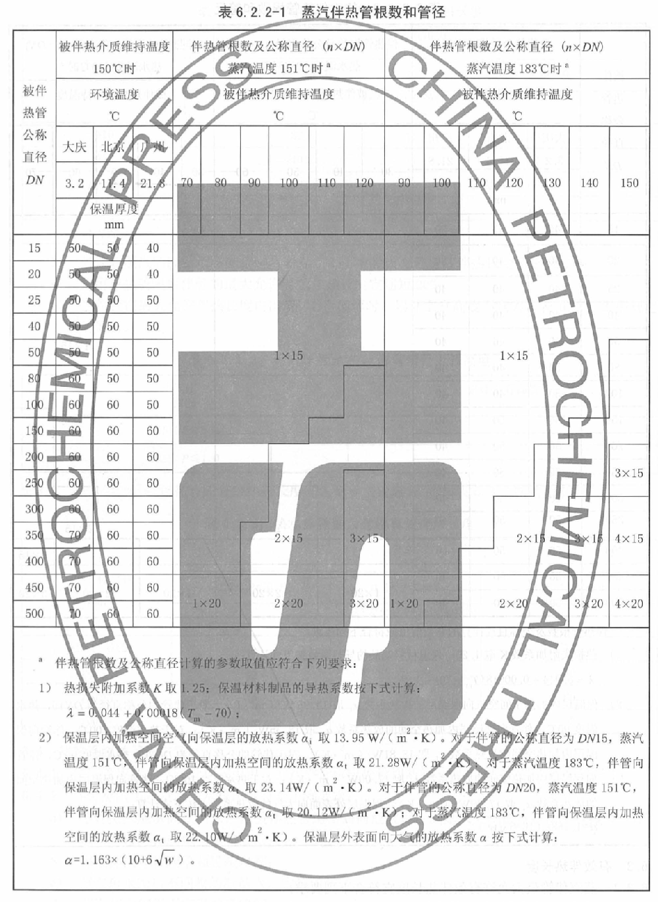

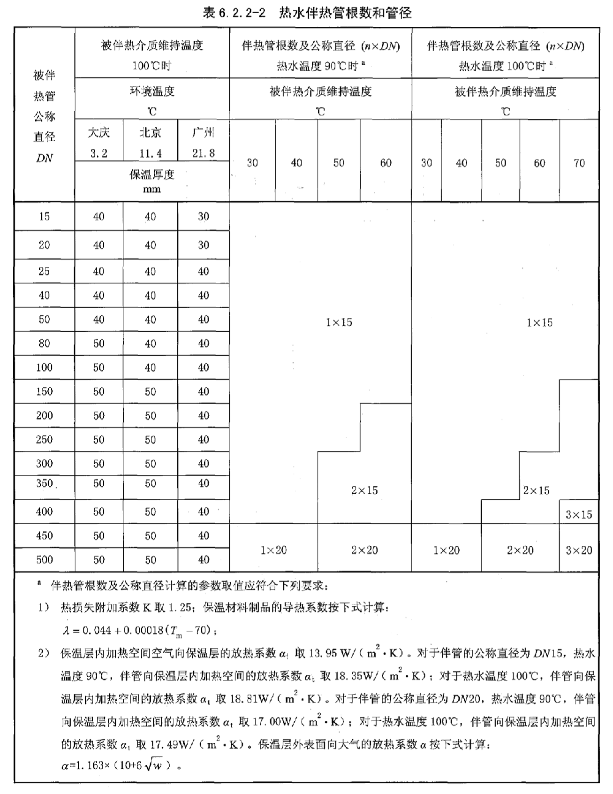

1『表 1 是蒸汽的数据，表 2 是热水的数据。从数据可以看出，一般情况下，1 根 DN15 的伴管就够了。』

### 6.3 有效伴热长度

6.3.1 蒸汽伴管最大允许有效伴热长度宜符合下列要求：

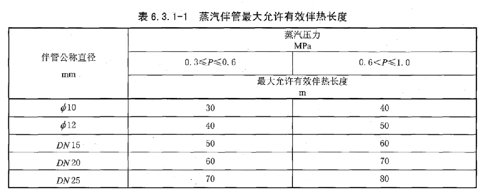

1. 伴管沿被伴热管的有效伴热长度（包括垂直管道）可按表 6.3.1-1 的规定确定；

2. 当伴热蒸汽的凝结水不回收时，表 6.3.1-1 中最大允许有效伴热长度可延长 20%; 

3. 采用导热胶泥后伴管的最大允许有效伴热长度宜缩短 20%；

4. 当伴管在最大允许伴热长度内出现 U 型弯时，累计上升高度不宜大于表 6.3.1-2 中规定的数值。

6.3.2 热水伴管沿被伴热管的有效伴热长度（包括垂直管道），可按表 6.3.2 的规定确定。

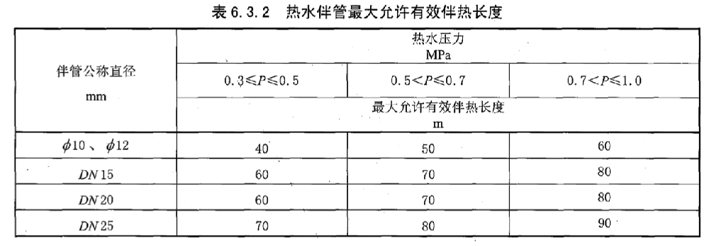

### 6.4 伴热系统的管道布置

6.4.1 供汽管应从主蒸汽管顶部引出，并在靠近引出处设切断阀，切断阀宜设置在水平管道上。

6.4.2 伴管蒸汽引入及凝结水排出宜符合下列要求：

1. 伴管蒸汽应从高点引入，沿被伴热管道由高向低敷设，凝结水应从低点排出，宜减少 U 形弯，以防止产生气阻和液阻；

2. 每根蒸汽伴管应单独设疏水阀；

3. 蒸汽疏水阀后不回收的凝结水，宜集中排放;

4. 蒸汽疏水阀组不应设置旁路阀；

5. 在密闭凝结水系统中，公称直径等于或大于 DN50 的凝结水返回管宜顺介质流向 45° 斜接在凝结水回收总管的顶部；

6. 在敞开凝结水系统中，蒸汽疏水阀排出的凝结水应采用汽水分离器经冷却后排至下水系统。

6.4.3 热水管伴热时，宜从被伴热管道的最低点开始伴至最高点，然后返回至热水系统。每根热水伴管的最高点宜设放空。

### 6.5 蒸汽分配站和疏水

6.5.1 在 3 m 半径范围内如有 3 个或 3 个以上的伴热点及回收点时，蒸汽伴热管道系统应设置蒸汽分配站和疏水站。站的设置应统一考虑，布局合理，并方便操作和维修。

6.5.2 蒸汽分配站和疏水的设置宜符合下列要求：

1. 蒸汽分配站的管径宜按式 6.5.2 计算出 S 值，并按表 6.5.2-1 的规定确定；

2. 疏水站的管径宜按公求 6.5.2 计算出 S 值，并表 6.5.2-1 的规定确定；

3. 蒸汽分配站和疏水站应预留 1 个或 2 个备用接头，S 值应包用接头的管径和数量；

4. 在同一个蒸汽分配的最短蒸汽伴管的当量长度不宜小手最长伴管当量长度的 70%；

5. 蒸汽分配站可水平安装或垂直安装；蒸汽引入管可从侧面或顶部接出。水平安装蒸汽分配站的示意图见图 6.5.2-3，垂直安装蒸汽分配站的示意图见图 6.5.2-4；

6. 蒸汽分配管和疏水站集合管的长度应根据引入或引出伴管的数量确定。为缩短分配管及集合管的长度，其伴管上的阀门可错开布置。

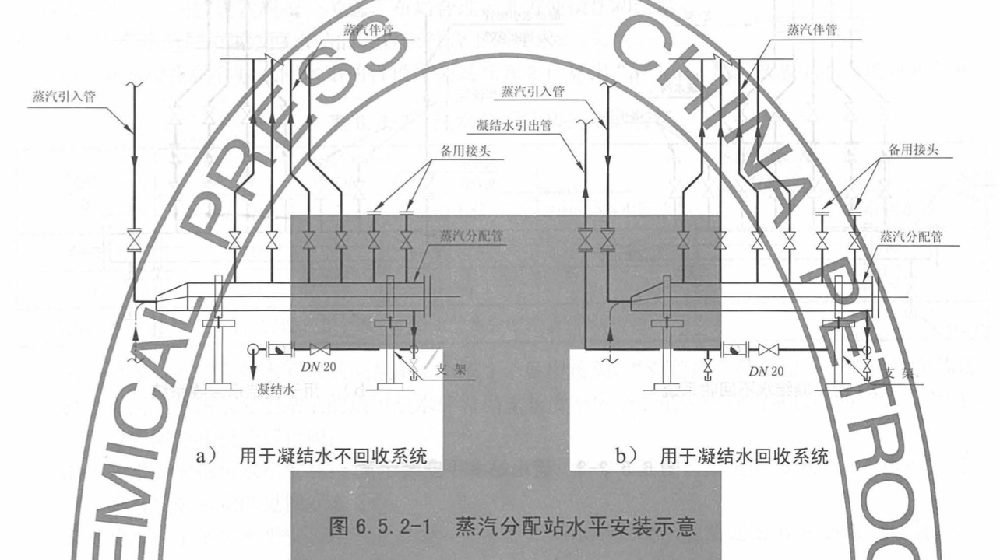

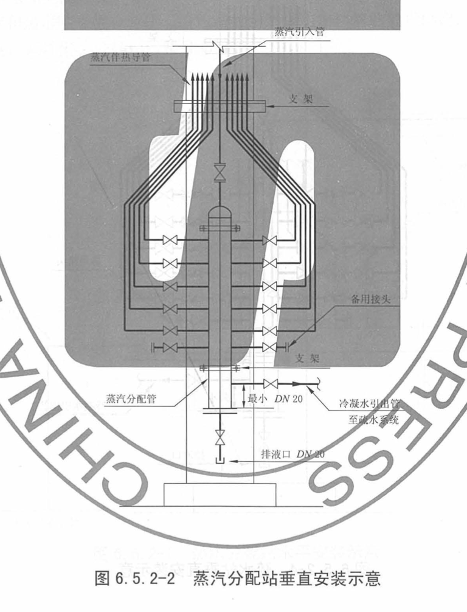

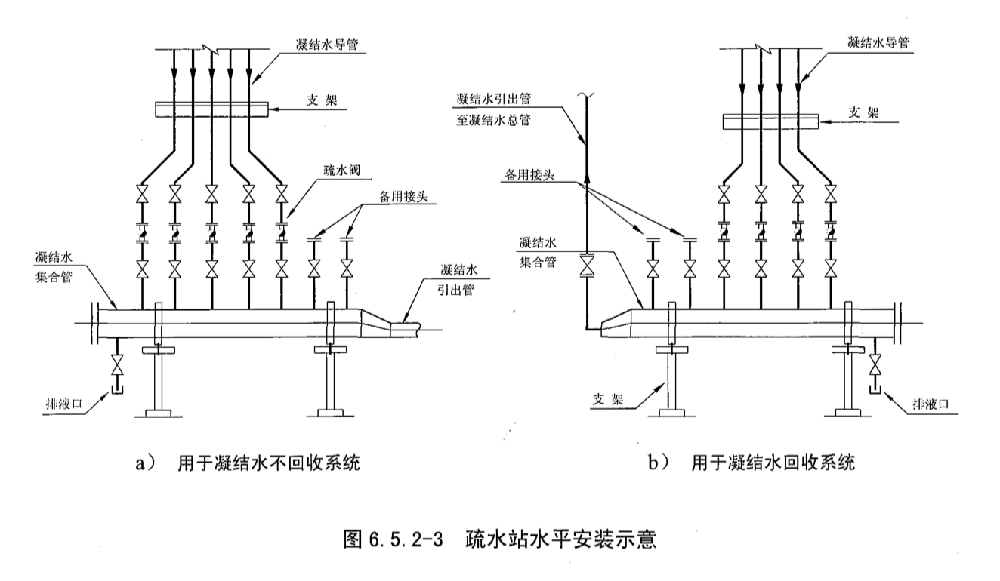

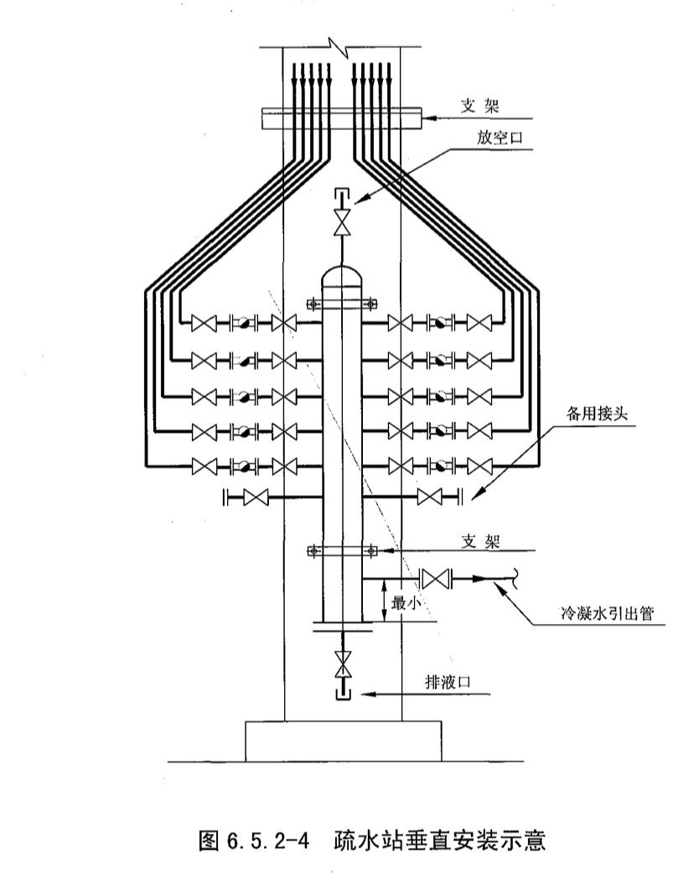

### 6.6 热水分配站和热水回水站

6.6.1 在 3 m 半径范围内如有 3 个或 3 个以上的伴热点及回收点时，热水伴热系统应设置热水分配站和热水回水站。站的设置应统一考虑，布局合理，并方便操作和维修。

6.6.2 热水分配站和热水回水站的设置应符合下列要求：

1. 热水分配站和热水回水站的管径可按式 6.5.2 计算出 S 值，然后按表 6.6.2 的规定确定；

2. 热水分配站和热水回水站应预留 1 个或 2 个备用接头，S 值应包括备用接头的管径和数量；

3. 在同一个热水分配站上的最短热水伴管当量长度不应小于最长伴管当量长度的 70%，否则应设置限流孔板或截止阀；

4. 热水分配站可水平安装或垂直安装，热水分配站水平安装示意图见图 6.6.2-1，热水分配站垂直安装示意图见图 6.6.2-3；

5. 热水回水站可水平安装或垂直安装，热水回水站水平安装示意图见图 6.6.2-2，热水回水站垂直安装示意图见图 6.6.2-4；

6. 热水分配管和热水回水集合管的长度应根据引入或引出伴管的数量确定。为缩短分配管及集合管的长度，其伴管上的阀门可错开布置。

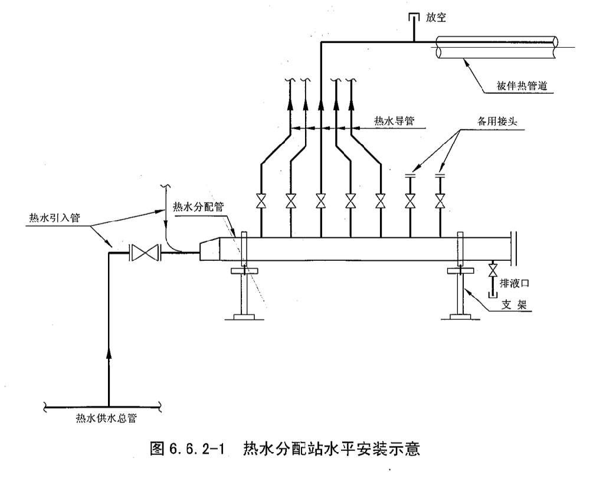

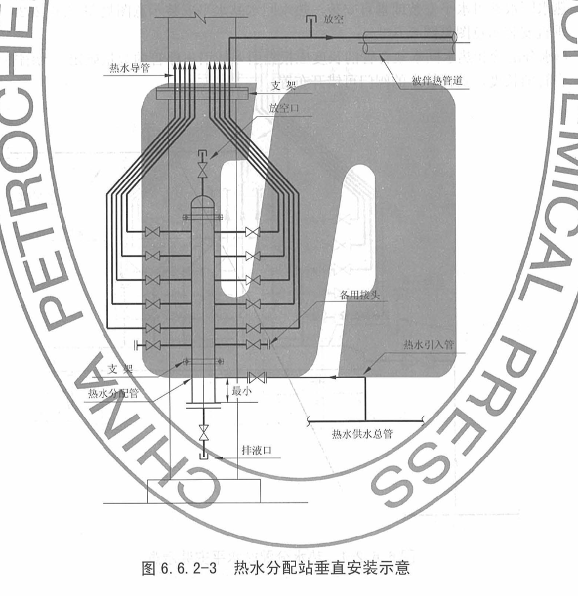

### 6.7 伴管的敷设要求

6.7.1 伴管敷设应符合下列规定：

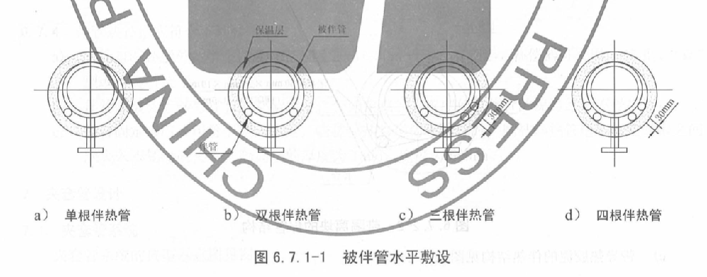

1. 被伴管为水平敷设时，伴管应安装在被伴管下方 1 側或 2 側，伴管敷设见图 6.7.1-1；垂直敷设时，伴管等于或等于 2 根时宜围绕被伴管均匀敷设，伴管敷设详见 6.7.1-2；

2. 伴管经过阀门或管件时，伴管应沿其外形敷设，且宜避免或减少 U 形弯；

3. 当主管伴热，支管不伴热时，支管上的第一个切断阀应伴热；

4. 被伴热管道上的取样阀、排液阀、放空阀和扫线阀等应伴热；

5. 伴管连接应采用焊接，在经过被伴管的阀门、法兰等处可采用法兰或活接头连接。10、12 紫铜管或不锈钢伴管宜采用卡套式接头连接。

6.7.2 伴管的结构型式应符合下列规定：

1. 伴管的结构见图 6.7.2-1;

2. 当被伴介质为热敏性物料或被伴管与伴管产生接触腐蚀时，应加隔离块，带隔离块的伴管结构见图 6.7.2-2；

3. 带导热胶泥的伴热结构见图 6.7.2-3。

6.7.3 伴管的支撑应符合下列要求：

1. 伴管宜用金属扎带或镀锌铁丝捆扎，捆扎间距宜为 1.0-1.5 m，有隔离块的伴管应在隔离块处捆扎：当伴管捆扎材料与被伴管有接触腐蚀时，在接触处应加隔离垫，见图 6.7.3；

2. 伴管不得直接焊在被伴管上。

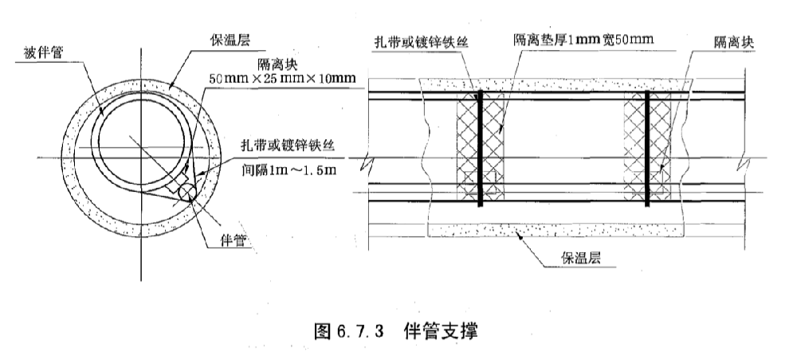

6.7.4 伴管热补偿应符合下列要求：

1. 除能自然补偿外，伴管直管段应每隔 20-30 m 设 1 个补偿器，补偿器可采用 U 型、Ω 型或螺旋缠绕型；

2. 伴管随被伴管转弯作自然补偿时，伴管固定点的设置应使被伴管的保温结构不受损坏；

3. 伴管固定点应采用管卡型式固定，当被伴热管道为不锈钢时，则被伴热管道和固定管卡之间应夹入不锈钢隔离垫，隔离垫的厚度为 1 mm，宽度为 50 mm。

